# 特法账单发送

## 程序部署

1.  将"特法生成发送工具.zip"压缩包，解压到本地电脑任意目录，比如D盘根目录下，

需要确保本地电脑能否访问德索crm数据库

解压后的文件目录结构如下

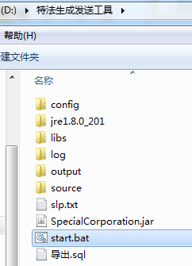

其中：

- Config 目录是用来存放结算单/中金所格式的模板文件

- Source 目录是存放具体某一天 报送监控中心的文件，通常是28个TXT文件

- Output目录是存放程序生成的数据包

- Log 目录是存放程序运行的日志

2.  将报送监控中心的28个文件，放到"source"目录下，注意需要包含日期文件夹

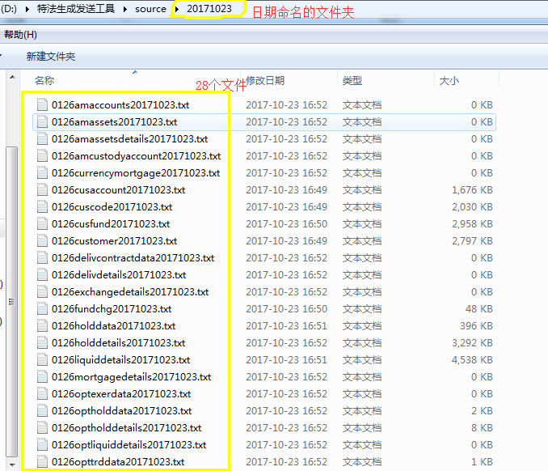

3．**双击Start.bat,** 运行特法程序，打开后程序界面如下

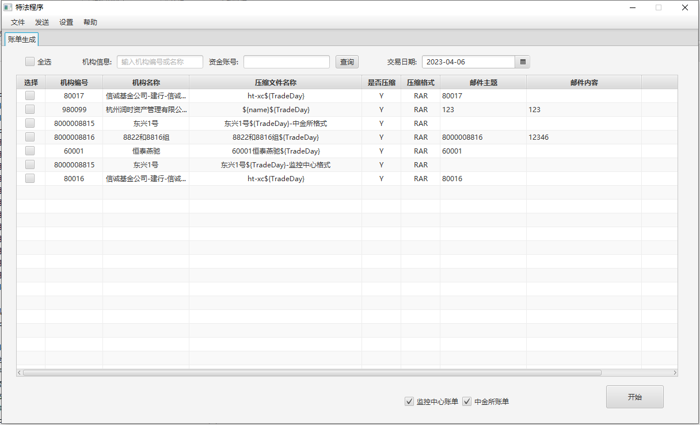

界面默认展示已经存在配置的 机构/特法户 信息；

程序默认勾选"监控中心账单"和"中金所账单"；

人工勾选确认待发送账单的客户范围，点击【开始】按钮，程序自动读取配置信息，生成账单数据，并按要求进行发送。

## 功能说明

特法工具，原本是为了解决特殊法人类客户对日账单需求迫切的时效性问题；目前已支持给所有有账单需求的客户生成并发送账单，包括一般法人、甚至自然人客户。

### 机构设置

点击"设置"-\>"机构设置"，进行【新增/删除/修改】 特法机构的操作

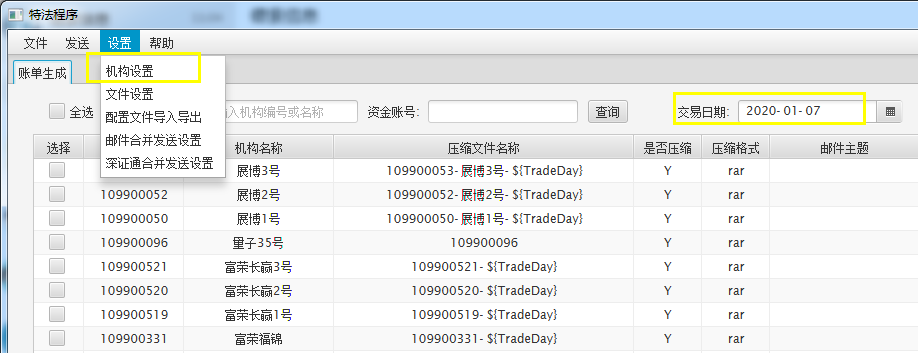

可以通过"机构信息"或者"资金账号"检索栏，快速定位至单个特法机构的配置项

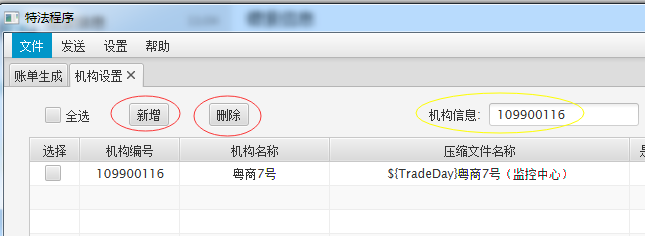

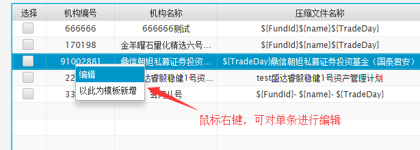

4. 点击"新增"或者"编辑"后，弹出详细配置界面

#### 【机构信息】

此界面用于进行单个特法客户账单发送的全局性配置。

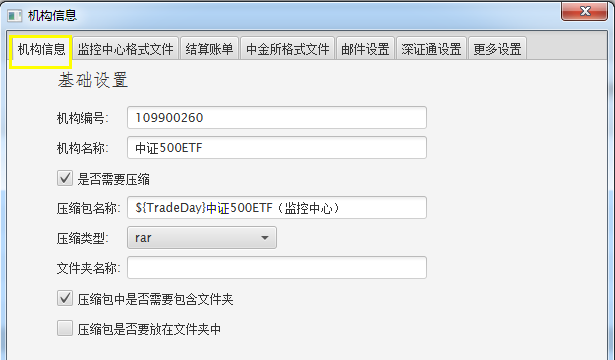

- **"机构编号"：** 即特法客户的资金账号，必填项；

- **"机构名称"：** 即特法客户的名称/简称，可选填；

- **"是否需要压缩"：** 需要压缩就打勾；

- **"压缩包名称"：** 即最终发送给特法客户的压缩包命名（不含格式后缀），必填项，可用参数代入；

- **"压缩类型"：** 支持"RAR"和"ZIP"两种格式，通过下拉框选择；

- **"文件夹名称"：** 默认跟"压缩包名称"一致；如果选择的是不压缩，则此处为必填项；

- **"压缩包中是否需要包含文件夹"：** 查看压缩包内容时，是否里面默认有嵌套一层文件夹；

  - **勾选** ，则压缩包解压到当前文件夹时，看到的首先是一个文件夹，里面才是具体的数据文件；

  - **不勾选** ，则压缩包解压到当前文件夹时，直接就是具体的数据文件；

- **"压缩包是否要放在文件夹中"：** 勾选中，产生的效果是 该特法客户发送账单时发送的是一个文件夹，文件夹的里面是一层压缩包，压缩包的里面是数据文件；

- **可用参数：**

  - **\${TradeDay} 特法数据日期**

  - **\${FundId} 特法机构编号，即特法客户的资金账号**

#### 【监控中心格式文件】

**5.监控中心格式文件的配置界面**

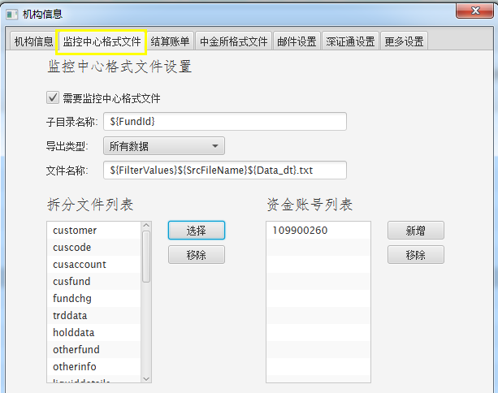

- **"需要监控中心格式文件"：** 开关设置；

  - 当前特法客户需要监控中心格式文件，则勾选；

  - 不勾选，下面的内容即使设置也是无效的；

- **"子目录名称"：** 如果数据压缩包下要求包含子目录，在此处填子目录的名称，否则不用填；

- **"导出类型"：** 暂时不用管，预留字段；

- **"文件名称"：** 监控中心拆分文件的命名格式，**可用参数**代入；

- **"拆分文件列表"：** 点击【选择】/【移除】，编辑需要的监控中心拆分文件种类；

  - 拆分：即从证监会报送的每一个文件中提取具体特法客户的数据；

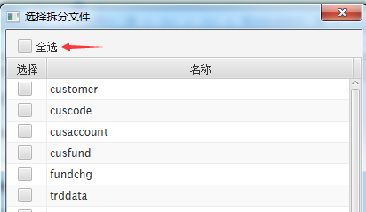支持一键"全选"

- **"资金账号列表"：** 点击【新增】，添加该特法机构的资金账号；**必须添加至少一个资金账号**，否则生成出来的特法文件无数据！

  - 如果添加了多个资金账号，程序会默认将这多个客户的同类型数据生成合并生成到同一个文件中；

- **可用参数：**

  - **\${FundId} 特法机构编号**

  - **\${SrcFileName} 拆分文件种类**

  - **\${Data_dt} 数据日期**

  - **\${FilterValues} 期货公司在监控中心的会员编号**

#### 【结算账单】

**6.结算账单文件的配置界面：**

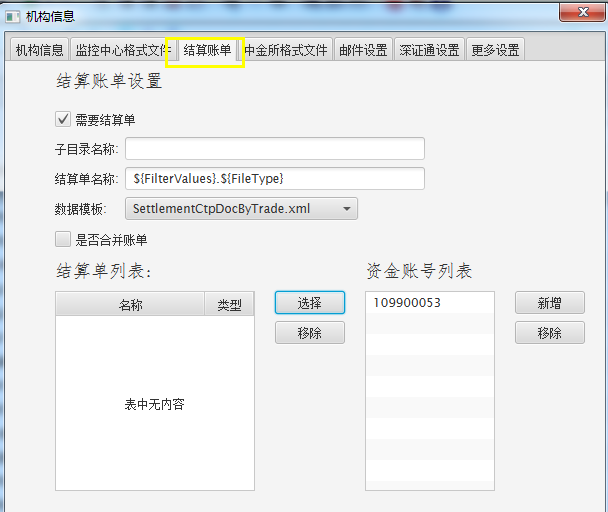

- **"需要结算单"：** 开关设置；当前特法客户需要此格式文件，则勾选；

- **"子目录名称"：** 如果数据压缩包下要求包含子目录，在此处填子目录的名称，否则不用填；

- **"结算单名称"：** 生成的交易结算单命名格式，可代入参数；

- **"数据模板"：** 默认可选"逐日盯市账单"or"逐笔账单"；如果公司的特法客户有个性化的账单需求，德索这边一般是通过工具后台配置的方式予以支持，界面此处会自动增加相应可选项；

  - **SettlementCtpDocByDate.xml为逐日的，**

  - **SettlementCtpDocByTrade.xml为逐笔的**

- **"结算单列表"：** 仅在极少特殊情况下会用到，通常不做任何操作，接受系统默认展示即可；

- **"资金账号列表"：** 点击【新增】，添加该特法机构的资金账号；**必须添加至少一个资金账号**，否则生成出来的特法文件无数据！

  - 如果此处添加了多个资金账号，那么必须勾选"是否合并账单"，否则系统可能无法正常处理；

- **"是否合并账单"：** 如果需要将多个特法资金账号的数据合并到同一张账单里，那么这里打勾；默认不打勾；

  - 只有勾选后，"资金账号列表"中维护的多个资金账号才有意义；

- **可用参数：**

  - **\${FundId} 特法机构编号**

  - **\${FileType} 账单文件格式，默认txt**

  - **\${Data_dt} 数据日期**

#### 【中金所格式文件】

**7.中金所格式文件的配置界面**

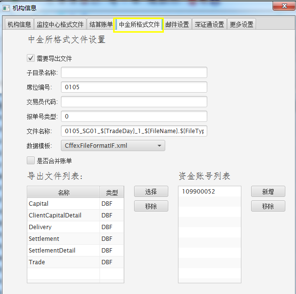

- **"需要导出文件"：** 开关设置；当前特法客户需要此格式文件，则勾选；

- **"子目录名称"：** 如果数据压缩包下要求包含子目录，在此处填子目录的名称，否则不用填；

- **"席位编号"：** 即数据文件中的PartId字段，填写后固定死该字段的值，可选填中金所席位号或特法客户编号；不填，则默认跟随各交易所的席位号；

- **"交易员代码"&"报单号类型"** 为系统预留参数，默认不用配置或修改；

- **"文件名称"：** 生成的中金所格式文件的命名格式，可代入参数；

  - 参考格式：*\${FundId}\_SG01\_\${ TradeDay }\_1\_\${ FileName }.\${FileType}*

- **"导出文件列表"：** 点击【选择】/【移除】，编辑需要的中金所格式文件的种类；

  - 文件格式有TXT和DBF类型；其中，生成的DBF文件，需要特殊工具才能打开，用EXCEL查看可能会显示乱码；

<!-- -->

- **"资金账号列表"：** 点击【新增】，添加该特法机构的资金账号；**必须添加至少一个资金账号**，否则生成出来的特法文件无数据！

  - 如果此处添加了多个资金账号，那么必须勾选"是否合并账单"，否则系统可能无法正常处理；

- **"是否合并账单"：** 如果需要将多个特法资金账号的数据合并到同一张账单里，那么这里打勾；默认不打勾；

  - 只有勾选后，"资金账号列表"中维护的多个资金账号才有意义；

- **可用参数：**

  - **\${FundId}---特法机构编号**

  - **\${TradeDay}\--数据日期**

  - **\${FileName}---导出中金所文件的种类**

  - **\${FileType}---导出中金所文件的格式**

#### 【邮件设置】

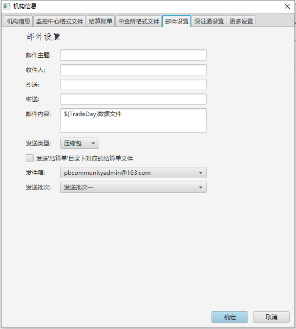

#### 【深证通设置】

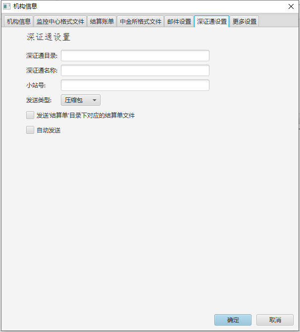

- 深证通目录：作为发送文件目的地的关键信息，必须设置正确；

- 深证通名称、小站：可以按需维护，对于本系统来说只是一种标签，系统不做检验和发送时的识别处理；

#### 【更多设置】

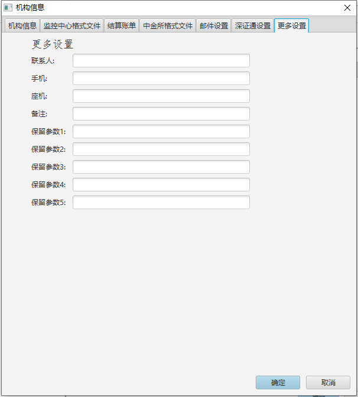

### 文件设置

**8.可以在"设置"-\>"文件设置"菜单中细化特法客户的具体配置**

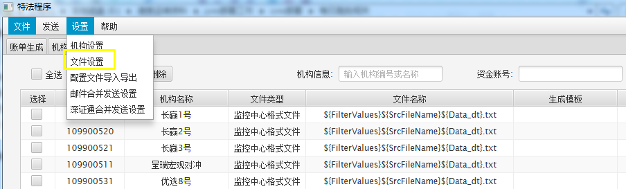

**文件设置，属于进阶设置，是对【机构设置】的补充。**

比如某个客户既需要"逐日账单"，又需要"逐笔账单"，

而在【机构设置】-【结算账单】中只能设置其中一种，

那么另一种就可以在这个"文件设置"界面下通过新增所需要的文件类别来达成。

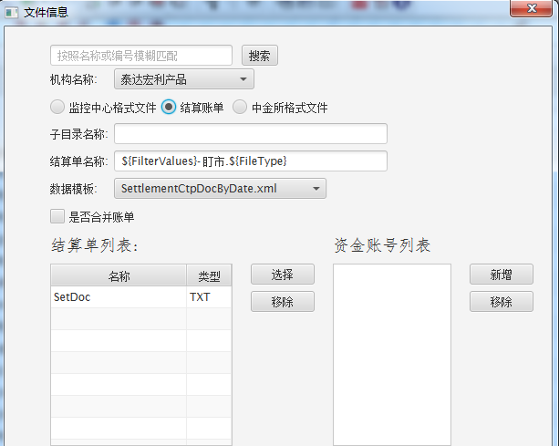

新增"文件设置"的界面，跟"机构设置"界面基本一致。

### 邮件&深证通合并发送设置

**9.邮件发送以及深证通合并发送的配置界面：**

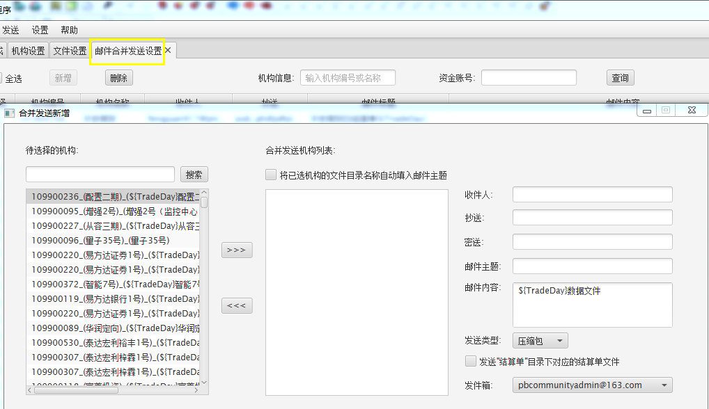

A.邮件合并发送配置界面

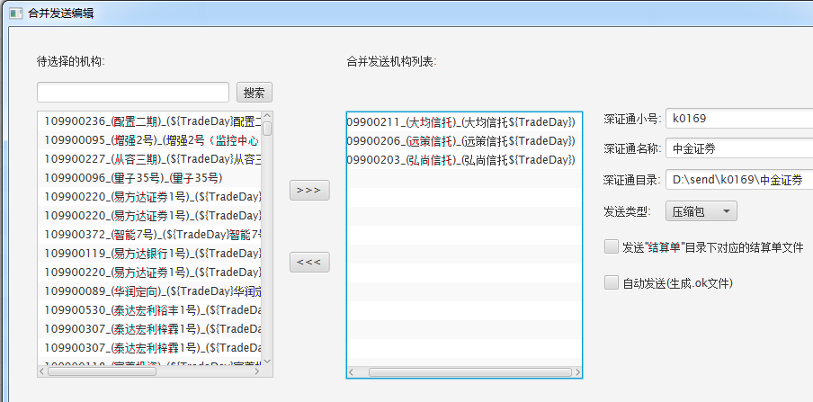

B.深证通合并发送配置界面

**邮件/深证通发送功能介绍**

合并发送机构列表：

通常一般是一一对应，一个特法账号发一封邮件；

但程序也支持多个不同账号的特法客户数据包，或者同一个特法账号但特法文件种类或命名不同的多个特法数据包，通过同一封邮件/深证通发送给客户

**发送类型：** 下拉框选择，发送的是压缩包，还是未压缩的文件夹

**发送"结算单"目录下对应的结算单文件：**

此功能是用于客户需要额外单独发送未压缩的结算单TXT文件，不需要的不用打勾

**是否"自动发送"：** 针对深证通发送的功能，勾上后特法程序会在发送特法数据包的同时，自动生成OK标识文件到深证通的程序下，触发发送指令，以此实现自动发送的效果。

### 发送：邮件/深证通

**10.发送邮件/发送深证通**

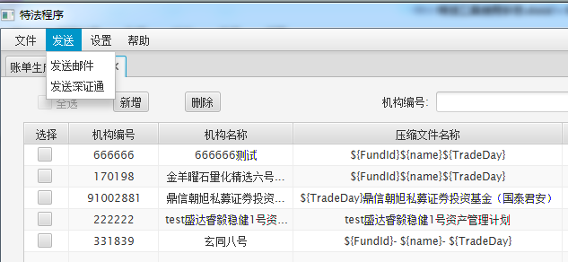

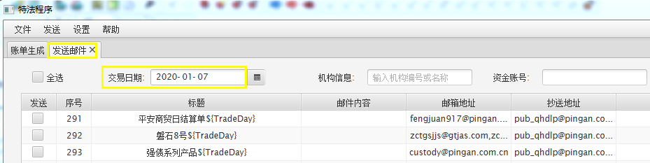

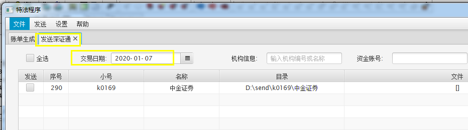

邮件/深证通发送界面 ，注意选择正确的"交易日期"，即特法数据文件的日期

**注意事项**：

（1）**发送邮件**：需要机器能连接外网。如本机可连外网，则可以直接在本机操作；如不能，需要把整个特法文件夹"特法生成发送工具.zip"拷贝到另一台可以连外网的机器上，然后再执行发送邮件的操作。

（2）**发送深圳通**：需要机器能访问深证通所在文件夹。如本机可直接访问，则本机上执行；否则也要把整个特法文件夹拷贝到可以访问深证通文件夹的机器上，再执行发送。

（3）当压缩rar文件结果变成zip或rar文件无法成功压缩时，可能是由于本地电脑没有将WinRAR解压程序配置进系统环境变量，具体操作可参考：[如何添加环境变量或路径添加到系统的Path里面](https://jingyan.baidu.com/article/db55b6099d1e0d4ba30a2fc0.html)

### 配置文件导入导出

11.配置文件导入导出

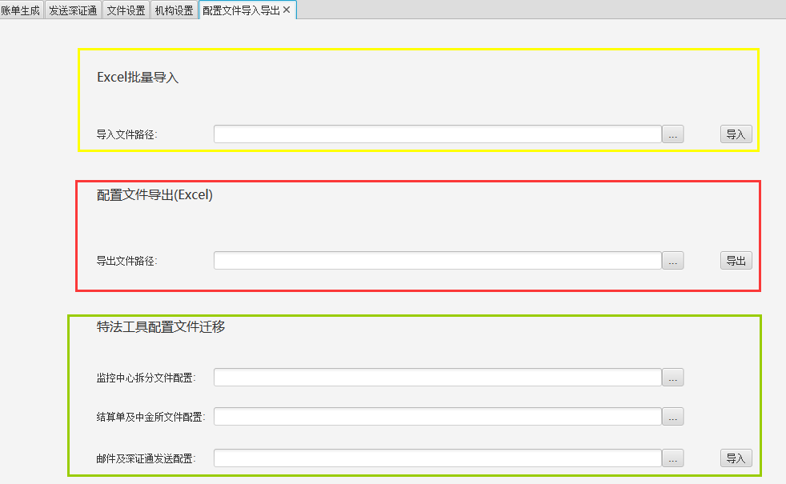

【设置】-【配置文件导入导出】界面介绍：

**Excel批量导入：** 结算部同事参照德索提供的Excel模板，把特法客户配置维护好，支持批量导入特法客户；

**配置文件导出（Excel）：** 把当前后台中所有的特法客户配置，导出成一个Excel文件；

**特法工具配置文件迁移：针对原先使用德索老版本特法工具的客户。** 通过导入本地的3个XML配置文件，转化成适用于新特法配置的数据库记录，从而实现新老特法工具客户配置的批量迁移。
