# 合同管理

## 0、系统描述

本模块是德索CRM的一个子模块，功能主要是围绕合同的管理来展开。

[下载:【手册】德索合同管理模块v1.0版本使用说明.pdf](/pdf/【手册】德索合同管理模块v1.0版本使用说明.pdf)

模块建设目标是：管理（期货公司）客户的所有合同，包含电子合同、纸质合同及其影像。

模块功能示意图：

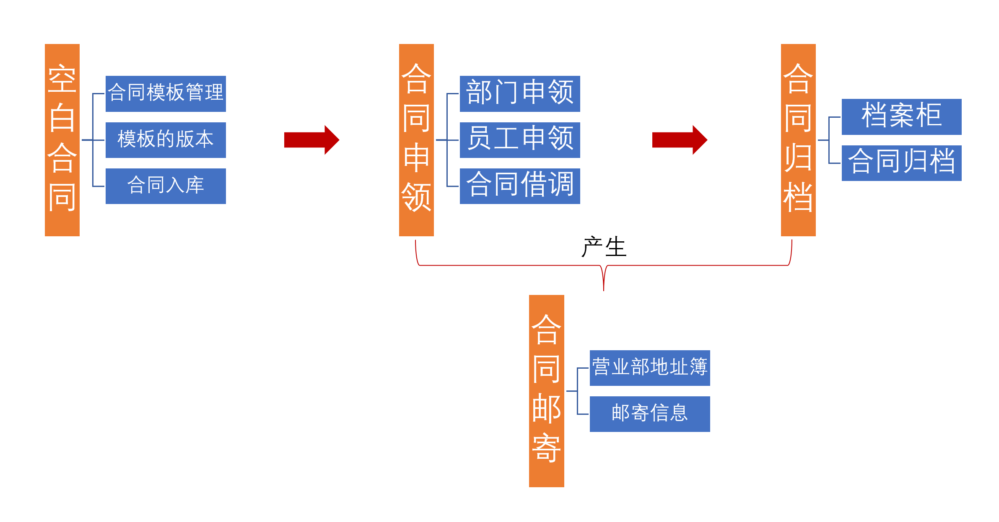

菜单数据权限控制情况：

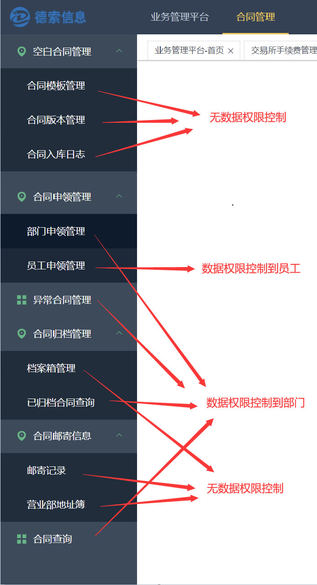

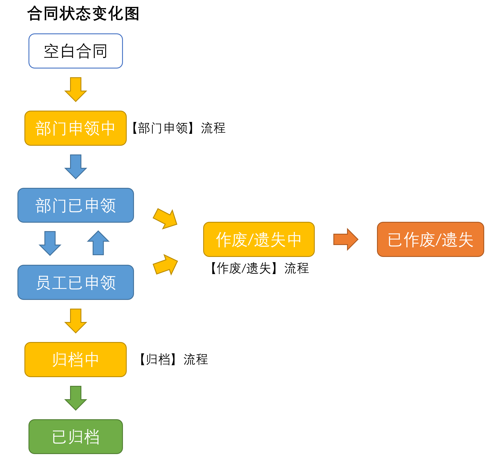

手册将分俩部分来介绍：1、合同模块的基本介绍与使用；2、搭配流程来使用。

## 1、空**白合同管理**

**合同模板**也可以称作**合同类别**（如期货开户合同），一个**合同模板**下可以有很多个版本（如2022年期货开户合同），然后针对合同版本可以进行入库（即将印刷好的纸质合同记录到系统）。

### 1.1、合同模板

新增合同模板

### **1.2、合同版本**

新增合同版本

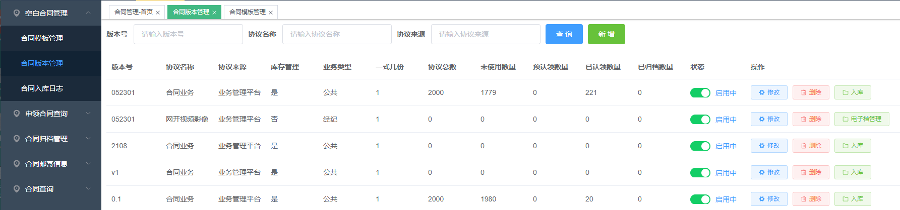

### **1.3、合同入库**

系统中我们通常把需要严格**有合同编号**的称作**正式合同；没有合同编号**的称作**协议合同**。他们通过【合同模块】中的**"是否库存管理"**来区分。

正式合同类可以登记库存（批量登记合同编号），之后每个合同编号都可以在系统中查询到。而对于协议类合同，系统只管理其电子档案，+至于是否需要印刷（打印）成字纸文件，印刷多少份，系统不做管理和登记。

所以合同的入库分为**正式合同**的入库和**协议合同**的上传电子档

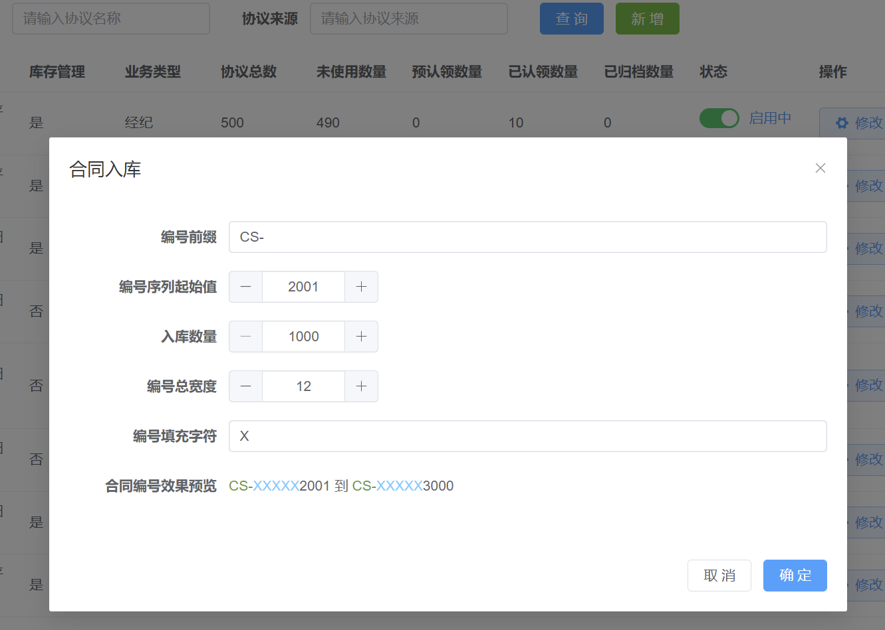

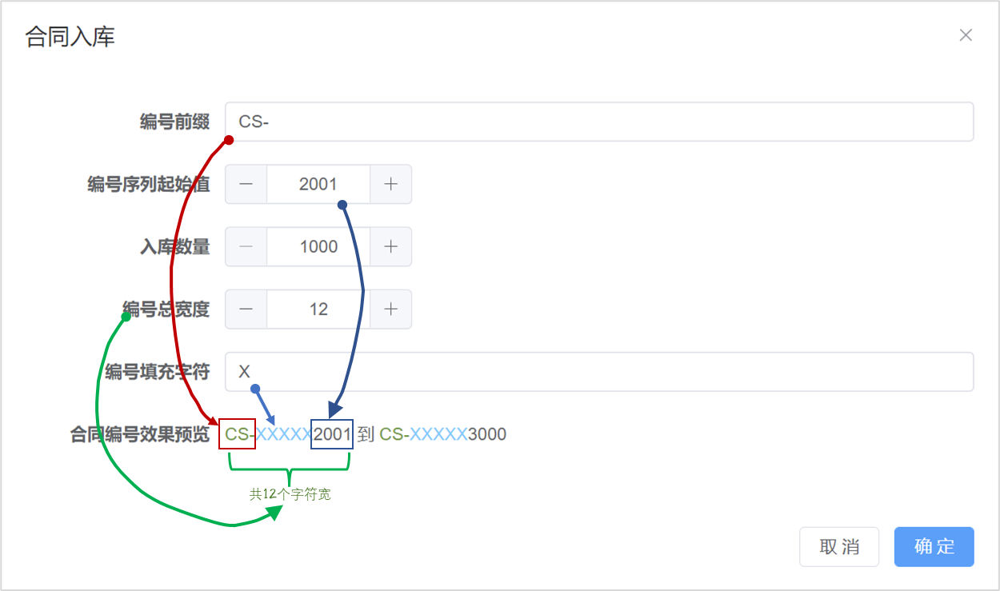

合同版本也能维护电子母版。

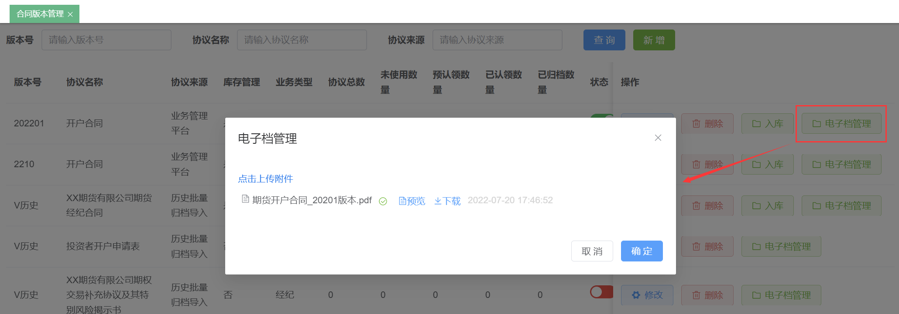

## 2、合同申领和借调

### 2.1、**部门申领**和**员工申领**

合同申领分为**部门申领**和**员工申领。部门申领页面**实现了**部门数据权限**（操作员只能看到自己部门内的申领）。**员工申领页面**实现了**员工数据权限**（操作员只能看到自己的申领）

**部门申领**是指部门向总部发起申领空白合同（或协议）的流程。申领流程是在业务管理平台的【业务审批】中体现。

**个人申领**是指业务人员向所在部门进行申领，可直接登记来申领。

**注：**

部门的 **"分配合同"** 和员工的 **"个人申领"** 这俩个功能，其实是针对不同场景的同一个功能。**"分配合同"** 是给部门中合同专员用的；**"个人申领"** 是给员工自己用的；目的都是把合同挂到员工名下。

同理，部门的 **"收回合同"** 和员工的 **"返还合同"** 这俩个功能也是一样。都是把合同从员工名下转移到部门中来。

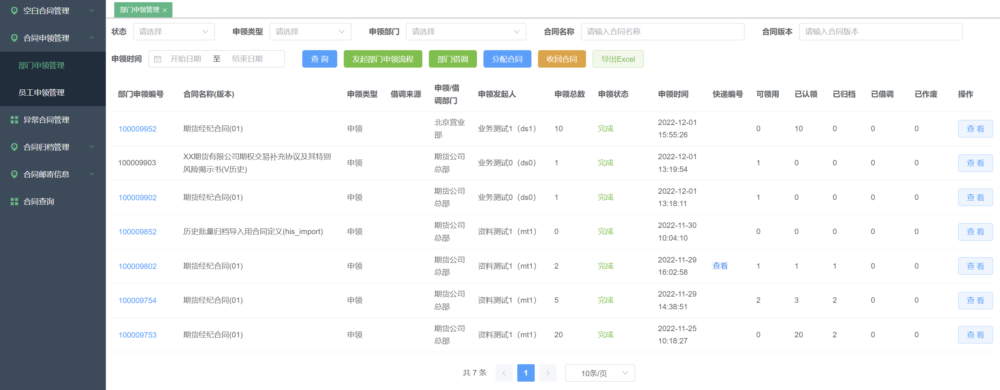

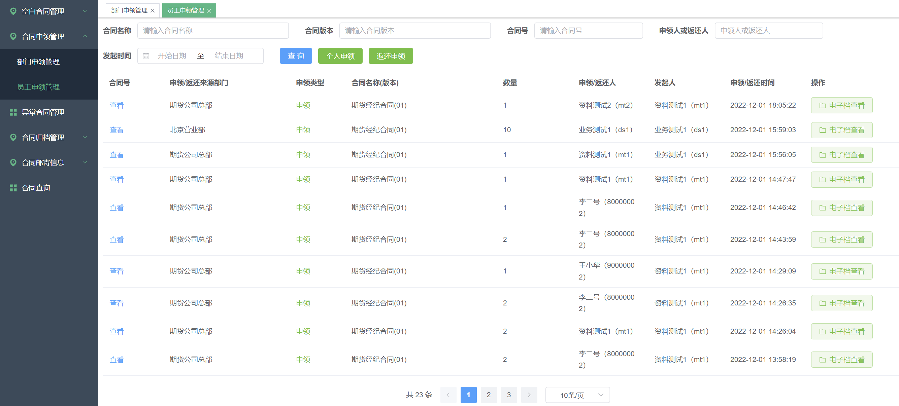

### 2.2、合同借调

可以进行部门间的合同借调。要借调出去的合同时需要在部门名下的，如果合同已经被部门内的员工申领了，则需要员工将合同先【返还】给部门再可以借调出去。

注：【部门借调】权限是需要总部员工

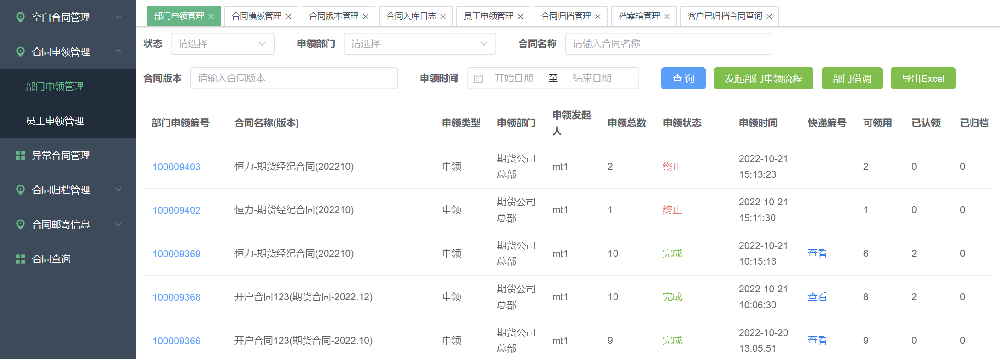

## 3、合同归档管理

可查询**已归档的合同**，可以记录**档案箱**。

**档案箱**的作用主要是用来代表实物合同的存放地。有的期货公司托管于文件存管机构，有的期货公司有自己档案室，都可以通过档案箱来标识出来。

### 3.1、档案箱管理

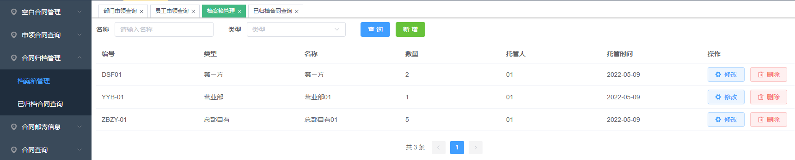

### 3.2、已归档合同查询

该页面实现了数据权限（操作员只能看到自己部门内的合同）

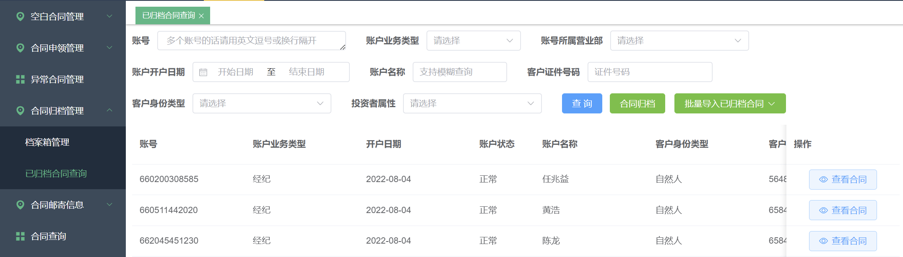

## 4、合同邮寄信息

主要包含了**营业部的地址簿**和**邮寄信息查询。**

**部门申领**空白合同、**合同归档**都可以产生邮寄信息。这里是从邮寄的角度去查询分散在各处的邮寄信息。

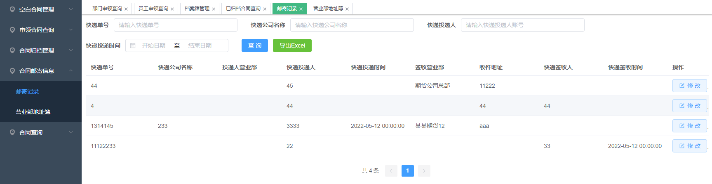

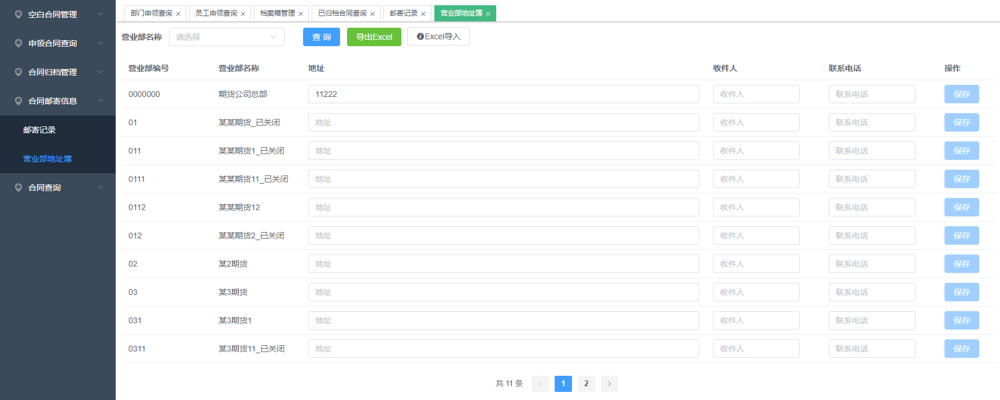

:::tip
- 营业部列表，来自CRM后台的组织架构树，此处不可新增。
- EXCEL导入：即通过导入EXCEL文件的方式来实现营业部地址信息的批量修改。
:::

## 5、合同查询

查询所有入库的合同，该页面实现了**数据权限**（操作员只能看到自己部门内的合同）

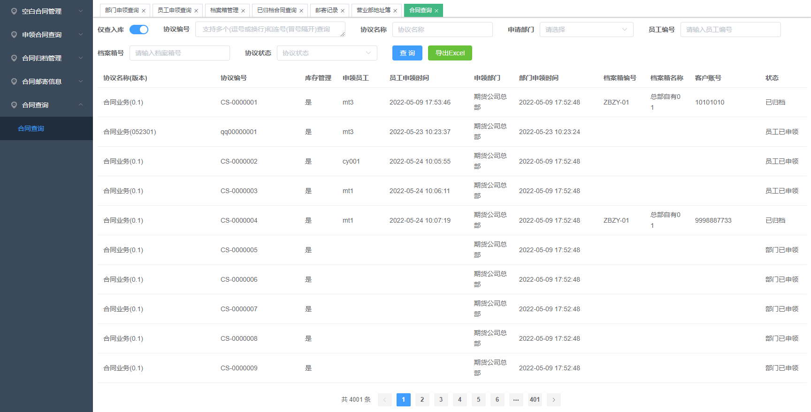

## 6、搭配流程使用

部门申领、合同归档、合同作废这些个业务可会涉及物流，会需要跟踪和确认，所以提供用流程的方式来表达这个业务。**要使用流程，是需要对德索的【业务管理平台】有一定的了解。**

流程的发起可以在【合同管理】模块内发起也可以【业务管理平台】模块内发起，作用一样。流程的审核是在【业务管理平台】模块内进行的。

当然，也运行设置为【业务管理平台】不能手工发起【合同管理】模块的流程。所以，根据偏好来选择即可。推荐通过【业务管理平台】来发起流程。

另外，【合同管理】模块在上线之初会初始化 部门申领、合同归档、合同作废、合同遗失(作废)4个流程。也允许管理员对流程进行进一步的调整，如调整审核节点，调整控件的可见/可编辑权限等等。

### 6.1、部门申领流程

发起部门申领流程

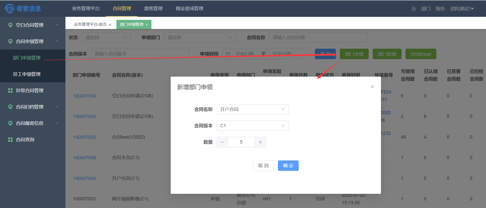

管理员可以在【业务管理平台】中进行申领流程的审核。合同归档、合同作废 同理。

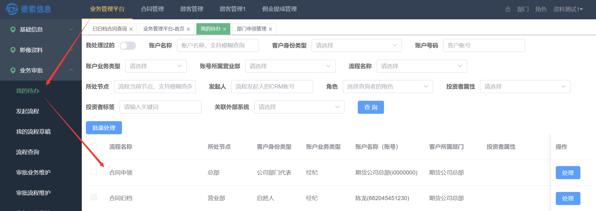

### 6.2、合同归档流程

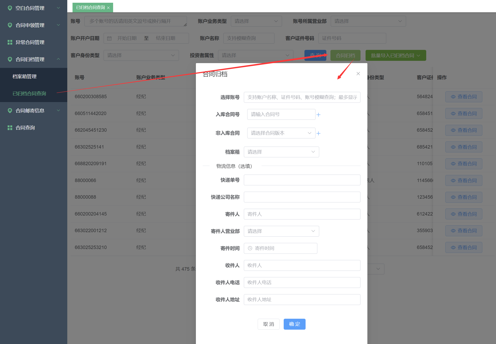

### 6.3、合同作废(遗失)流程

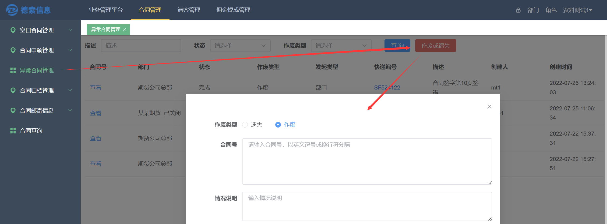

## 7、其他新增功能

### 7.1、增加柜台中资金账号与合同编号的绑定关系(2023.5.10)

我们知道柜台开户时会登记合同编号，合同模块里面也会记录客户，本功能会显示合同与与俩边的关系，并提示不一致的情况。

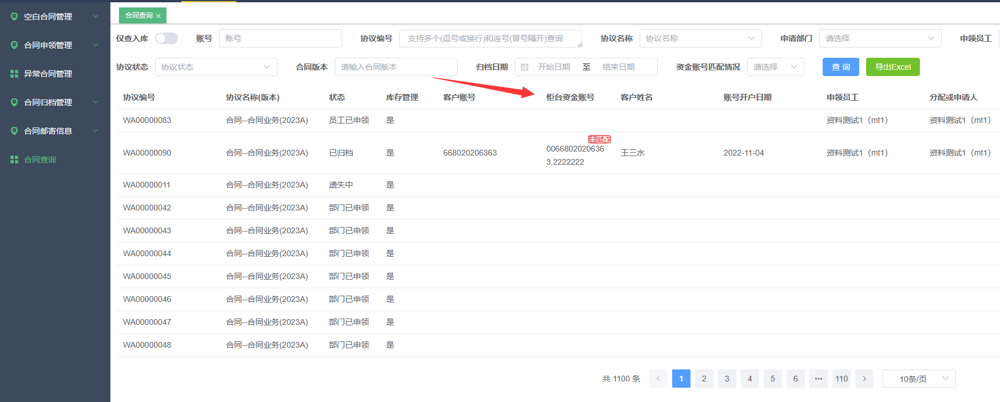

### 7.2、【邮寄记录】页面增强(2023.5.10)

查询条件增加了"合同编号"；显示内容增加了流程信息、合同信息。

从而实现：通过合同编号查快递信息；通过快递信息查合同编号

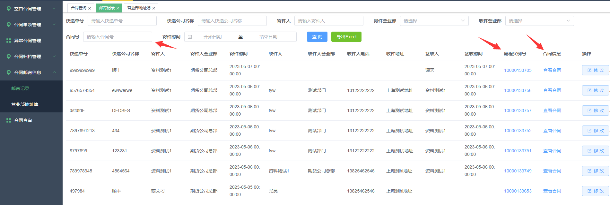

### 7.3、邮寄信息控件改进(2023.5.10)

寄件人/寄件营业部/签收人设定为默认操作员或所属部门，寄件时间/收件时间默认操作日；

显示收件人的营业部，且收件人处可以联想出【址簿里面】的部门或收件人。

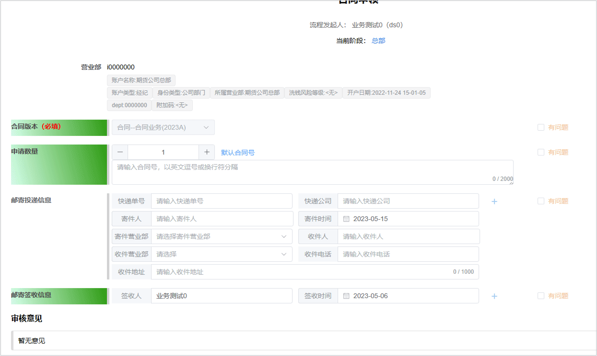
