# 报表中心

## 一、系统内置报表包含：

- 基础报表
  - 交易统计表
  - 月度交易统计表
  - 费用顺序表
  - 资金对帐表
  - 月度资金对帐表
  - 交易统计表-日
  - 费用顺序表-日
  - 资金对帐表-日
  - 客户排名统计
  - 客户风险状况表
  - 客户结算资金查询

:::tip 注:
这部分报表保留投资者营业部变更历史，而柜台只保留客户的最新部门归属；

- 最新归属，是以客户的视角统计数据，客户当天在哪个机构，则客户所有数据都归属到这个机构。

- 历史归属，是以营业部管理视角统计数据，客户每天的数据归属于当天客户所在的机构，客户的归属的变动体现在每天的明细数据中。

且德索系统根据期货公司的要求，支持不同的变更日期处理方式：

一、变化时间在月中某天，如果是按整月划定归属，则当月的客户数据都划归新部门；

二、变化时间为月中某天，如果是按天划定归属，则当月的客户数据会同时归属于新旧两个部门，按月查询时，会出现两条记录；
:::

> 交易统计表 - 部分字段解释:
>
> 保证金，实指公司保证金；
>
> 日均成交手数 = 每日成交手数之和/期间交易天数
>
> 日均成交额= 每日成交额之和/期间交易天数

> 资金对账表 - 部分字段解释:
>
> 手续费周转率 = 留存手续费/日均权益

> 客户综合情况表 - 部分字段解释:
>
> 风险级别，取自交易系统
>
> 期末风险度1=公司风险度=公司保证金/权益
>
> 期末风险度2=交易所风险度=交易所保证金/权益

- 客户报表
  - 客户资金对帐表
  - 客户交易统计表
  - 客户持仓查询
  - 客户成交明细查询
  - 客户出入金流水
  - 客户交割情况表
  - 客户强平情况表
  - 客户强平统计表
  - 客户综合查询
  - 客户交易编码查询
  - 客户实际手续费率查询
  - 客户手续费率查询
  - 手续费模板信息查询
  - 客户手续费率模板查询
  - 客户保证金模板查询
  - 投资者基本信息查询
  - 行权明细表

:::tip 注:
【客户报表】则同柜台保持一致逻辑，只记录客户当前的最新归属。
:::

- 营业部报表
  - 营业部综合情况月报
  - 营业部统计年报
  - 营业部客户权益结构表
  - 营业部成交金额分布情况
  - 营业部交易编码申请统计表
  - 营业部开销户查询
  - 营业部客户情况表
  - 营业部市场份额表
  - 月度新开户统计表
  - 指定时段开户客户情况表
  - 指定时段市场占有率统计
  - 营业部夜盘统计表
  - 月度指标统计表
  - 营业部强平追保情况表

:::tip 注:
此栏目下的报表，按"营业部"维度进行统计的报表，不一定是能直接下放给营业部人员看的，因为有些报表可能没有做数据权限控制。
:::

> 营业部综合情况表 - 部分字段解释：
>
> 盈利客户数=总盈亏\>=0的客户
>
> 亏损客户数=总盈亏\<0的客户
>
> 净盈利客户数=净盈亏\>=0的客户
>
> 净亏损客户数=净盈亏\<0的客户

> 营业部统计年报 - 部分字段解释：
>
> 手续费流转率：统计期内 手续费之和\*天数/每日权益之和
>
> 日均权益：AVG(每日期末权益),统计期内每天的期末权益之和/交易日天数
>
> 平均可用资金：AVG(每日可用资金),统计期内每天的可用资金之和/交易日天数
>
> 赢利客户数：总盈亏\>=0的客户
>
> 亏损客户数=总盈亏\<0的客户
>
> 盈利面：赢利客户数/总客户数
>
> 平仓盈利人数：统计期内 累计平仓盈亏（逐日）\>0的客户数

> 营业部客户综合情况表 - 部分字段解释：
>
> 盈利客户数=总盈亏\>=0的客户
>
> 亏损客户数=总盈亏\<0的客户
>
> 净盈利客户数=净盈亏\>=0的客户
>
> 净亏损客户数=净盈亏\<0的客户
>
> 有交易客户：统计期内有持仓或有成交或者交割

- 公司报表
  - 分品种交易量统计
  - 月度市场品种统计表
  - 月度公司品种统计表
  - 交易量统计表
  - 公司交易所成交统计表
  - 各席位资金持仓报表
  - 月度客户类型统计表
  - 席位资金查询
  - 持仓汇总表

- 监管报表
  - FS4营业部列表维护表
  - FS4上_境内分支机构报表模板
  - FS4下_境内分支机构报表模板
  - FS5:IB营业部维护表
  - FS5:IB营业部经营情况表
  - F19经纪业务手续费净收入
  - 上市公司客户统计
  - 上市公司客户明细统计

- IB报表
  - IB营业部手续费对应表
  - IB营业部期末权益对应表
  - IB营业部日均权益对应表
  - IB营业部开户数对应表
  - IB营业部净手续费对应表

## 二、功能介绍

报表中心，除了内置的常用报表之外，也提供个性化定制的功能，可以针对具体的报表做字段的增减及计算逻辑的调整，最终目的，是减轻中后台人员手工制表的工作，将重复的，规则明确的报表集中到系统中来展示与管理，让中后台人员从繁复的基础制表工作中解放出来，从而能够支撑公司更多业务运营上的需求。

### 1.营业部管理

若柜台定义的组织架构不适用于实际的运营管理，则可以在德索系统上，自定义统计范围及口径。营业部管理用于定义报表数据的选择范围，可以设置不同的数据级别，从分公司、营业部、IB多个角度划分数据范围。

- 分公司维护 & 营业部归属分公司维护

维护分公司，再将某几个营业部或统计团体归属于某一个分公司的情况；

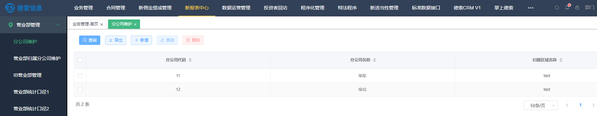

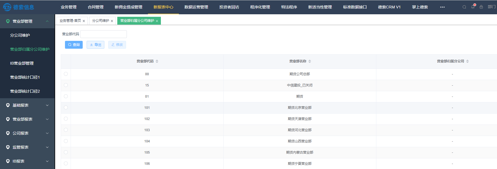

后续以此作为统计口径，可以出具分公司统计维护的报表；

- IB营业部管理

用于对应期货营业部与IB营业部的关联关系，实际影响【IB报表】模块的数据统计范围；

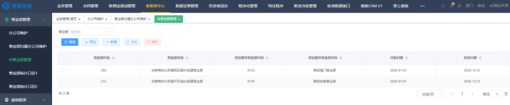

- 营业部统计口径1

只是一个例子，用于将个别营业部的数据合并到指定的部门去，满足实际归属与统计归属不同的情况。

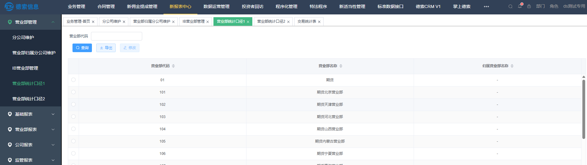

实际使用，通过报表查询条件中的机构类型进行区分，可以理解成对数据按不同的营业部层级进行统计。

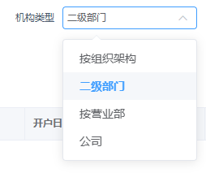

- 营业部统计口径2同"营业部统计口径1"

### 2.报表分类

报表按照生成方式大致分为：

- 行列式报表

> 表头固定，每行数据跟表头保持一致。
>
> 

- 指标报表

> 每个数据项分散在表中，位置没有一定规则。
>
> 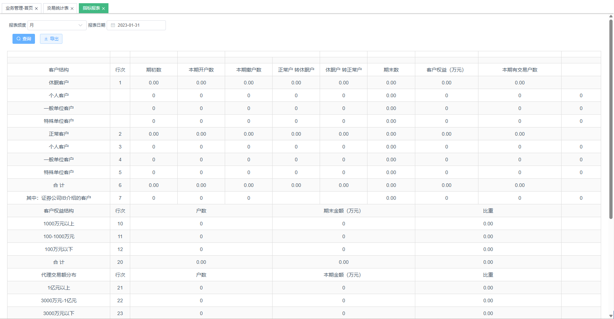

- 交叉报表

> 报表标题同时在上方和左边。
>
> 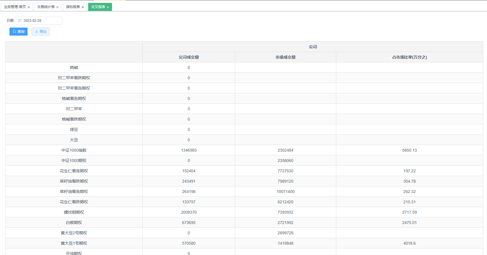

- 图表报表

> 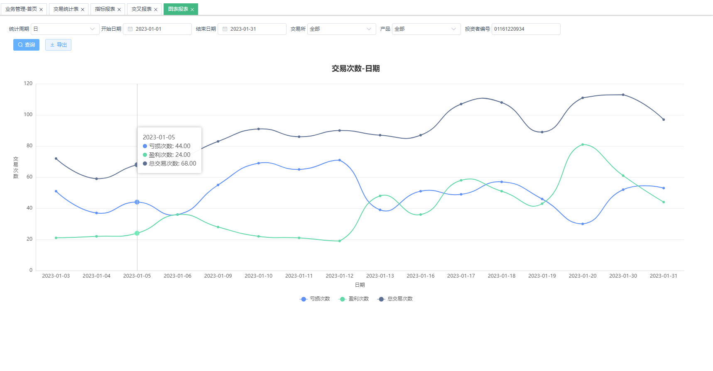

### 3.查询条件

报表支持多个查询条件，一般情况，条件均在报表上方；

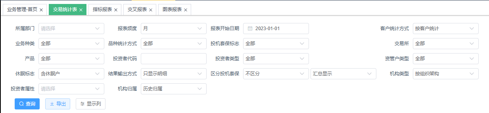

查询条件支持如下几类：

- 部门：指客户所在的营业部，以树状展现出来的；

> 选中需要查询的机构，点击【确定】即可；

- 报表日期选择

> 
>
> 报表频度有如下选择：
>
> 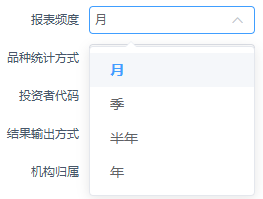
>
> 选择"月"的时候，只查询"报表开始日期"所在月份的数据
>
> 选择"季"的时候，只查询"报表开始日期"所在季度的数据
>
> 选择"半年"的时候，只查询"报表开始日期"所在半年的数据
>
> 选择"年"的时候，只查询"报表开始日期"当年的数据

- 其它下拉菜单

> 只支持单选，只要选择其中一项即可；

- 输入数据

> 
>
> 如果需要限定某一个客户的数据，此时需要输入某个投资者代码。

- 默认参数

> 目前，有如下两个默认参数可能参与报表查询，这些都在开设用户信息的时候进行了设置；

- 用户归属部门：限制用户只能查看自己归属部门的数据；

- 用户报表数据类型：限制了用户查看数据的统计口径。

> **统计口径分两类：原始指用户看到的客户归属是与交易系统设置的一致；实际则指为了管理需要，将客户的归属进行了调整，用户进入系统查看的报表是调整后的统计口径。**

### 4.分页规则

系统报表默认每页显示50行数据，每次查询会单独拿出当页的数据，都会向服务器发送一次请求获取数据。

行列式报表会在报表右下角显示，总行数及当前页等信息。

### 5.报表操作

- 筛选条件的收起与展开：

- 展示列的排序，是否展示，冻结：

- 字段的复制：

- 导出：直接点击报表查询框旁边的【导出】按钮即可导出Excel文件。

### 6.部分名词解释&公式

#### 1）总体资金情况

- 当日结存（逐日）=上日结存＋当日出入金－总手续费+总盈亏＋当日权利金收支

- 客户权益=当日结存（逐日）+当日质押金额

- 可用资金=客户权益-保证金-冻结资金

- 当日出入金（净出入金）=今日入金-今日出金

- 可提资金=客户权益-保证金-质押-冻结资金

- 期权市值=期权买方市值－期权卖方市值

<!-- -->

- 期权买方市值＝∑（期权合约最新价×每手数量×买方合约持仓数量）

- 期权卖方市值＝∑（期权合约最新价×每手数量×卖方合约持仓数量）

<!-- -->

- 客户市值权益=客户权益+期权市值

- 权利金=期权合约成交价格×合约乘数×手数

<!-- -->

- 期权权利金收入：期权卖方收入权利金

- 期权权利金支出：期权买方支出权利金

- 权利金收支=期权权利金收入 - 期权权利金支出

#### 2）手续费&盈亏

- （总）手续费

> =上交手续费+留存手续费
>
> =交易手续费+交割手续费+行权手续费+履约手续费

- 交易手续费：含开仓手续费、平仓手续费、平今手续费；

- 交割手续费：期货交割产生的费用；

- 行权手续费：期权买方提交行权申请需收取的费用；

- 履约手续费：期权卖方履约配对需要收取的费用；

> 如上各项手续费，均为期货公司收取投资者的手续费，其中已经包含了投资者保障基金；

- 上交手续费=上交交易手续费+上交交割手续费+上交行权手续费+上交履约手续费

> 上交手续费，意为期货公司上交给各交易所的费用；

- 留存手续费 =（总）手续费-上交手续费

> = 留存交易手续费 + 留存交割手续费 + 留存行权（&履约）手续费

- 投资者保障基金：由期货公司代收、上交给投资者保障基金协会的专项费用；

<!-- -->

- 一般包含在交易手续费、交割手续费和行权手续费中；

- 留存手续费，其中包含了投资者保障基金；

<!-- -->

- 总净留存 = 留存手续费 - 投资者保障基金

- 净留存手续费 = 留存手续费- 投资者保障基金 - 返佣

- 总盈亏 = 持仓盈亏（逐日）+平仓盈亏（逐日）+期权执行盈亏

<!-- -->

- 持仓盈亏（逐日）、平仓盈亏（逐日）：仅期货使用；

- 期权执行盈亏：现金交割类型的期权品种（比如，沪深300股指期权IO），在最后交易日以标的结算价计算期权合约的执行盈亏，直接以现金结转给投资者；

<!-- -->

- 纯利/净盈亏 = 总盈亏 - 总手续费

#### 3）保证金

- 保证金=当日客户的持仓保证金+交割保证金

- 公司保证金=当日客户的公司持仓保证金+公司交割保证金

- 交易所保证金=当日客户的交易所持仓保证金+交易所交割保证金

- 交易所保证金 \<=公司保证金

#### 4）风险度

- 穿仓：客户权益为负

- 强平状态：交易所保证金-客户权益\>0 and交易所保证金\>0

- 追保状态：公司保证金\>客户权益\>=交易所保证金 and交易所保证金\>0

- 追加保证金= if(公司保证金-客户权益\>0 and公司保证金\>0) then 公司保证金-客户权益

- 风险度1·公司风险度：公司保证金/客户权益

- 风险度2·交易所风险度：交易所保证金/客户权益

#### 5）其他

- 原始归属：投资者在业务系统中所归属营业部

- 实际归属：投资者在内部管理中业绩实际归属营业部

- 有交易客户：统计期内有持仓或有成交或者交割

- 自然天数：统计期内的自然日天数

- 交易天数：统计期内的交易日天数

- 日均权益=AVG(每日期末权益) = 统计期内每交易日的期末权益之和 / 交易天数

- 日均权益（自然日）= 统计期内累计期末权益 / 自然天数

<!-- -->

- 非交易日，权益按上一交易日的期末权益计算；

<!-- -->

- 日均可用资金=AVG(每日可用资金) = 统计期内每交易日的可用资金之和 / 交易天数

- 日均可用资金（自然日）= 统计期内累计可用资金 / 自然天数

<!-- -->

- 非交易日，可用资金按上一交易日的可用资金计算；

## 三、报表使用示例

### 1.交易统计表表样

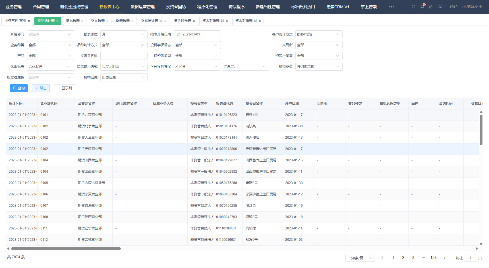

### 2.交易统计表统计字段

1) （总）手续费

2) 上交手续费

3) 留存手续费

4) 交易手续费

5) 上交交易手续费

6) 留存交易手续费

7) 平今手续费

8) 平今交易所手续费

9) 交割手续费

10) 上交交割手续费

11) 留存交割手续费

12) 投资者保障基金

13) 总净留存

14) 成交手数

15) 平今手数

16) 成交额

17) 日均成交手数

18) 日均成交额

19) 平今成交额

20) 总盈亏

21) 持仓盈亏

22) 平仓盈亏

23) 交割手数

24) 交割金额

25) 持仓手数-买

26) 持仓手数-卖

27) 持仓手数

28) 持仓金额-买

29) 持仓金额-卖

30) 持仓金额

31) 日均持仓

32) 保证金

33) 交易所保证金

34) 行权手续费

35) 交易所行权手续费

36) 履约手续费

37) 交易所履约手续费

38) 期权多头持仓市值

39) 期权空头持仓市值

40) 期权权利金收入

41) 期权权利金支出

42) 期权执行盈亏

### 3.交易统计表筛选条件及说明

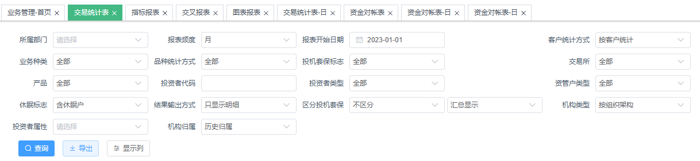

3.1 所属部门：可以勾选所需数据的层级，总部级别、营业部级别等；

> 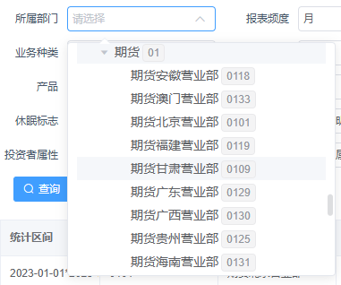

3.2 报表频度与报表开始日期：

> **月：** 报表开始日期选择需要查询的那一月的任意一天
>
> **季：** 报表开始日期选择需要查询的季度的任意一天
>
> **半年：** 报表开始日期选择需要查询的半年的任意一天
>
> **年：** 报表开始日期选择需要查询的年度的任意一天

3) 客户统计方式：

> 
>
> **按客户统计：** 以单个投资者为统计目标
>
> **按营业部统计：** 以营业部为单位统计
>
> **按组织架构+属性统计：** 以组织架构+投资者属性为单位统计
>
> **按组织架构+部门统计：** 以组织架构+部门为单位统计
>
> **按"-"统计：** 忽略此项统计条件，提高其他选项统计优先级。

4) 业务种类

> 
>
> **全部：** 查询所有期货和期权数据；
>
> **期货：** 仅查询"期货"数据；
>
> **期权：** 仅查询"期权"数据；

5) 品种统计方式：

> 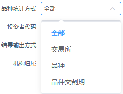
>
> **全部：** 查询合计数，例如：查询某时段所有交易数据
>
> **交易所：** 以交易所为统计方式，例如：查询某个交易所某段时间的交易数据
>
> **品种：** 以品种为统计，例如：查询某个品种的某段时间的交易数据
>
> **品种交割期：** 以合约为统计，例如：查询某个合约的交易数据

6) 投机套保标志：

> 
>
> **全部：** 对于查询结果的客户类型不做区分
>
> **投机：** 查询系统内标志为投机的客户
>
> **套保：** 查询系统内标志为套保的客户
>
> **套利：** 查询系统内标志为套利的客户

7) 交易所

> 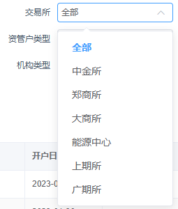

8) 产品

> 包含所有品种类型，根据查询目的选择品种类型。
>
> 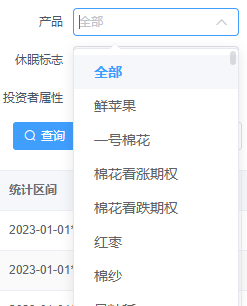

9) 投资者代码

> 即资金账号，用于查询已知投资者代码的客户交易统计数据；

10) 投资者类型

> 
>
> 用于筛选自然人、法人、特法、资管等客户不同类型；

11) 资管户类型

> 

12) 休眠标志

> 
>
> **含休眠户：** 即查询客户范围为全部客户；
>
> **不含休眠户：** 仅查询状态不是"休眠"的客户数据；
>
> **休眠户：** 仅查询状态为"休眠"的客户数据；

13) 结果输出方式

> 
>
> **只显示明细：** 显示明细数据，形成多条记录；
>
> **只显示小计：** 显示小计数据，形成单条记录；
>
> **显示明细和小计：** 显示明细数据和小计数据；

14) 区分投保套

> 
>
> **不区分：** 不同投保标志的合并统计；
>
> **区分：** 不同投保标志的分开单独统计；

15) 机构类型

> 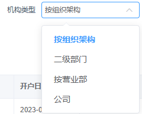
>
> 按组织架构：组织架构树中的叶子节点；
>
> 二级部门：组织架构中的二级部门；
>
> 营业部：组织架构中的营业部；
>
> 公司：一般针对组织架构中的一级部门；

:::tip 注：
【营业部管理】中的自定义营业部统计口径就是应用在这个筛选条件中，按统计归属来合并展示部门数据；
:::

16) 投资者属性

> 根据系统定义投资者属性，选定某类同一属性投资者进行查询。
>
> 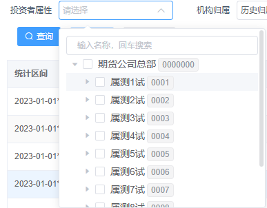

### 交易统计表查询示例

**"XX期货公司XX营业部，2023年1月，自然人，在上期所的汇总手续费是多少？"**

