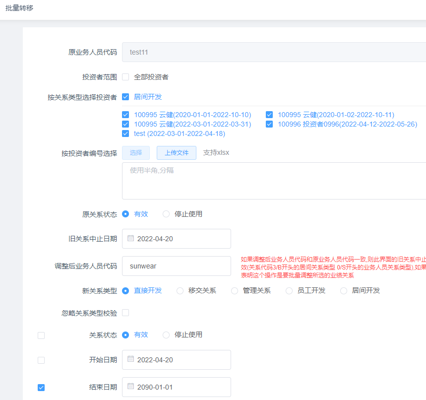
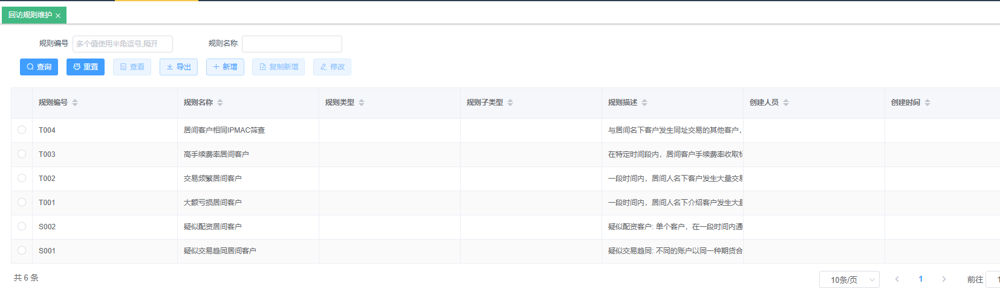
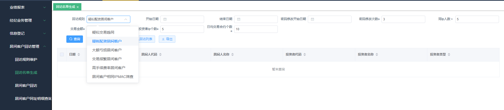
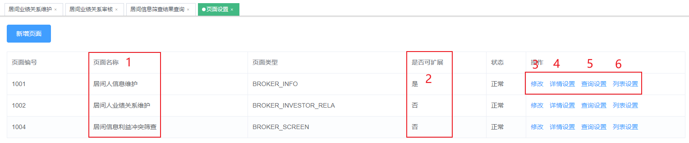

# 新佣金提成管理

## 一、背景说明

为了支持2021年开始试行，2025年正式发布的[期货公司居间人管理办法.pdf](/pdf/附件1：期货公司居间人管理办法.pdf)，帮助期货公司从容应对监管要求。

本次发布的版本将拥有以下特性：

1. 涵盖《居间人管理办法》中提到的功能点，例如利益冲突筛查，异常交易监控，居间人回访等；
2. 兼容老版本佣金管理模块的所有功能；
3. 报表查询启用了新的报表引擎，可以针对查询慢的报表做性能优化。
4. 页面的 **查询筛选项**，**列表项**，**详情页**的内容，支持**自定义配置**，包括顺序也可自行调整，满足各家公司的个性化需求；
5. 考虑到各家能平滑切换，新版在菜单和操作逻辑上保持与老版本一致，账号密码不变，点击新模块，系统会自动跳转，权限的开通方式也没有变化；

------------------------------------------------------------------------

## 二、参数管理

本模块主要用于维护投资者保障基金、公司利率、交易所年利率等基础参数。

### 1. 投资者保障基金比例设置

此处设置的投资者保障基金比例是全局的，影响投资者基础数据的计算；

### 2. 公司利率维护

用于维护公司内部核算客户利息贡献的利率，或者是给客户进行利息返还的基础参照利率。

:::warning 
设置多条记录时，不能存在时间交叉或重叠！否则，会导致重叠日期的利息基数被重复计算。
:::

### 3. 交易所年利率维护

用于维护公司利息收入的年利率，即各交易所返给期货公司的利率，一般全市场统一、不区分交易所设置。

:::warning 
设置多条记录时，不能存在时间交叉或重叠！否则，会导致重叠日期的利息基数被重复计算。
:::

## 三、软件费用计费

### 1. 终端特征码维护

此模块设计是针对投资者所用到的收费软件（例如开拓者、达钱这类交易服务终端），将它们视为类似于业务人员一样，进行其与投资者的关系维护、费用比例设置等，最终体现在《居间人员月度佣金表》、《营业部月度员工提成表》的软件费用列内；同时，根据需要，进行是否扣减增值税、是否扣减风险金的设置。

### 2. 投资者终端计费信息维护

此界面设置哪些投资者使用了需要收费的终端，开始计费的起止日期及提成算法（计费类型、计费基准、提成比例）；

- 终端特征码：列表选项加载自【终端特征码维护】；
- 投资者代码：即投资者的资金账号；
- 交易品种：仅在投资者需要区分品种进行差异化计费时才需要选择；
  - 默认选择“-”，表示针对所有品种合并处理，即不区分品种；
- 签约状态、开始日期~终止日期：设置此计费方式是否生效及生效起止日期；——建议：状态与起止日期勾稽关系保持一致；
  - 开始日期~终止日期：这个时间范围，默认采取头算、尾不算的模式；——仅此功能特殊处理；其余维护界面，均是头尾都参与计算！
- 计费类型：固定比例、分段；通常模式为“固定比例”；
- 计费基准：通常是“留存手续费”，但是也可以支持其他不同计费基数类型，比如 交易所手续费、成交金额、成交手数等；
- 固定提成比例（金额）：当“计费类型”-“固定比例”时设置该要素；假设“计费基准”是成交手数，此处可能填写的是一个金额；

::: tip
如果收费软件的“计费类型”需要使用分段模式，那么需要联系德索工程师！
:::

### 3. 投资者终端计费信息审核

对新增的计费终端情况，或者修改后的计费情况，进行审核确认。审核通过的，才会生效；否则，不生效。

### 4. 投资者终端计费信息查询

用于查询当前投资者使用计费终端的情况，包括软件、费用基准、收费比例、审核状态等。

### 5. 软件费用查询

可以按不同的投资者终端，不同的营业部等口径进行统计，计算某段时间内、使用了收费软件的客户其交易成交情况、各类手续费、终端费用、留存等信息。

### 6. 软件费用计算

此界面用于单独计算软件使用费，为应急功能，一般在发生【投资者终端计费信息维护】操作并审核通过、且需要看到调整数据生效结果时使用。

- 如果维护数据需要对上个月份生效，那么必须手工计算；
- 如果维护数据仅需要对当月生效，那么可以不执行，盘后跑批时系统会自动重算；

常见的业务流程是先计算软件使用费，再计算居间人、员工提成。

## 四、居间人管理模块 使用说明

主要包含以下几个子模块：

1. **居间人信息管理**：用于维护居间人员信息，包括资料和附件，并提供**利益冲突筛查**；
2. **居间人业绩关系管理**：用于维护业绩关系，包含提成比例，并提供**利益冲突筛查**；
3. **居间人业绩公式管理:** 用于维护比较复杂的提成计算公式，比如提成比例可以使用分段定额、分段超额的方式设置；
4. **业绩报表**：用于展示居间人业绩数据；
5. **防范利益冲突筛查**：记录居间信息 及 业绩关系数据产生的利益冲突筛查结果；
6. **居间客户回访管理**：按一定的规则(异常交易)生成需要回访的投资者列表及对应的回访动作；
7. **信息登记**：用于维护居间人培训，违规记录，客户投诉及处理情况；

此模块用以管理居间人基本信息、居间业绩关系、居间业绩公式等基础数据，提供单独针对居间主体发起佣金提成计算的功能，并可以查询居间主体的相关业务报表。

其中，此模块中维护的提成比例，主要是针对留存手续费部分的提成；而居间人提取名下客户的交易所返还比例和利息返还比例，则应该分别到【交易所返还管理】->【公式维护】、【利息返还管理】->【公式维护】中设置。

【居间信息管理】、【居间业绩关系管理】、【居间业绩公式管理】这几个子模块中，均可以进行“提成比例”设置，系统在各个主体佣金提成计算时按照一定的优先级来获取实际生效的提成比例：

- 居间业绩公式管理：优先级最高
- 居间业绩关系管理：优先级次之
- 居间信息管理：优先级最低

------------------------------------------------------------------------

### 1. 居间人信息管理

#### 1.1 居间人信息查询

用于查询、导出系统目前已经录入的居间人信息，**包括**所有**审核通过 及 未通过**的居间人信息。

::: tip
列表区的**公共字段**都支持排序，**自定义字段**暂不支持排序功能；

查询区的筛选条件 以及 列表区的表头 都支持自定义配置

双击列表区里的一条记录，可以查看该条记录的详情；

:::

查询的列表仅展示居间人的文字资料信息，附件类信息需要在详情页查看；

居间人信息在审核通过之后，对应的附件资料会自动归档到**影像资料系统**里；

可以在【影像资料查询】或者【服务归档查询】里，根据账号类型（选"居间"）能快速查到；

#### 1.2 居间人信息维护

居间人的增、删、改、查都可在此界面操作，其中查询功能与【1.1 居间人信息查询】一样，下面主要介绍增、删、改功能；

- **新增**

作为新增居间人信息的入口，页面的设计思路：

系统会提供一个**默认**的录入界面，包含行业通用字段，同时也支持期货公司根据自身需要调整录入界面的内容、顺序；

> 字段解释：
> - 根据居间人类型，选择自然人居间或法人居间；并根据居间人类型，填写相关证件信息等；
> - 所属部门：居间人归属的业务部门；此处的部门设置，跟其开发的投资者归属部门没有直接限制或约束关系；也即，投资者跟居间人不在同一个部门，也可能投资者分散在多个不同部门；
> - 状态：分活跃和注销，若“注销”则该居间人不再参与提成计算；
> - 开始日期 和 结束日期，对应居间合同上的日期，应注意此处的开始时间不能晚于【居间业绩关系维护】中的开始时间，否则日终数据处理的时候会将居间业绩关系中的开始时间置为居间人信息中的开始时间；
> - 默认提成比例、是否扣税、是否扣减风险金：默认是不需要扣税，并且扣除风险金；
>   - 这三项内容在【居间业绩关系维护】中也可以录入，根据期货公司自身的使用习惯可以进行灵活配置；
>   - 若两个地方都维护，居间业绩关系中的优先级更高，以【居间业绩关系维护】界面录入的为准；
> - 更多设置要素，以公司针对居间人信息管理要求为准。

新增保存之后，系统会自动**触发居间人的利益冲突筛查**程序，并将**筛查结果落地** *（筛查结果在【4 防范利益冲突筛查】中可以查看）*，然后进入审核环节，变成一条待审核的记录.

- **修改**

选中一条记录后，点修改按钮，进入居间人信息修改界面；

除了和新增界面看到一样的居间人详情页之外，修改页面在最底下额外增加了两部分内容：

一是**利益冲突筛查的结果**，可以看到是否通过筛查。

**注：**【修改】提交时，系统不会发起防范利益冲突筛查。

二是过往对这个居间人信息的**变更日志**。

- **删除**

支持多选删除；

当全选时，删除的是**当前页的记录**，而非所有查询结果。

删除后，需要在【居间信息审核】界面审核通过，才会真正删除；审核不通过，则该条记录恢复。

- **批量修改**

此功能主要用于：多条居间人信息的同一列希望批量更新成同一个结果。

例如：同时对一批居间人进行注销操作，或者更新合同结束日期。

下面以更新合同结束日期举例：

在列表界面选中这两条，点击批量修改

填入合同结束日期，同时记得将左边的复选框打上勾，表示为本次要更新的项目，然后保存。

在审核界面可以看到，这两个居间人的合同结束日期已经被批量置为新的日期。

#### 1.3 居间人信息审核

增删改都在此页面审核，审核通过之后才算正式生效；

支持单条审核 与 批量审核；

- **单条审核：**

除了和新增，修改界面看到一样的居间人详情页之外，修改的字段会自动高亮展示，审核按钮放在**右上角**：

- **批量审核：**

分为批量审核通过/不通过，操作方式就是左上角全选 *（当前页面记录）*，然后点击批量审核按钮，在弹窗确认即可 *（审批意见可选）*。

#### 1.5 居间人信息批量导入

此功能的主要使用场景有：

1. 批量新增一批居间人信息；
2. 批量修改一批居间人的若干个字段的信息；

操作的流程图如下：

下载模板之后，填写相应的信息：

如果碰到不知道如何填写的字段，可以参考码表sheet：

成功导入后，全选或者勾选部分记录，正式新增，则相当于批量录入了一批居间人信息；

选择正式更新，则会弹窗提示需要更新的字段，只有勾选的字段会将居间人的信息更新；

但都需要审核之后才算正式生效。

若填写的内容有误，导入时会有相应的提示：

::: warning 
**直接从查询列表内导出的数据，可能无法批量导入**，因为，查询列表内的字段可能并不全（因为用户可以在页面设置中设置哪些字段在列表内显示/不显示）。**建议下载模板后 ，根据模板进行数据填写再批量导入**。
:::

[批量新增居间人信息.mp4](/videos/批量新增居间人信息.mp4)

[批量更新居间人信息.mp4](/videos/批量更新居间人信息.mp4)

------------------------------------------------------------------------

### 2. 居间人业绩关系管理

此模块用以管理居间人与投资者业绩关系信息，包括关系有效期、提成&业绩占比、提成比例等信息。

居间与客户的业绩关系，是为居间人计算各种提成（留存手续费提成、交返提成、利息提成）的核心基础；虽然此模块设置的留存提成比例仅用于手续费提成的计算，但是这里关系设置的存在与否会直接影响是否给居间人计提其名下客户的交返提成和利息提成 及 围绕居间人主体的相关数据统计和报表展示；

即，如果居间人针对名下客户仅计提交返提成和利息提成、不计提留存手续费提成，那么也必须在此模块维护居间与单个客户的业绩关系、可以将留存提成比例设置为0。

#### 2.1 居间业绩关系查询

与【1.1 居间人信息查询】的使用逻辑一样，不再赘述。

#### 2.2 居间业绩关系维护

界面的使用逻辑与【1.2 居间人信息维护】大部分一样，通用部分不再赘述，这里仅介绍与业绩关系维护有关的内容；

首先，页面的设计思路：由于关系维护的字段往往需要参与到实际的佣金提成计算中，例如留存、交返、利息的提成比例、占比等，这些字段如果各家要添加，也是在后台添加，作为公共字段处理，自定义字段更多是用于补充一些资料信息。

> 字段解释：
> - 业务人员代码：即居间人代码；
> - 投资者代码：即投资者的资金账号；可以同时输入多个，用英文逗号分割即可；
>   - 如果部分投资者代码输入错误，则错误的不会被添加，但正确的依旧会被添加；
>   - 如果已经存在该居间关系，则会提示关系已存在，添加失败；
> - 关系类型：根据公司需求，后台配置可选项；
> - 关系状态：若为"停止使用"，则该关系失效；
> - 开始日期、结束日期：居间人与投资者业绩关系的生效起止日期；根据期货公司要求是否启用这个区间；——不过，应居间新规要求对接居间客户回访规则的过程中，德索总结经验，逐步趋向于建议应将"关系状态"与关系起止日期及时维护到位！
>   - 若启用了"结束日期"，则时间到了结束日期，居间关系失效，结束日期之后的交易日将不参与提成计算；如果居间人要续期，需要新增一条关系设置，在此续期之后，需要重新计算；
>   - 若不启用"结束日期"，则只是作为一项记录，并不影响提成计算；
> - 提成占比：将按给定公式算出的 居间返佣 * 提成占比 得到居间对此客户的最终返佣；
>   - 常用于多个居间人共享一个客户的情况，此时每个居间人的提成占比都小于1，但加起来刚好是1；
> - 业绩占比：同提成占比的使用方式，对相关业绩报表中业绩指标的统计产生影响；
> - 提成类型：若不填写，默认为留存手续费；
> 提成类型可以包含以下几种，按期货公司实际业务需要灵活配置：
>   - 留存手续费：留存手续费*提成比例；
>   - 交易所手续费：交易所手续费*提成比例；
>   - 交易所保底：在交易所手续费的基础上，按手数多收或按金额多收一个固定的比例，剩余的全部返给居间人；例如某品种，在交易所手续费基础上，按照每手加收2块钱，其余都返还给居间人这样的规则，在系统中也都可以实现。 
>   - 特殊：指个性化的公司保底设置；比如，手续费按手数收取的、固定收一个留底金额，按成交额收的、则按成交额的比例收取一个留底，其余再返给居间人。

最后，修改界面，在关系数据的最下方，同样引入利益冲突筛查结果 和 变更日志：

**注：**【修改】提交时，系统不会发起防范利益冲突筛查。

- **批量修改**

与居间人信息的批量修改类似，此功能主要用于：多条居间人业绩关系的同一列字段希望批量更新成同一个结果。

例如：同时对一批居间关系进行注销操作，或者更新关系的结束日期。

下面以批量更新一个居间名下所有客户关系的结束日期举例：

通过居间人代码快查询出所有该居间的关系，如果一页显示不全，可以通过右下角的显示数量控制展示所有条目。

在列表界面左上角选中全部记录，点击批量修改：

填写结束日期之后， 记得左边的复选框勾选上，再保存。

再次查询，就可以看到居间关系的结束日期已经批量更新，当然需要审核通过之后才算正式生效。

[居间业绩关系批量修改.mp4](/videos/批量更新居间人信息.mp4)

- **根据主键查询**

当然，很多时候是需要同时对一批居间人的部分业绩关系进行批量更新，光靠筛选区的查询条件无法满足要求时，可以使用按主键查询功能，举例说明：

一条居间的业绩关系，由居间人代码|投资者代码|关系类型|关系开始日期 唯一确定，所以只需要上传包含这四列的表格，就可以精确定位这一批关系，如下图所示：

将表格上传之后，再点查询，就能得到对应的居间关系，然后再进行批量修改即可。

[居间业绩关系根据主键查询.mp4](/videos/居间业绩关系根据主键查询.mp4)

- **批量转移**

针对需要将一个居间人名下的关系转移给另一个居间人或者客户经理的情况。

**部分字段说明**：

**投资者范围**：优先级最高，若勾选"全部投资者"，则表示**选中所有投资者**（**无论下方两个字段选择什么**）

**按关系类型选择投资者**：勾选某关系类型，下方对应的投资者会被选中

**按投资者编号选择，分为2步**：

首先，上传excel文件。系统会自动识别第一列的所有数据并放在文本框里。（因此，需要把投资者编号放在excel的第一列）

然后，点击"选择"，系统会自动匹配并在上方的投资者列表中勾选对应的投资者，如下图示。

**举例说明**，如现在需要将test11居间人的关系转给sunwear，可以勾选全部投资者，也可以按开发类型选择，或者可以通过excel列的形式上传需要转移的投资者。

**原关系状态**：表示test11被转走的关系是继续有效还是停止使用；

**旧关系中止日期：** 用于设置test11被转走的关系的结束日期，默认是系统当前日期；

**调整后的业务人员代码**：sunwear，可以是居间人也可以是客户经理；

**新关系类型**：如果居间开发类型同时存在好几种，需要进行选择；

**忽略关系类型校验**：如果是居间关系转给客户经理，则需要勾选，否则无法转移；

后面的字段，左边都有一个复选框，如果不打上勾，则新关系直接取老关系的值；如果打上勾，则新关系统一用这个结果。

如上图 操作之后，孙伟获得了新的居间关系，而且结束日期都变成了2090-01-01

[居间业绩关系批量转移.mp4](/videos/居间业绩关系批量转移.mp4)

#### 2.3 居间业绩关系审核

与【1.3 居间人信息审核】的使用逻辑一样，不再赘述。

------------------------------------------------------------------------

#### 2.4 居间业绩关系批量导入

与【1.4 居间人信息批量导入】的使用逻辑一样，同样支持批量新增 和 批量更新，不再赘述。

[批量导入居间业绩关系.mp4](/videos/居间业绩关系批量导入.mp4)

### 3. 居间业绩公式管理

#### 3.1. 居间业绩公式查询

选中某个居间人业绩公式，可以查看或者导出。

#### 3.2. 居间业绩公式维护

**3.2.1. 新增**

点击""新增"，填写居间业绩公式。

填写"业务人员代码"：填写，自动查询带出。

平今返佣标志：是否平今的交易参与返佣

"产品代码"不填写，则默认为所有产品；

"投资者代码"不填写，则默认为该居间人的所有投资者。

分段类型：默认三种，固定比例/分段定额/分段超额。

- 分段定额是指，达到了某一个分段，则整体按照对应提成比例提成；
- 分段超额是指，达到了某一个分段，达到部分按照对应提成比例提成。（因此 **分段超额必须适用于 分段基准-提成金额** 即 **提成类型** 的场景）

**分段基准：** 常见的是根据留存手续费、成交手数等进行分段比例的计算。分段基准可以根据期货公司的业务要求调整。

**提成类型：** 即要提成的金额。

**固定提成比例：** 当"分段类型"选择"固定比例"时，该数据有效。

**分段比例设置部分**，当分段类型选择分段定额/分段超额时有效。

举例如下：

**① 分段定额**

假设选择分段基准为成交手数，提成类型为总手续费X

分段提成设置如下：

则表示：

- 0\<成交手数\<-100，返还比例为0
- 100\<成交手数\<-200，将返还X\*0.5给该居间人
- 200\<成交手数，将返还X\*0.8给该居间人

::: tip
下限一般从零开始（即分段金额0 填 0），上限必须要填（最大不超过 999,999,999,999）
:::

**② 分段超额**

假设选择 分段基准 为 留存手续费，提成类型为 留存手续费X

分段提成设置如下：

则表示：

- 0\<留存手续费\<-100，返还比例为0
- 100\<留存手续费\<-200，将返还（X-100）\*0.5给该居间人
- 200\<留存手续费，将返还{（200-100）\*0.5|（X-200）\*0.8}给该居间人

:::tip
下限一般从零开始（即分段金额0 填 0），上限必须要填（最大不超过 999,999,999,999）
:::

[居间业绩公式维护.mp4](/videos/居间业绩公式维护.mp4)

**3.2.2. 修改**

已经审批通过的居间业绩公式，只能修改具体的提成比例，如下图所示

一般情况下主键不能修改(特殊情况下需要修改主键的话，可以联系技术人员设置)

**3.2.3. 批量修改**

勾选多条记录，点击批量修改

勾选需要批量修改的字段，输入最新信息后点击保存，则提交审批。

居间业绩公式审核、删除复核，与居间业绩关系模块类似，不再赘述。

#### 3.3. 居间业绩公式批量导入

操作逻辑与居间业绩关系批量导入类似。

首先，点击下载模板，根据实际数据及码表，填写需导入的数据。

然后，点击导入，针对已导入的内容，选择多条点击新增（针对新录入的业绩公式）或者更新（针对已经存在的业绩公式，可以选择部分字段进行更新）。

**注意：直接从查询列表内导出的数据，可能无法批量导入**，因为，查询列表内的字段可能并不全（因为用户可以在页面设置中设置哪些字段在列表内显示/不显示）。同时，居间业绩公式中的分段公式，为了方便显示，在查询列表内将分段金额与提成比例合并显示，如下图所示。**因此，请勿直接将导出的数据批量导入，建议下载模板并对应填写数据后再批量导入**。

系统操作与【2.5 居间业绩关系批量导入】类似。

### 4. 业绩报表

#### 4.1. 居间人月度业绩报表

该报表的表头（展示的字段列），会因各家公司业务人员考核办法需要和使用习惯的差异而有所不同。

### 5. 防范利益冲突筛查

利益冲突筛查，包含两部分业务数据 | 两套筛查逻辑：

新增，修改时会在 [1.2 居间人信息维护](./return.md#_1-居间人信息管理) 及 [2.2 居间业绩关系维护](./return.md#_2-居间人业绩关系管理) 中提交时直接触发；

居间人信息的利益冲突筛查流程如下：

居间人信息的利益冲突筛查说明：

1. **期货公司工作人员，员工的配偶、父母、子女及子女的配偶**：系统会使用居间人的名称|证件类型|证件号码 与 【员工交易行为排查】模块中录入的员工及近亲属信息进行匹配（*因此需要提前维护好员工及近亲属名单：【员工信息维护】和【员工近亲属信息维护】*）；

2. **开户代理人、指定下单人、资金调拨人、结算单确认人**：系统会使用居间人的名称|证件类型|证件号码 与 柜台获取的投资者关系人信息进行匹配；

3. **自然人居间的工作单位不能是与公司签约的法人居间**:系统会使用自然人居间的工作单位统一社会信用代码 与 法人居间的证件号码（应该采集其 统一社会信用代码）进行匹配；

其次，业绩关系维护也支持利益冲突筛查，流程如下：

居间业绩关系的利益冲突筛查说明：

1. **居间客户不得出现特殊单位客户**：系统会排查挂靠的投资者是否为特殊法人户；
2. **机构客户的法人代表、实际控制人、工作人员不得成为该机构与期货公司的居间人**：居间人如果是在职员工，系统将其证件号码与挂靠的一般法人户的法人代表，实际控制人进行匹配，将其工作单位的统一社会信用代码与挂靠的一般法人户的统一社会信用代码进行匹配；

:::warning 注意
实际控制人信息从德索反洗钱中获取，若无对接德索反洗钱，默认不筛查实际控制人。（若需对接外部数据源，请联系德索工程师支持）
:::

3. **居间人不得成为其本人及其配偶、父母、子女、子女配偶的居间人**：居间人录入业绩关系时，开发的客户不能是本人及本人配偶、父母、子女、子女配偶。

每日盘后触发，目的是当柜台里的客户资料发生变更，包括投资者关系人发生变更，以及员工近亲属信息发生变更时，系统能够自动筛查出存量居间人信息是否有利益冲突的情况。

筛中是存在利益冲突情况的，系统会记录详情，比如投资者代码、关系人类型及名称等，或者是员工代码、近亲属类型及名称等。

筛中记录，是以 **居间人代码|对象代码**（投资者代码/员工代码）为主键，相同主键的记录再次命中时，系统保存是以覆盖式处理，然后更新"时间"信息。

以 居间人 与 投资者及关系人 的筛查为例来说明：

（1）客户主体销户了，已经命中过的记录，则会成为"历史"无效记录保留，不会被删除；

（2）客户主体未销户，被命中过的关系人已经全部变更、不再命中，则已经命中过的记录也会成为"历史"；

（3）客户主体未销户，被命中过的关系人未完全变更，或者产生新的关系人被命中，那么历史命中过的记录会被做覆盖处理，系统会以"当前"结果展示最新的筛中结果；

根据业务数据分成两个页面：

#### 5.1 居间信息筛查结果查询

#### 5.2 居间关系筛查结果查询

#### 5.3 居间信息前置筛查

此功能主要用于将利益冲突筛查前置，以便于及时决定期货公司是否要跟此居间人建立居间关系。

界面【查询】结果，均为人工发起过的事前筛查的历史记录留痕：（【查询】≠本次筛查）

点击【新增】按钮，录入本次待筛查的居间人信息，以发起筛查请求：

点击右上角的【保存】按钮，系统会保存录入要素，并立即自动进行【居间人信息维护】阶段对应的利益冲突筛查内容（如下图所示），并输出展示筛查结果。

### 6. 居间客户回访管理

#### 6.1 回访筛查规则及描述

::: tip
（注：参数条件为“且”的关系，若只需单独筛查其中一项参数，另外两项参数值可设置为0）
:::

##### 6.1.1.多账户交易行为趋同

不同的居间客户账户以同一种期货合约为标的，在同一时间段内，在相同的价位进行方向相同的交易，我们把这些投资者列为疑似交易行为趋同的投资者。

筛查规则包含交易次数、成交金额、成交手数 3个可自定义调整的筛查参数，以满足各机构对筛查最低特征标准的自定义需求，或满足未来交易所的特定筛查要求。

同时，还计算出单项比对的相似度和综合比对相似度，在报表中支持调整“单次交易接近的比例”和“多次交易综合核定比例”这两个相似度阈值自定义控制筛查的严格程度。 

通过规则筛查出来的疑似交易趋同居间客户的明细情况，可在【居间客户疑似交易趋同明细查询】页面中进一步查询疑似趋同的对方投资者信息、合约名称、交易日期，以及成交明细详情。

##### 6.1.2.同址交易

识别在特定时间段内，使用相同IP地址或MAC地址登录/交易的不同期货投资者账户，特别关注这些账户与居间人之间的业务关系，以防范潜在的账户共享、违规操作等风险行为。

- 同址类型：
  - 地址类型：支持筛查“登录地址”或“报单地址”相同的场景。

  
  - 匹配方式：支持以下4种IP/MAC地址组合的匹配条件：
  

  通过规则筛查出来的疑似同址交易居间客户的明细情况，可在【居间客户同址明细查询】页面中进一步查询同址交易的居间客户IP地址、MAC地址和同址对方客户的信息。

##### 6.1.3.疑似配资

识别在特定时间段内，通过不同MAC地址接入交易，并且频繁修改密码的居间客户。

提供密码修改开始日期、密码修改次数、同ip人数、交易金额、同一个投资者ip个数、日均交易合约个数 阈值作为筛选参数。

##### 6.1.4.交易频繁

识别在特定时间段内，日均成交量超过一定阈值的居间客户。
提供**日均成交量（手）**阈值作为筛选参数。

##### 6.1.5.大额亏损

识别在特定时间段内，亏损超过一定阈值或比例的居间客户。

提供亏损金额和亏损比例 阈值作为筛查参数。

##### 6.1.6.手续费较高

识别在特定时间段内，总手续费超过交易所手续费一定比例的居间客户。

提供 佣金比率（总手续费/上交所手续费 的比值）阈值作为筛查参数。

#### 6.2 回访操作步骤

##### 6.2.1 回访规则维护

系统运维人员使用菜单，普通业务人员请谨慎授权！

此功能用于维护期货公司**自定义**的居间回访规则，可以支持：自定义 **筛查规则**、录入的**筛选参数（可带默认值）** 以及 **输出结果字段**。

##### 6.2 回访名单生成

选择某一个"回访规则"，输入对应的参数值（如果设置了入参默认值，那么筛选条件中会自动展示），点【查询】即可生成对应的回访名单结果，可以选择部分名单【加入回访列表】或者【全部加入回访列表】。

此功能，支持数据权限管理；即分支机构人员登录系统使用此功能，筛查结果仅显示本部门或者下级部门的客户。

此功能，建议仅授权给总部人员，不建议下放分支机构。

##### 6.3 居间客户回访

【回访名单生成】界面勾选加入的回访列表，会汇总到此界面展示。

**同一个客户、同一个日期（操作日期，自然日）**，如果因多个回访规则都生成了回访任务，那么系统后台会自动合并为一条任务，涉及的一个或多个原因体现在"回访原因"中，英文逗号间隔处理。

:::tip
此界面显示的数据，已经进行了部门数据权限控制，即分支机构人员进入此界面只能看到本部门的客户回访任务数据。
:::

点击任务右边的"回访"超链接，进入回访情况维护界面：

**"回访状态"：**

- 选择"择日再回访"、"待回访"或者"回访不成功"，那么提交后此回访任务并未结束，允许再次发起"回访"，"回访完成标志"为"回访待完成"；
- 选择"回访完成"，提交后此回访任务结束，"回访完成标志"会自动更新为"回访完成"；

------------------------------------------------------------------------

## 五、员工管理模块 使用说明

### 1. 员工信息管理

基本操作与【1. 居间人信息管理】类似，下面只阐述重点或者特殊功能。

#### 1.1. 员工信息批量导入

注意，必须完成所有必填项的填写后，方能录入。查看有哪些必填项，可进入"员工信息维护\--》新增"页面查看。

其他操作与【1.5 居间人信息批量导入】类似。

### 2. 员工业绩关系管理

基本操作与【1. 居间人信息管理】类似，下面只阐述重点或者特殊功能。

#### 2.1. 员工业绩关系维护

点击【导出】将会导出已查询出来的列表内的所有结果。

选中多条记录，可以【删除】或者【批量修改】。

【批量修改】时，针对要修改更新的字段，需要勾选中前面的复选框，提交后系统针对本次要批量修改记录的选中字段，会默认统一修改为设置的内容；

:::warning 
不需要修改的要素，一定不要勾选中！
:::

选中**单条记录**，可以点击【批量转移】，将对应员工下的多条业绩关系批量转移给其他员工：

系统默认显示当前业务人员名下存在业绩关系的所有客户清单：

:::warning 
"调整后业务人员代码"不设置，则不产生转移效果，仅相当于修改原业务人员与选中客户的"关系状态"和"终止日期"；

"开始日期"为必填项，必须勾选并填写对应内容（默认今日）。

"旧关系中止日期"和新关系的"开始日期"，不应该有交叉；

"忽略关系类型检查"：当确实跨人员类型转移（居间转员工、员工转居间等）时，则需要勾选此项，否则系统报错；
:::

此处的"新关系类型"默认显示了所有的 [居间业绩关系类型|员工业绩类型]，因为可能会存在比如居间关系终止后、需要将其名下客户全部转移到员工名下的情况。

批量转移操作提交成功，则系统会针对原业务人员与客户的业绩关系提交一条"修改"申请，针对新业务人员与客户的业绩关系提交一条"新增"申请。

### 3. 员工业绩公式管理

与【3. 居间业绩公式管理】类似，不再赘述。

### 4. 业绩报表

#### 4.1. 员工月度业绩报表

该报表的表头（展示的字段列），也会因各家公司业务人员考核办法需要和使用习惯的差异而有所不同。、

#### 4.2 客户价值贡献表

此报表用以展示在指定时间区间内所有客户给公司带来的净贡献信息。

- 统计分类：支持“投资者明细”和按“营业部汇总”；
- 机构类型：支持选项包括“按组织架构”、“二级部门”、“按营业部”、“公司”；
- 机构归属：区分“历史归属”和“最新归属”；

查询结果主要包含如下几部分：

- 基本信息：统计区间、营业部、资金账号、客户名称；
- 权益类：即投资者期初权益、期末权益及日均权益，期间产生的出入金等；
- 成交类：即投资者在期间产生的成交信息及盈亏等；
- 收入项：包括 留存、交返（交易所减收）、利息等各种创收数据；
- 支出项：各种税费、客户自身留存返&交返&利返、居间人的三种返还、员工的三种返还，可能还会包括公司的各种手工调整数据等；
- 净贡献：收入项与支出项的轧差。

------------------------------------------------------------------------

## 六、交易所返还管理

针对各期货交易所手续费减收业务（通常也会称作"交易所返还业务"，简称"交返"），系统支持交返收入（交易所返给公司）计算、交返支出（公司返给投资者、居间、员工等各种主体）计算。

随着交易所交返业务规则不断变更、以及期货公司针对交返支出个性化管理的需要，该模块下的功能也在不断的扩展；下面从公司交返收入和交返支出这两个角度来区分通用版本基本功能菜单的用途。

总的来说，收入部分的基本菜单，各家期货公司看到的结构基本一致。而支出部分，是跟各家佣金提成考核办法紧密相关，每家看到的菜单数和功能界面可能均会有一定差异，本文档仅介绍通用基本情况。

### 1.交易所返还基础数据查询

此菜单用以查询一段时间内每个投资者给公司带来的各交易所手续费减收情况，包括交易手续费每日直减、及各种持仓达标返还类型。

### 2.交易所返还基础数据计算

此菜单为应急计算功能，当发生基础比例变更、基础参数导入等调整操作时，需要立即核对交易所返还公司部分的数据时使用。
通常大概率，是针对上一个周期进行重算，那么只要将“数据日期”选定在周期内的任意日期即可；点击【RUN】按钮，发起计算请求，等待系统反馈计算完成。

正常情况下，系统每天盘后跑批会自动计算每日直减数据；而持仓达标类减收数据，系统每天跑批只能预测，待当期期末+基础参数维护到位后，当期最后一次盘后跑批时才能够计算到位。

### 3.交易所持仓返还达标测算

此菜单为月中进行持仓达标情况预测的功能；
用于在月中及时查看各个交易所持仓达标返还类型中涉及的各品种、本公司当前是否达标的情况，将各个交易所的持仓返还类型数据以横向列字段的方式扩展显示，并根据各交易所的返还标准显示当前缺口数据，方便业务人员及时关注到有缺口的品种及缺口大小，以便及时做出相应努力为公司争取到更大的持仓返还额度。
此处查询的为T-1日盘后结果，不是T日盘中实时情况。

【交返收入参数管理】下的各基础参数维护菜单中数据，目前仅【投资者做市品种或合约维护】纳入了测算的剔除处理（基于月初已经及时维护了该月份的做市商数据），其他维护菜单的数据暂未纳入。

### 4.公式维护

用于实现某个领取人（投资者、居间人、员工等）提取交易所手续费减收返还的公式设置；即，不同领取主体的交返设置，均是在此界面进行。

- **适用范围：** 非必填项；若是投资者自身提取交返，那么此处不填；若是非投资者自身提取交返，则此处必填；
  -   如果领取人是居间人、或者员工，则直接在第一个编辑框里面输入居间人代码、或者员工代码；

  -   如果领取人是部门，则直接点击后面的【...】按钮在弹出的组织架构树中选择对应的部门节点，确认后返回设置界面，系统自动将部门代码填充到前面的输入框中；------启用以部门为单位的计提管理模式，需要联系德索，由双方协商一致，否则设置不会生效！

  -   如果以团队的方式计提，那么此处需要设置为团队长的投资者代码，作为系统识别一个特定团队集合的依据；

-   **投资者代码：**非必填项；支持批量设置多个投资者代码，需以英文逗号间隔；

  -   **"适用范围"为空：**意为客户自身提取交返；单个或多个投资者，均使用此相同设置；

  -   **"适用范围"为居间人代码或者员工代码、此处为空**：居间人或者员工对其名下的所有客户提取交返，都使用此设置；

  -   **"适用范围"为居间人代码或者员工代码、此处不空**：居间人或者员工对其名下指定的客户提取交返才使用此设置；

  -   **"适用范围"为部门、此处为空或者不空**：需要联系德索协商生效规则；

  -   **"适用范围"为某个投资者代码、此处不空**：团队计提，此设置对团队内的一个或多个客户生效设置；

-   **默认提成类型：**默认为"交易所返还"；

-   **开始日期\~结束日期、公式状态**：设置此公式的生效起止时间、及当前状态；

-   **"分段类型"**：固定比例、分段；

  -   参考居间人返佣模块，可以对返还按照固定比例或分段金额进行比例设置。

-   **"提成类型"：**选项可根据期货公司实际需求做配置；

  -   四所返还：表示投资者交易品种所涉及到的四个交易所（大商所、郑商所、中金所、上期所）返还的总和；

-   **"固定提成比例"：**仅在"分段类型"="固定比例"时，设置才有意义；

其中，"适用范围"和"投资者代码"设置后组合生效的多种情形，列举如下表：

|                      |  **投资者代码=空**                |  **投资者代码不空** |
|----------------------|----------------------------------|-----------------------------|
|  **适用范围=空**      |                                 |  客户（组）自身提取交返|
|  **适用范围=居间人**  | 居间人提取，对名其下所有客户生效  |  居间人提取，仅对该客户（组）生效|
|  **适用范围=员工**    | 员工提取，对其名下所有客户生效    |  员工提取，仅对该客户（组）生效|
|  **适用范围=部门**    | 部门提取，对部门下挂所有客户生效  | 部门提取，仅对该客户（组）生效|
|  **适用范围=投资者**  |                            | 团队提取模式，对该客户（组）生效|

相关要素设置完毕，点击【确定】按钮，系统保存设置。

其中，如果"投资者代码"中设置了多个投资者的资金账号，那么系统会自动展开成多条记录，即每个资金账号对应一条设置。

### 5.交易所返还提成查询

从领取人角度，查询不同领取主体享有交易所返还的提成情况。

### 6.交易所返还提成计算

此菜单为应急计算功能，当执行了【交易所返还基础数据计算】、或者进行了客户/居间人/员工的交返【公式维护】操作，需要立即核对各领取人的提成数据时使用。

:::warning
仅【审核通过】的公式参与计算，未审核的公式不生效。
:::
------------------------------------------------------------------------

## 七、利息返还管理

### 1.公式维护、审核、查询

用于实现某个领取人（投资者、居间人、员工等）享有客户利息返还提成的公式设置；即，不同领取主体的利息返还设置，均是在此界面进行。

此界面的大部分设置要素定义及设置方式和生效规则，与【交易所返还管理】->【公式维护】界面基本一致，相同之处不再赘述。

-   **默认提成类型：** 默认为"利息提成"；

-   **分段类型&分段基准：** "分段"方式下使用的具体分段对象，可以根据需要进行配置；

-   **提成类型：** 选项可根据期货公司实际需求做配置；

    -   通常，利息提成对应的计息基数是可用资金；可用资金，可以是公司可用，也可以是交易所可用；可以分为按自然日算（这是多数情况），也可以按交易日算；

    -   关于仓单质押，是否要做扣除，还是参与计息基数计算；

-   **计息天数：** 必填项；通常一般为360或者365，根据与提取人的约定来设置；

-   **折扣率：** 非必填项，相当于实际返还的利息做一个打折系数的处理；

-   **起息金额：** 非必填项，不填默认为0；即，每日的计息基数超过这个金额的部分，才参与计息；起息金额不参与计息；

-   **初次计息日期：** 非必填项；目前仅用于备注，不参与计算；

新增或者修改过的公式，必须【审核通过】后才会生效。

### 2.利息返还查询

从领取人角度，查询不同领取主体享有投资者利息的提成情况。

### 3.利息返还计算

此菜单为应急计算功能，当执行了客户/居间人/员工的利返【公式维护】操作，需要立即核对各领取人的提成数据时使用。

### 4.公司利息查询

此菜单用以查询一段时间内所有客户给公司带来的利息收入情况。

如果所有利息收入都使用统一的利率计算，那么此利率维护位置一般是在【参数管理】->【公司利率维护】中完成；
如果公司内部考核办法要求对不同部门做差异化处理，或者有其他特殊的收入利率计算要求，那么具体利息率的维护方式，参考业务人员跟德索的约定，此处不做展开。

------------------------------------------------------------------------

## 八、提成计算管理

### 1. 提成计算

此功能，为手动发起对整个佣金提成管理模块进行指定月份的全部支出数据进行重算。

数据日期，只取到月份，如选择2019年06月25日，再点【佣金计算】，则计算的是2019年6月份的数据。

:::tip
**什么时候需要用到这个功能？**

系统每天盘后跑批时都会自动计算当月的最新数据,因此对于当月的数据，只需要等待系统自动跑批即可。

当期货公司临时调整了居间或员工等提成主体与客户的业绩关系（生效起止时间范围 或者比例 或者权重占比），或者改变了客户、居间或员工等提成主体的提成公式等，需要马上重算看到效果时，可以使用此界面的佣金计算功能。

系统通常默认上个月的可以重算，而超过一个月之前的数据则不能再重算，具体视期货公司如何约定。
:::

### 2. 提成计算-单客户

此功能，为手动发起对单个客户或业务人员的数据进行指定月份的全部支出数据进行重算。

## 九、页面管理

此界面用于对页面进行自定义设置，以满足各期货公司个性化的信息维护需求，通常在模块上线时 或者 业务发生调整，对录入信息有调整时使用；

1.  系统为每个页面提供一个默认的模板，如居间人信息维护，业绩关系维护，利益冲突筛查等。通过页面名称基本上可以对应到实际使用的菜单。
2.  **是否可拓展**：如果是可拓展，则允许期货公司自行添加自定义字段，反之，则只能调整现有字段的顺序。目前提供的模板里，居间人信息可拓展，业绩关系，利益冲突筛查结果不可拓展。
3.  **修改**：目前就页面状态有用，用于控制当前页面是否有效；

目前，居间人信息查询，维护，审核 **共用一个模板**；同理，居间人业绩关系的查询，维护，审核 也共用一个模板；

### 1. **详情设置**

用于自定义录入，修改，审核看到的详情页面。

如果时不支持拓展的页面，则详情页设置仅包含公共字段；若支持拓展，则额外提供自定义字段。

**公共字段**：

-   系统内置的字段，只能选择是否在详情页展示，不可完全删除；
-   公共字段作为列表页面的支持排序功能；
-   公共字段可以作为查询区的筛选条件；

**自定义字段**：

-   完全由使用者自定义，可以选择是否在详情页展示，也可以删除；
-   自定义字段作为列表页面的表头**不支持排序**功能。
-   自定义字段可以作为查询区的筛选条件；
-   单选，多选，下拉框 提供的侯选项为 CRM系统的码表；
-   附件上传，候选项为【影像资料管理】-\>【影像参数列表】；
-   可以选择该字段是否展示在 查询区 和 列表中；

对字段的操作包括以下三种：

1.  齿轮：设置在详情页显示的名称，以及该字段是否必填，以及数据源选择；

应用场景：指在哪个场景里显示该字段。某个字段新添加或者系统初始化的时候，默认所有场景全选。

是否显示：该字段是否在查询条件区、查询列表区显示

1.  减号：隐藏，移到左边作为可用字段，不在详情页中显示；
2.  删除：删除该字段，仅自定义字段可以删除，公共字段无法删除；

下面以居间人信息维护的详情页为例进行操作演示：

[页面详情设置.mp4](/videos/页面详情设置.mp4)

### 2. 查询设置

在此界面维护页面的查询条件；

以居间人信息的查询页为例进行操作演示：

[页面查询设置.mp4](/videos/页面查询设置.mp4)

### 3. 列表设置

在此界面设置查询的列表的表头显示内容，显示与否，以及显示顺序；

以居间人信息的查询页为例进行操作演示：

[页面列表设置.mp4](/videos/页面列表设置.mp4)

## 十、Q&A

1. **Q：几个手动计算功能，各自计算范围或内容有什么区别？**

- **【A】：**

| **编号** | **功能菜单**                                                       | **功能说明**                                                                                                         |
|----------|--------------------------------------------------------------------|----------------------------------------------------------------------------------------------------------------------|
| 1        | 软件费用计费-\>[软件费用计算](./return.md#_6-软件费用计算)                       | 仅计算软件费用                                                                                                      |
| 2        | 居间人管理-\>提成计算管理-\>[提成计算](./return.md#_1-提成计算)                  | 默认情况，计算除 交返基础创收 之外的所有 支出 数据；即，交返基础收入数据，需要单独发起计算，核对通过后，再点此计算； |
|          |                                                                    | 部分公司，可能有做到能计算整个佣金提成模块的所有收入|支出数据；                                                      |
|          |                                                                    | 【费用类型】：软件计费、留存、交返、利返；                                                                           |
|          |                                                                    | 【方向】：收入|支出                                                                                                  |
|          |                                                                    | 【主体】：投资者、居间、员工                                                                                         |
| 3        | 交易所返还管理-\>[交易所返还基础数据计算](#交易所返还基础数据查询) | 仅计算交易所返还的基础数据，即公司收入部分                                                                           |
| 4        | 交易所返还管理-\>[交易所返还提成计算](#交易所返还提成计算)         | 仅计算交易所返还的支出数据：投资者|居间|员工                                                                         |
| 5        | 利息返还管理-\>[利息返还计算](#利息返还计算)                       | 仅计算利息返还的支出数据：投资者|居间|员工                                                                           |

2. **Q：上述几个计算功能，有些仅支持单个日期设置，有些却支持日期范围选择，为何有这种差异？执行效果上有何区别？**

**【A】：**

- **【差异背景】：** 计算功能设计之初，均是默认为单个日期设置；随着期货公司使用，有公司针对部分计算功能提出要求，希望能支持针对历史一段时间进行重算，这才有了现在看到的差异；

- **【执行效果】：**

  - **设置单个日期：** 若为当前月份，则直接重算月初到最近一个交易日盘后数据；若为历史月份，则直接重算指定月份的整月数据；

  - **设置日期范围：** 一般是针对历史一段时间，系统默认是将 开始日期的月初 到 结束日期的月末，即一或多个整月数据，全部重算；

3. **Q：固定比例、分段定额、分段超额，有什么区别？计算规则各自是怎样的？**

**【A】：** 以 居间对客户的留存手续费 提成来举例说明；

- **固定比例：** 即不管客户的留存手续费金额多少，居间均是按指定的比例来进行提取；
- **分段定额：** 将"分段基准"指标（不一定是 留存手续费）分成多个区间档，每个档对应不同的提取比例（一般是区间档位越高、提取的比例也越高），看客户的"分段基准"指标值落在哪个区间，那么直接按该区间对应的提取比例来计算整个 留存手续费提成；

- **分段超额：** 将（"分段基准"必须是）留存手续费 分成多个区间档，每个档对应不同的提取比例（一般是区间档位越高、提取的比例也越高），看客户的留存手续费金额覆盖了几个区间；每个区间内的金额，按该区间对应的提取比例来计算区间提成；该客户的总提成，为各个区间提成金额的汇总；

假设，居间人A对名下客户 **C1采用固定比例0.15，对客户C2采用分段定额方式，对客户C3采用分段超额方式**；

其中"分段基准"均是"留存手续费"，假设C2和C3的分段区间和提取比例值一致的，如下：

--- 
|              **分段区间**             |           **提成比例**       |
|--------------------------------------|-------------------------------|
|                 \[0,10000)           |                   0            |
|               \[10000,50000)         |                  0.1           |
|              \[50000,100000)         |                  0.2           |
|                \[10000, ∞)           |                  0.3           |

（实际区间边界值的开闭处理·包含关系，以各家生产环境为准；通常版本初始默认模式：第一个分段是上下都包含，之后分段是左开右闭。）

C1、C2、C3，各自在月度不同留存手续费金额下、不同模式下的提取算法结果大概如下：

| **留存手续费（元）** | **C1·固定比例**   | **C2·分段定额**   | **C3·分段超额**       |
|----------------------|--------------------|-------------------|------------------------|
| 5000                 | 750               | 0                 | 5000\*0=0             |
| 30000                | 4500              | 30000\*0.1=3000   | (30000-10000)\*0.1|10000\*0=2000|
| 80000                | 12000             | 80000\*0.2=16000  | (80000-50000)\*0.2|(50000-10000)\*0.1|10000\*0 = 10000|
| 130000               | 19500             | 130000\*0.3=39000 | (130000-100000)\*0.3|(100000-50000)\*0.2|(50000-10000)\*0.1|10000\*0 = 23000|

4. **Q：如果一个居间人或者员工仅享有名下客户的交返或者利返提成、不享有留存手续费提成，是否可以不用设置业绩关系信息？**

**【A】：** 不行；

居间与客户业绩关系、员工与客户业绩关系 必须设置，因为业绩关系的存在是交返和利返计算结果的依附，否则相关报表数据统计均会存在问题；

5. **Q：同一个主体与客户的对应关系，为何不在一个界面集中设置？目前是在三个界面分别设置留存提成比例、交返提成比例和利返提成比例；**

**【A】：** 这样的设计，会为了便于数据核对；

一般情况下，客户是不返留存手续费、只提取交返和利返；

而且，有些情况下，一个主体提取同一客户的留存返、交返、利返的时间区间可能也是不完全同步的；

另外，有些期货公司，留存返、交返和利返，分别由不同的部门或者人来管理；

综合上述各种情况，因此把交返和利返的设置分别独立出来。

在实际设置的时候，假设一个居间人进来，他针对名下客户的交返和利返提取标准一致，那么可以在对应的【公式维护】界面为该居间人增加一条不指向任何特定客户的兜底公式即可，那么新增的居间客户业绩关系，系统会自动为居间人计算对应该客户的交返或利返。

6. **Q：系统是否计算各交易所做市商客户的减收数据？**

**【A】：** 系统核心处理在交返数据时，仅是根据各个交易所的减收规则，针对做市商客户做相应的剔除处理，但输出的结果中不会体现做市商客户的减收数据；

做市商客户的减收数据，交易所每日结算文件中应该是以分项资金的形式提供出来，柜台系统在导入交易所结算文件时已经做了相应处理。

*不过，德索在每次交易所交返规则变更后的开发支持阶段，在佣金提成后台处理过程中，是会单独提取要剔除的做市商客户、计算其产生的减收金额影响，与来自柜台的做市商减收金额进行核对，以验证逻辑的正确性和数据的准确性。*