# 影像归档对接说明

[下载:德索业务管理平台影像归档对接说明_v1.4.pdf](/pdf/德索业务管理平台影像归档对接说明_v1.4.pdf)

**业务说明：** 将影像资料归档（存放）到客户的账号下。

**使用步骤：**

## 1. 用Postman导入接口定义文件

（postman是一个Http接口调试工具，[官方网址](https://www.postman.com/)）**

> 导入后可以看到有编号为1-9的9个接口：
>
> 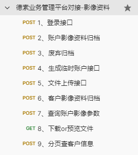

## 2. 修改调用地址

> 几个接口调用地址根据各家情况自行替换。将协议、ip、端口部分替换为和业务管理系统一致的。
>
> 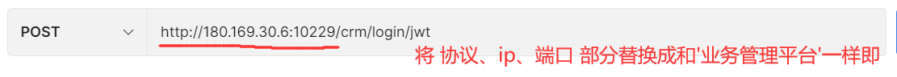

## 3. 接口调用方法：

> 下面就一些常用的使用场景分开说明：

- **归档影像资料:**

a.  先调用**接口1**进行登录，从http header里面获取到Authorization，其他接口调用的时候都会要用到它，Authorization的有效时间默认是1小时。
    
:::tip 
注意：当请求是https协议时，最好跳过证书的检测。因为大部分期货公司用的证书可能是自签名的。
:::

b.  可选。根据情况，看是否需要调用**接口3**新增账号。因为有的业务类型的账号是系统里就有的（通常存量的经纪账户、居间账户是内置好的）。

c.  可选。根据情况，看是否需要调用**接口5**单独上传文件。有的文件体积比较大不适合使用base64编码来上传。

d.  调用**接口2**进行账户的影像归档。注意URL中有一个参数，他是业务管理平台为调用者颁发的系统编号。第三方系统进行对接的话，联系我们颁发**新编号**即可。

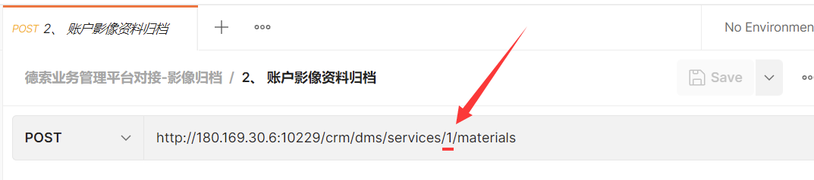

``` sql
# 查询已有编号sql：
select t.* from ldm.oauth2_registered_client t
```
e.  可选。**接口3**是用作废弃**接口2或接口6**归档进来的资料，可以理解为是对**接口2或接口6**的撤销。

f.  可选。调用**接口6**进行客户的影像归档。

- **查询下载单个影像资料场景：**

a)  先调用**接口1**进行登录。具体见上面。

b)  调用**接口7**查询单个账户下面的影像（主要是获取fileId）。

c)  调用**接口8**下载文件（通过fileId获取真实资料文件）。

- **查询下载多个影像资料场景：**

a)  先调用**接口1**进行登录。具体见上面。

b)  调用**接口9**分页查询出满足条件的客户。

c)  调用**接口7**查询单个账户下面的影像（主要是获取fileId）。

d)  调用**接口8**下载文件（通过fileId获取真实资料文件）。

<!-- -->

## 4. 接口中需要说明的字段

其中有字段取值码表值，下面码表查询方法示例：

``` sql
select t.* from ldm.adm$cde_code t where t.comm_cd = 'ACCT_BIZ_TYP';
``` 
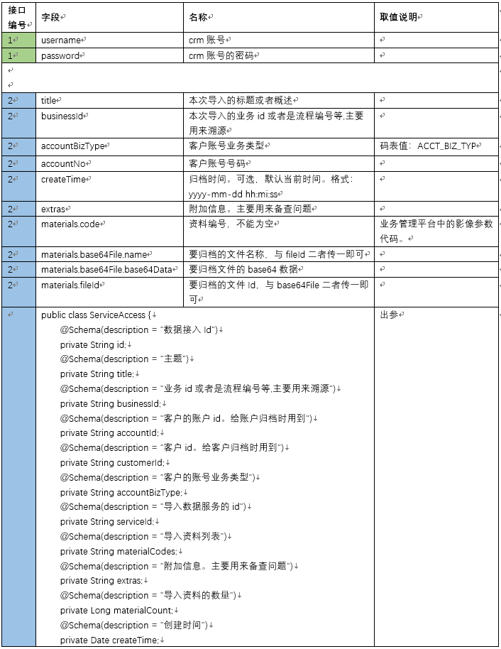
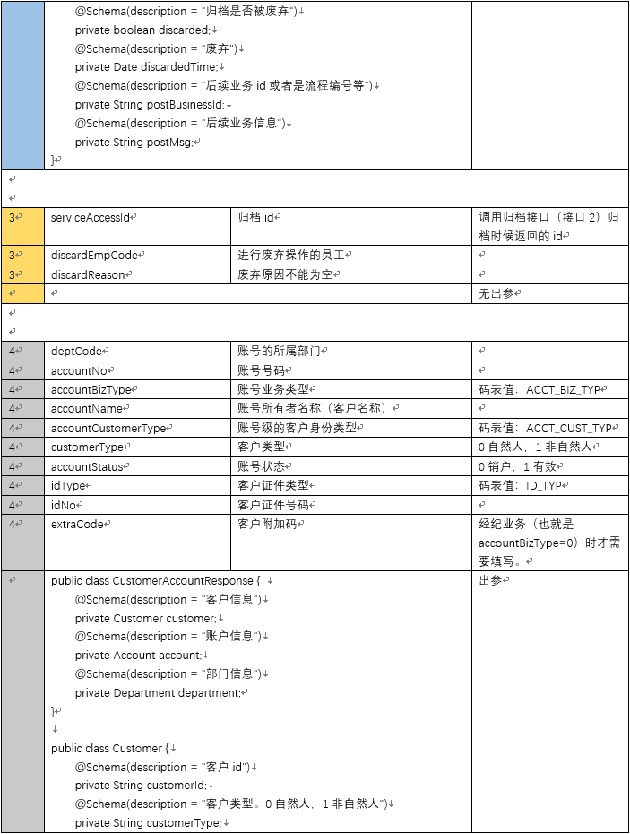

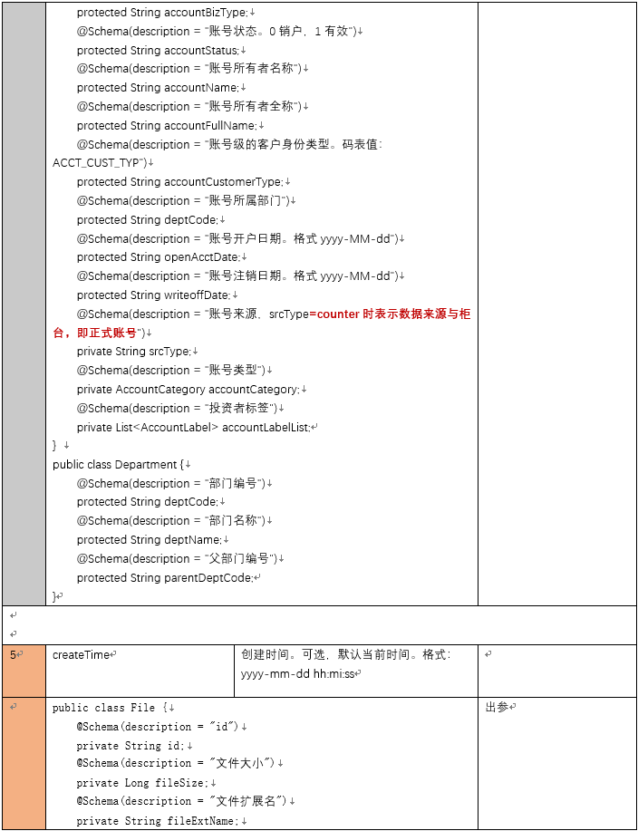
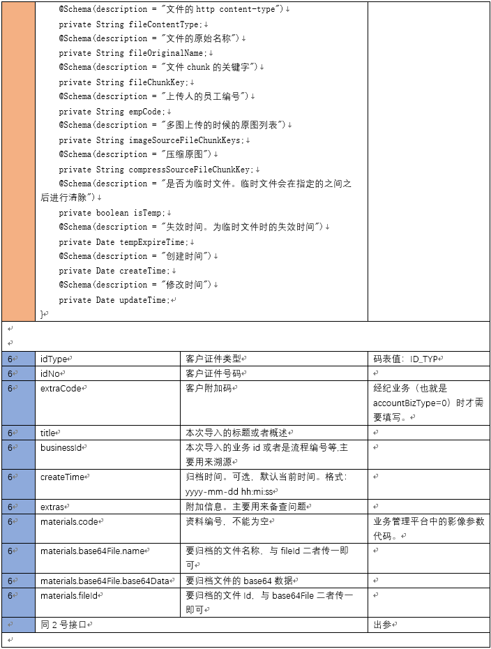
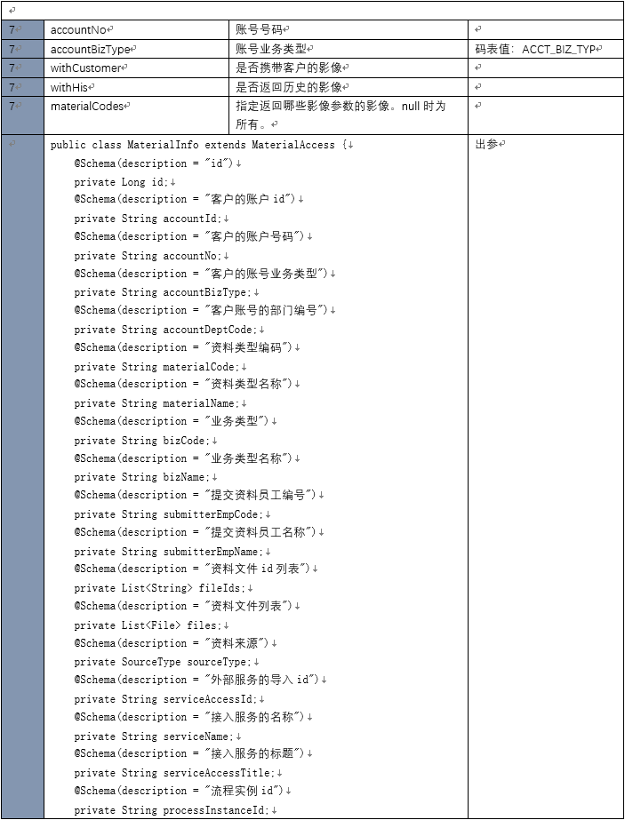
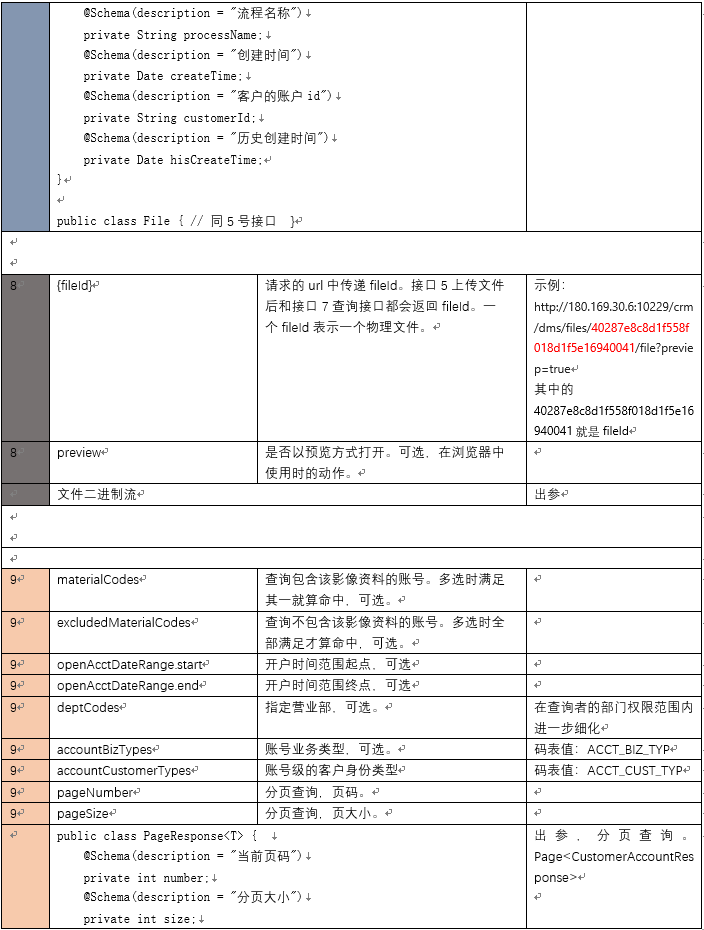
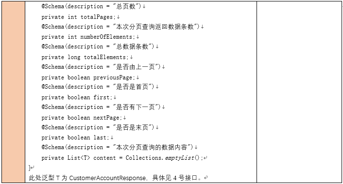


## 5. 接口返回说明

http code 为200-299内都是成功，其他都是失败。

> 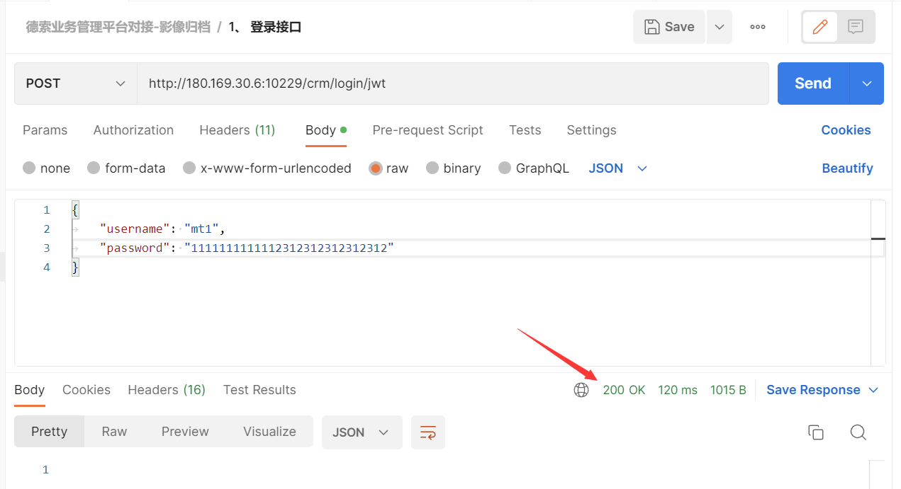
>
> 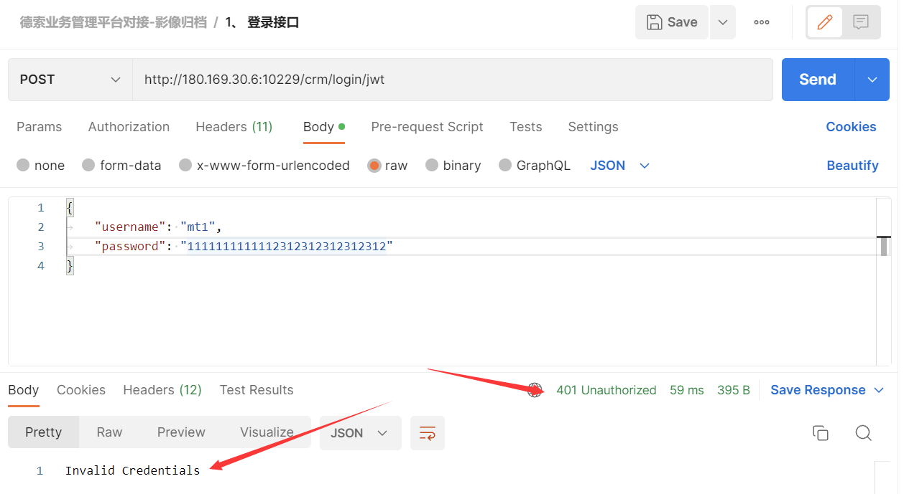

