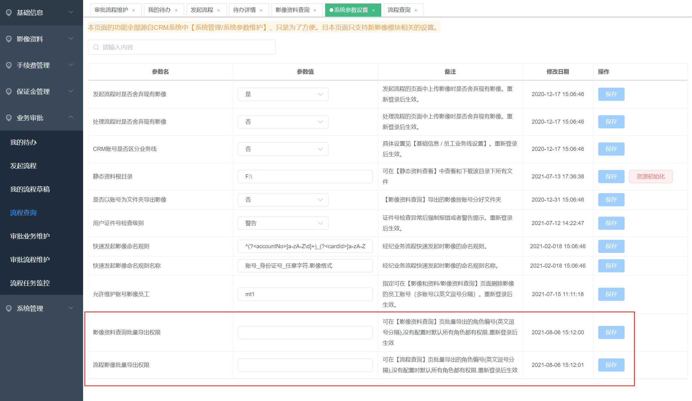
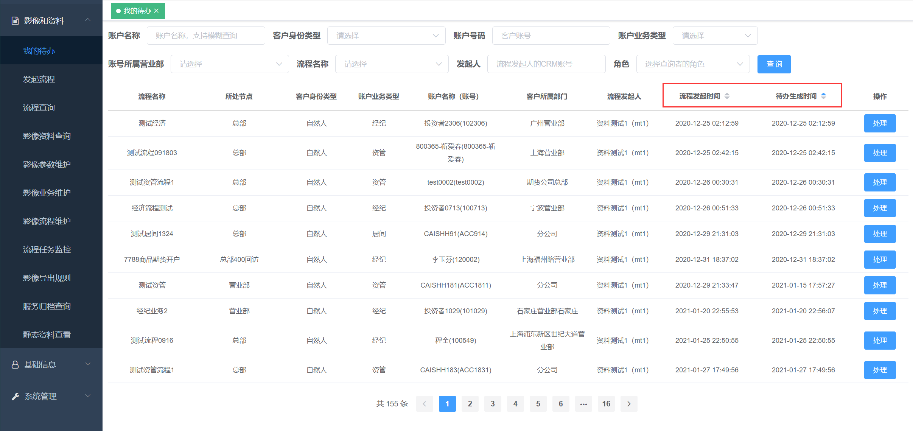

## 1、流程任务增加批量审批功能

值得注意的是不同流程、同流程的不同节点，它们的审核按钮都是可以不一样的。所以，在本功能提供了的俩类的批量按钮：一类是审核按钮名称中包含了关键字 **"不\",\"回\",\"退\"** 等的【批量驳回】；和另外一类**不**包含关键字的【批量通过】。批量操作不成功的流程会保留。

## 2、增加流程草稿功能

对于准备发起的流程，可以存至流程草稿。

点击处理，则可以重新唤醒流程

注：流程草稿只能针对未发起的流程，点击存至流程草稿后，又发起，则不会存至流程草稿。

## 3、流程审核退回时支持审计

本功能需要搭配CRM的"员工业务率准确度考核"功能一起使用。开始该功能后，业务管理平台可以将流程的审核信息报送给CRM，然后CRM可以根据数据再加工为统计报表等。支持对"驳回"类似审核的自定义。

开启该功能：联系我们运维同事，之后就可以在界面进行进一步设置

## 4、【影像资料查询】【流程查询】的资料批量导出权限控制

## 5、查询条件支持：CTP柜台的投资者属性

## 6、【影像资料查询】页面中，增加删除\"历史导入\"类文件功能

**需求产生背景：** 上了新影像系统后，我们会帮忙把德索老影像系统（或者友商影像系统）的资料迁移进来。然后期货公司在新影像系统中对资料进行检查梳理时容易遇到，当发现历史资料是错误的时候，新影像系统是无法提供删除功能这么一个问题。

**开启该删除权限方法：**

## 7、【静态资源查看】页面优化

本次优化主要针对大数据量的查询，已测试的是千万级别。

**注意：本次优化** 会影响【静态资料查看】页面中的**搜索功能**。重新初始化资源后可以恢复。

1.  其他改进

    a.  【我的待办】页面中支持\"流程发起时间\"和\"待办生成时间\"两种排序

## 8、【批量上传】时，允许检查客户名称

**需求产生背景：** 有一些线下历史资料，在上传的时候发现，当初填写的资金账号是错误的，而要找出这些错误的文件也非常麻烦。所以，在上传时程序允许对客户名称的检查，用来辅助验证。

即上传的文件中既包含**账号（或身份证）**又包含**客户名称**，那么程序检测到**账号的客户名称**和**文件名中的客户名称**不一致时，会以**警告**的方式提示。

**该功能取决于压缩包提取规则的设置，也就是提取规则里面启用了**customerName**才会有效果**

