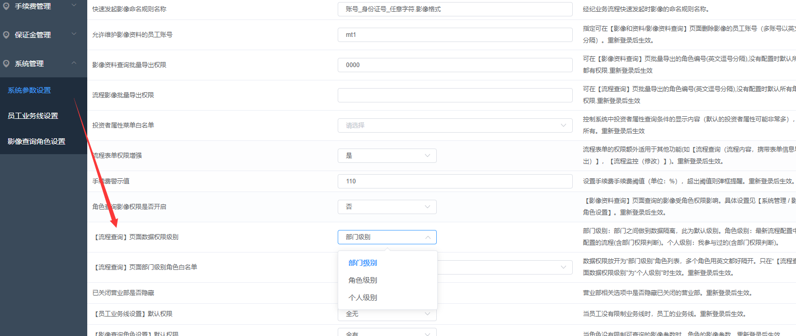
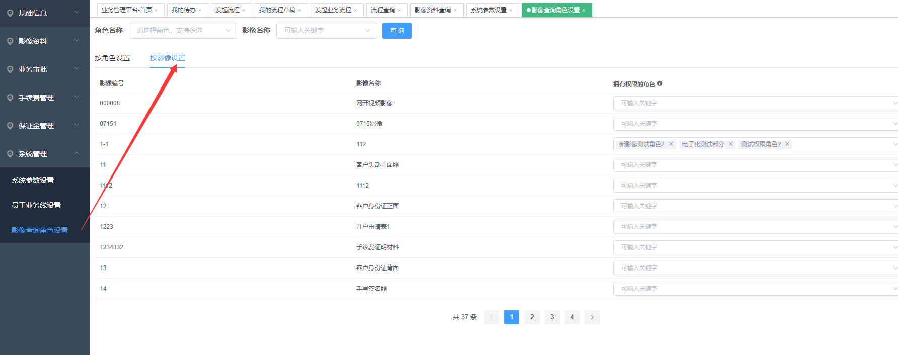
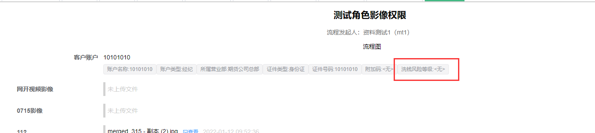
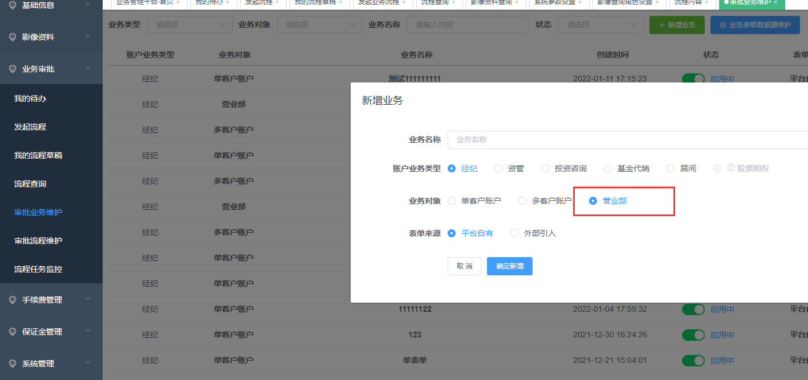
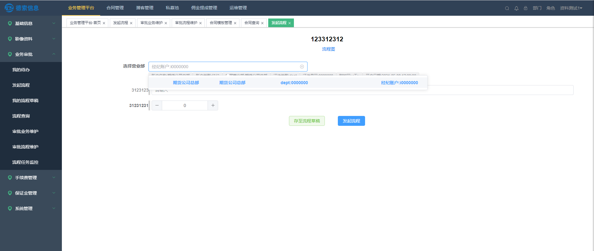
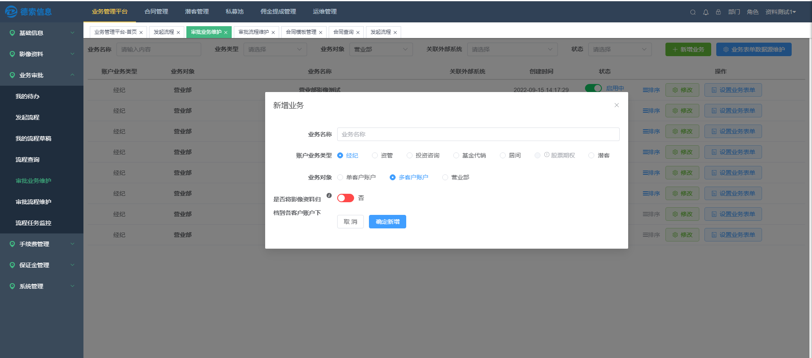
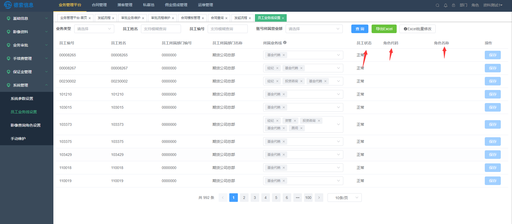
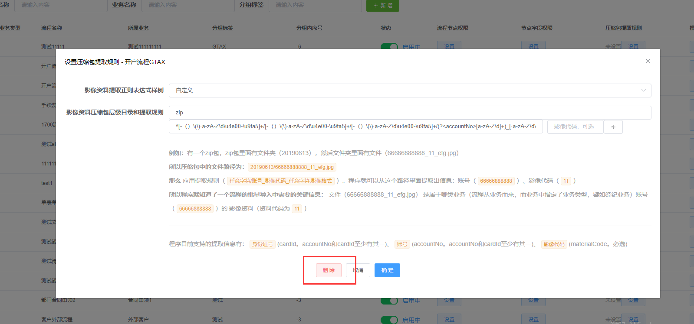

## 1、【流程查询】页面数据增加权限级别

【流程查询】页面数据权限级别：

部门级别：部门之间做到数据隔离，此为默认级别。

角色级别：最新流程配置中所对应配置的流程(包含部门权限判断),此外还角色级别参与的所有流程。

个人级别：在部门级别上再加上"是我参与过的"

## 2、【影像查询角色设置】添加按影像设置

对于不同的角色设置可以查看的影像的白名单和黑名单

## 3、增加反洗钱接口，流程页面展示反洗钱风险等级

## 4、【系统参数设置】增加参数

【已关闭营业部是否隐藏】：设置营业部相关选项中是否隐藏已关闭的营业部

【员工业务线设置】默认权限：当员工没有限制业务线时，员工的业务线。

【影像查询角色设置】默认权限：当角色没有限制可查询的影像参数时，角色的影像参数。

## 5、流程中必填判断优化

设置为不可见、不可编辑的表单跳过必填校验

## 6、新增业务对象【营业部】

业务对象新增营业部

对于业务对象是营业部的流程，流程发起后的界面如下：

此时勾选的对象不是单个客户 ，是针对部门的账号。

## 7、【业务表单数据源设置】页面优化

1.  sql界面调整

2.  数据项顺序拖拽

3.  默认值设置页面，从【候选项】中选择默认值

4.  数据源切换显示bug修复

## 8、【流程查询】支持按休眠节点查询，多客户账户流程按客户账户查询

## 9、多客户账户流程可以设置影像的分发

未勾选的情况下，会将业务中提交的影像资料归档到所选择的部门

勾选的情况下，会将业务中提交的影像资料归档(分发)到各个客户账户

## 10、【员工业务线设置】导出增加员工状态，角色代码，角色名称字段

## 11、【审批流程维护】增加压缩规则的删除

