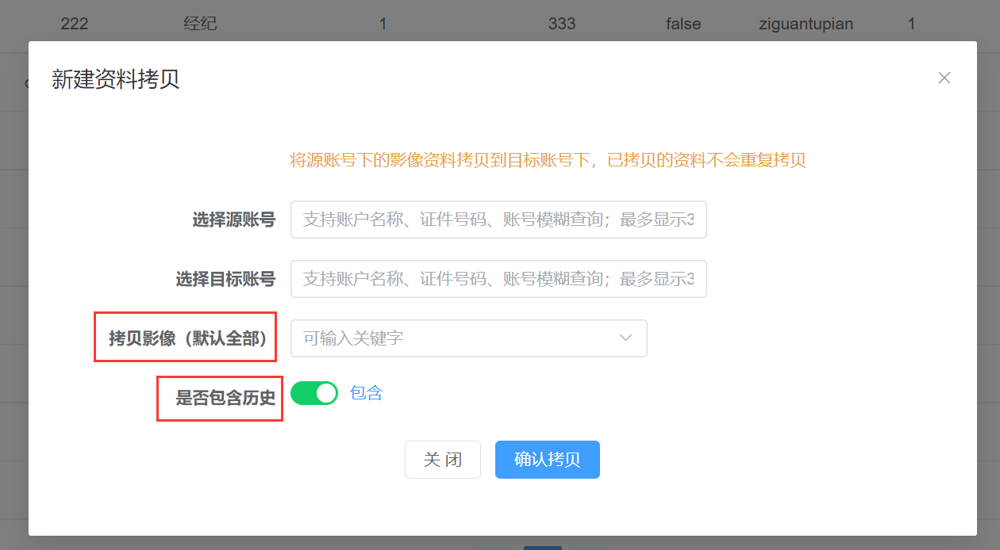

## 1、\"创建经纪账号\"时检测客户是否是居间客户（仅经纪业务线）

功能介绍：在德索业务管理平台中新增经纪业务账号的时，会根据 **证件号码**
和 **证件类型**
去关联居间人，如果关联到了**活跃的居间人账号**，则新增失败。

功能开关：

## 2、【账户间影像拷贝】功能调整

**a、客户的证件类型和证件号码一致才可以进行影像资料拷贝。**

客户的**附加码**（特法）不做验证。不同业务线之间的账号也可以拷贝，如将经纪账号下的身份证拷贝到投资咨询账号下。

**b、允许指定要拷贝影像参数，以及是否包含参数的历史**

## 3、增加【云平台影像同步查询】页面

有了该功能后，可以更方便的对云平台同步情况进行查询。

对于期货公司是**CTP1**或部署了**CAP系统**的，能够对 **\"同步失败参数\"** 参数进行进一步的分组显示。如果不是的话则全划分为可选组。

划分详情如下：**可选**表示不是所有客户办理该业务都会产生该影像；**必选**表示任何客户办理该业务都会产生该影像。

所以对于一般的日常来讲，只需要关注是否有**必选**类同步失败即可。有\[专业投资者资料\]的才需要特殊关注一下。

| 业务编号   | 业务名称                      | 云平台编码    | 云平台编码名称     | 是否必选 |
| --------- | ---------------------------- | ------------ | ----------------- | ------- |
|  2          | 云平台5期-开立期货/资管账号   | adequacy      | 专业投资者资料     | 否      |
|  2          | 云平台5期-开立期货/资管账号   | 99            | 客户手写签名影像   | 是      |
|  2          | 云平台5期-开立期货/资管账号   | 81            | 结算银行卡正面     | 是      |
|  2          | 云平台5期-开立期货/资管账号   | 80            | 客户头部正面照     | 是      |
|  2          | 云平台5期-开立期货/资管账号   | 6A            | 客户身份证正面     | 是      |
|  2          | 云平台5期-开立期货/资管账号   | 6B            | 客户身份证背面     | 是      |
|  3          | 云平台5期-增开交易编码        | ine           | 原油相关资料       | 是      |
|  3          | 云平台5期-增开交易编码        | 99            | 客户手写签名影像   | 是      |
|  3          | 云平台5期-增开交易编码        | 80            | 客户头部正面照     | 是      |
|  3          | 云平台5期-增开交易编码        | 6B            | 客户身份证背面     | 是      |
|  3          | 云平台5期-增开交易编码        | 6A            | 客户身份证正面     | 是      |
|  3          | 云平台5期-增开交易编码        | finance       | 金融相关资料       | 是      |
|  4          | 云平台5期-变更结算银行账号    | 81            | 结算银行卡正面     | 是      |
|  4          | 云平台5期-变更结算银行账号    | 6B            | 客户身份证背面     | 是      |
|  4          | 云平台5期-变更结算银行账号    | 99            | 客户手写签名影像   | 是      |
|  4          | 云平台5期-变更结算银行账号    | 6A            | 客户身份证正面     | 是      |
|  5          | 云平台5期-变更身份证有效期    | 6A            | 客户身份证正面     | 是      |
|  5          | 云平台5期-变更身份证有效期    | 6B            | 客户身份证背面     | 是      |
|  5          | 云平台5期-变更身份证有效期    | 99            | 客户手写签名影像   | 是      |
|  6          | 云平台5期-变更手机号          | 99            | 客户手写签名影像   | 是      |
|  6          | 云平台5期-变更手机号          | 6B            | 客户身份证背面     | 是      |
|  6          | 云平台5期-变更手机号          | 6A            | 客户身份证正面     | 是      |
|  7          | 云平台5期-变更其他信息        | 6B            | 客户身份证背面     | 是      |
|  7          | 云平台5期-变更其他信息        | 99            | 客户手写签名影像   | 是      |
|  7          | 云平台5期-变更其他信息        | 6A            | 客户身份证正面     | 是      |
