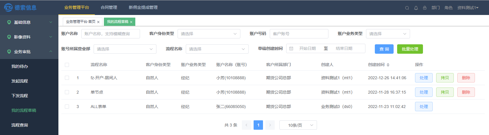
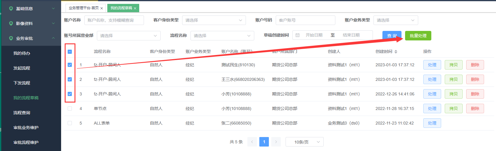
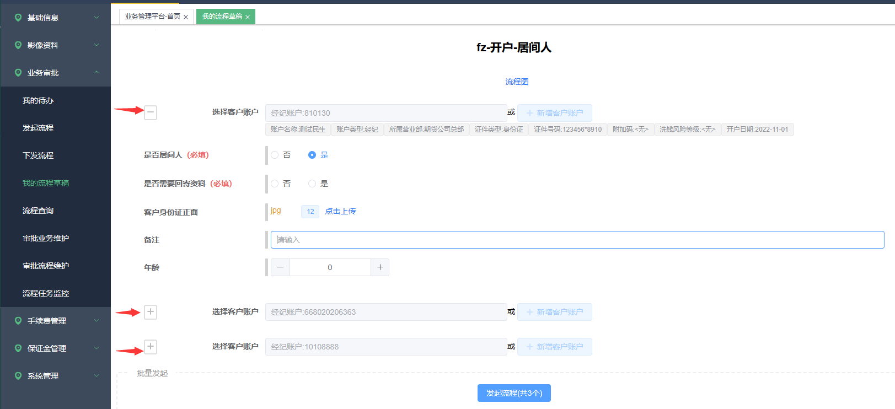
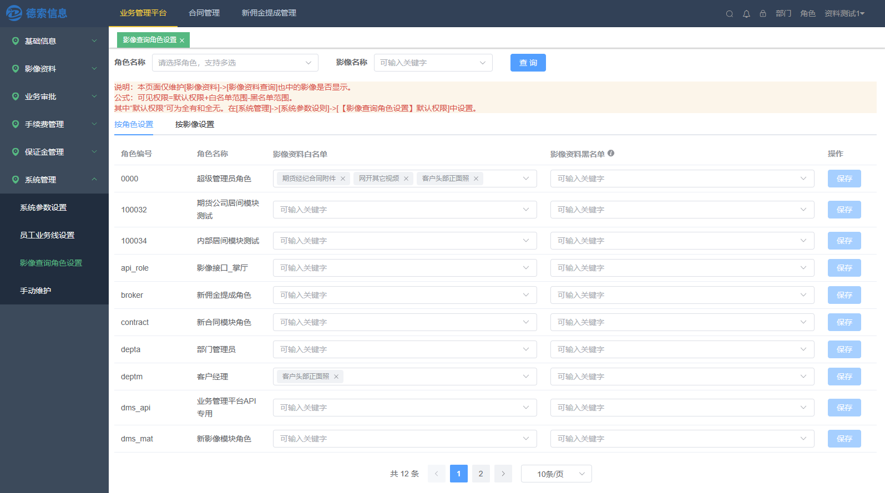

## 流程批量发起和草稿的复制

**拷贝：** 拷贝当前流程草稿至其他客户名下

**批量处理：** 选择一批草稿进行处理，支持对单个流程的内容微调

所以，通过\"拷贝\"+\"批量处理\"功能的组合，可以实现批量发起流程的功能

## 影像参数查询黑白名单

说明：本页面仅维护\[影像资料\]-\>\[影像资料查询\]页面中的影像是否显示。

公式：可见权限=默认权限+白名单范围-黑名单范围。

其中"默认权限"可为全有和全无。在\[系统管理\]-\>\[系统参数设则\]-\>\[【影像查询角色设置】默认权限\]中设置。

## 数据监控

按照指定的频率查询数据，从而触发特定的业务动作。

如：每天检查是否存在证件即将到期的客户，有的话就启动一个\"证件到期提醒流程\"，好让业务人员进行跟进。

## 流程发起的对外接口

流程发起接口进先了优化，将很多参数变为可选，简化了接口对接难度。

\"发起时是否带出历史影像\"下放到流程

允许各个流程单独控制，在启动流程时是否携带历史影像。

## 历史影像的颜色逻辑

如果选择\"发起时带出历史影像\"，那么在流程审核中，这些表单项改为无颜色，而不是之前以绿色提示。

## 菜单搜索

实现了个简单的查询菜单名称的功能
