## 新功能：

## 1、【服务归档】页面支持部门权限

原来这个页面是给管理员用的，没有做部门权限控制。

而这个页面可以跨系统的查询到客户业务办理情况（原理是各系统的客户办理完业务，基本都会进行影像资料的归档），于是就希望开发给营业部使用。

所以我们对这个页面增加了部门权限的支持。即，操作员只能看到自己管辖部门内客户。

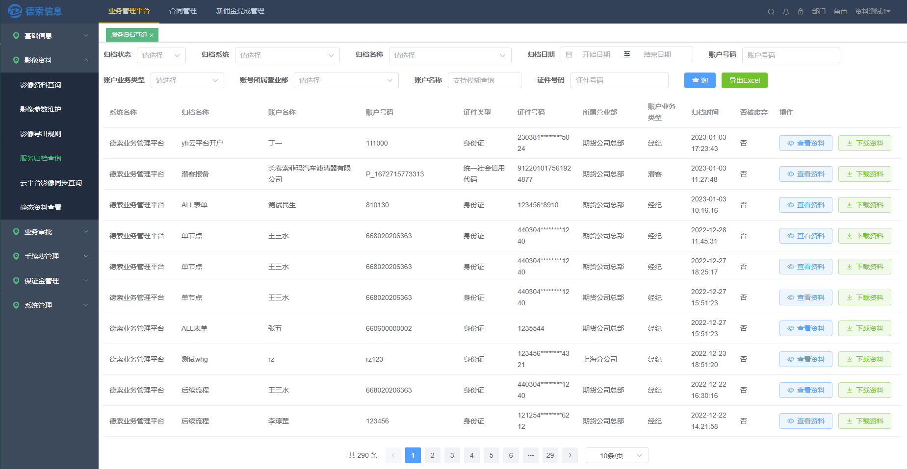

## 2、自然人客户信息脱敏

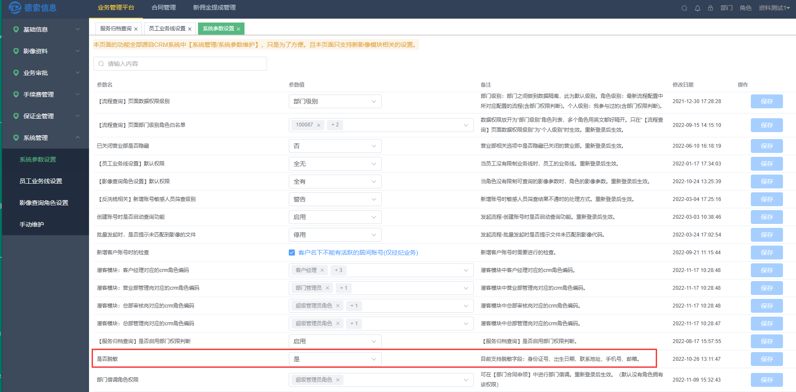

## 3、显示客户的洗钱风险等级

该功能需要**德索反洗钱模块**提供功能支持。

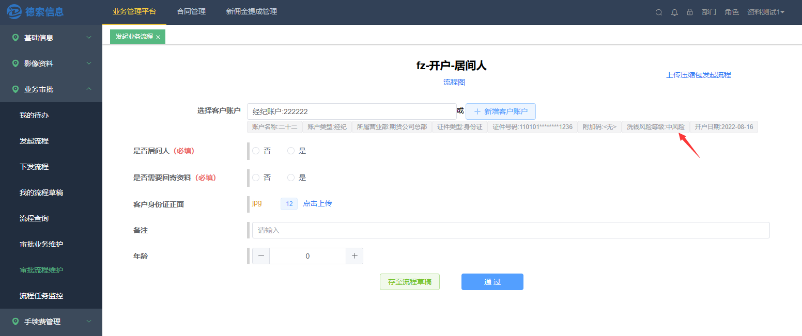

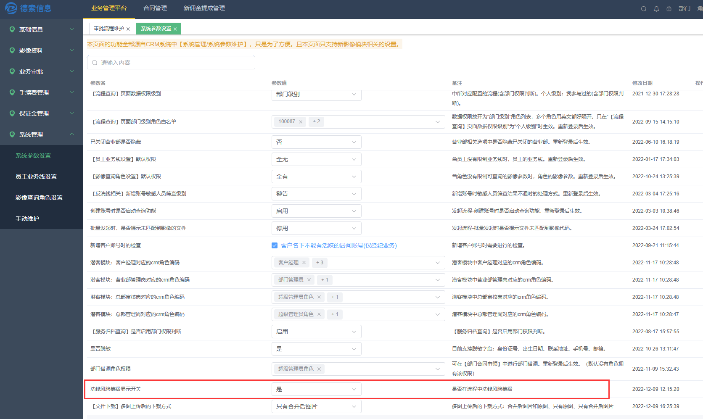

## 4、支持选择客户账号时候进行反洗钱筛查

该功能需要**德索反洗钱模块**提供功能支持。各个节点

功能开关：【审批流程维护】页面\--\> 敏感人员筛查

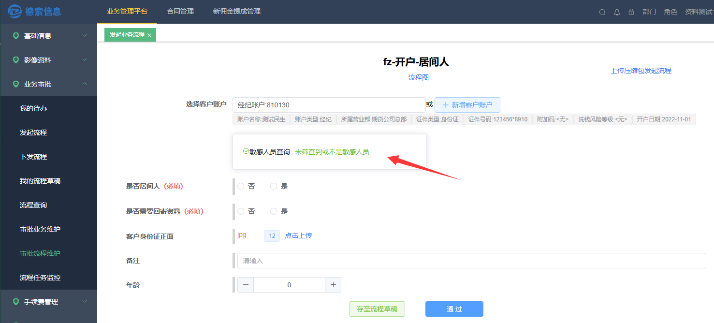

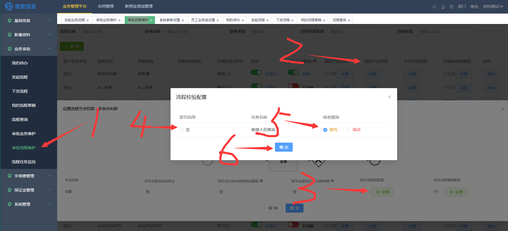

## 5、支持创建客户账号时候生成反洗钱筛查任务

该功能需要**德索反洗钱模块**提供功能支持。

功能开关：【审批流程维护】页面\--\> 敏感人员筛查

提示级别：筛中后的提示级别

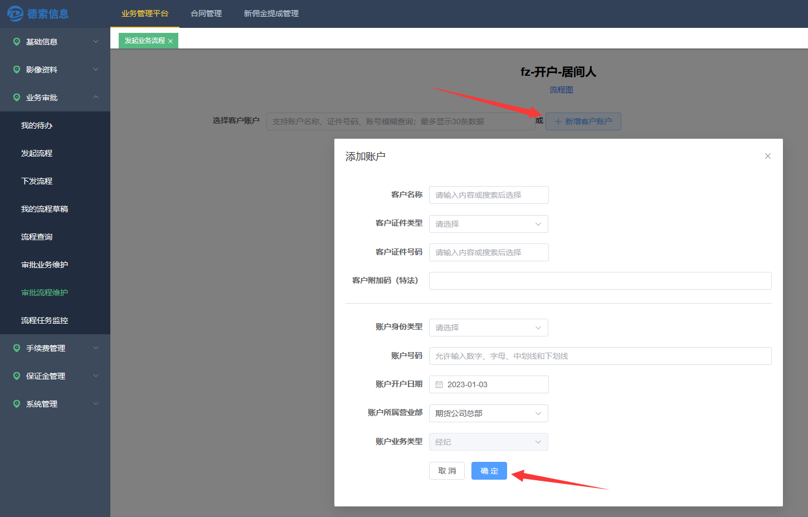

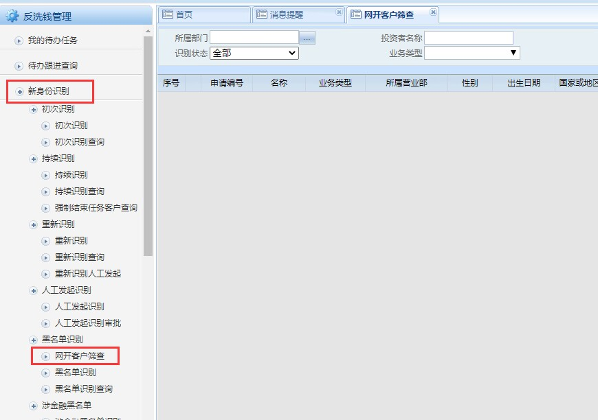

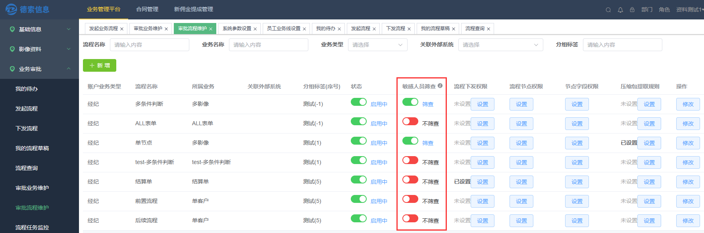

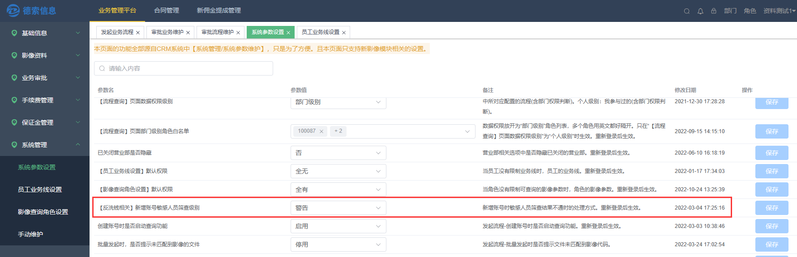

## 6、流程支持批量下发

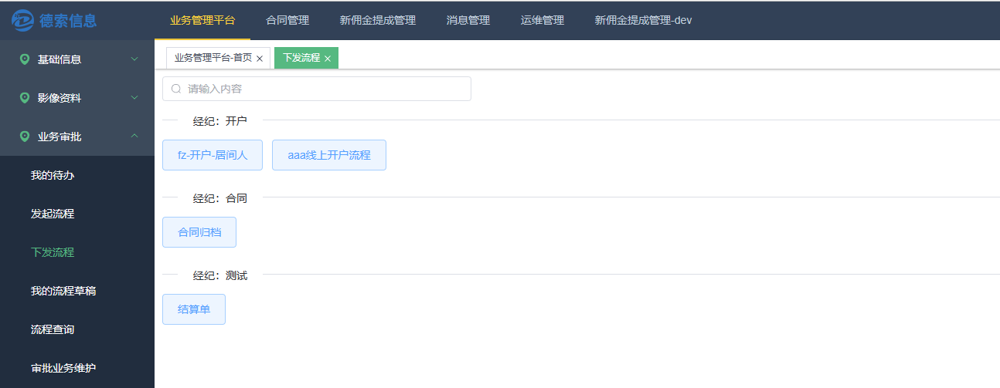

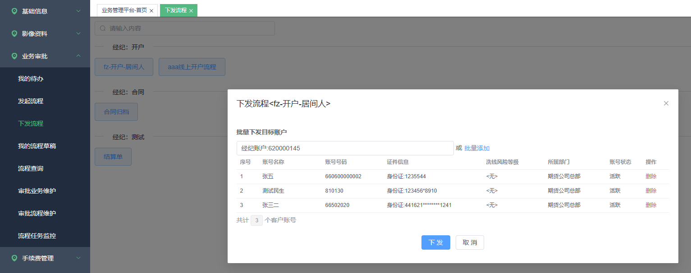

## 7、流程支持批量发起

这种批量方式主要是增强以文本内容为主的流程。本功能是通过批量复制【流程草稿】来实现的。

###### 7.1 制作一份【流程草稿】。草稿里面将一些共用数据填写好

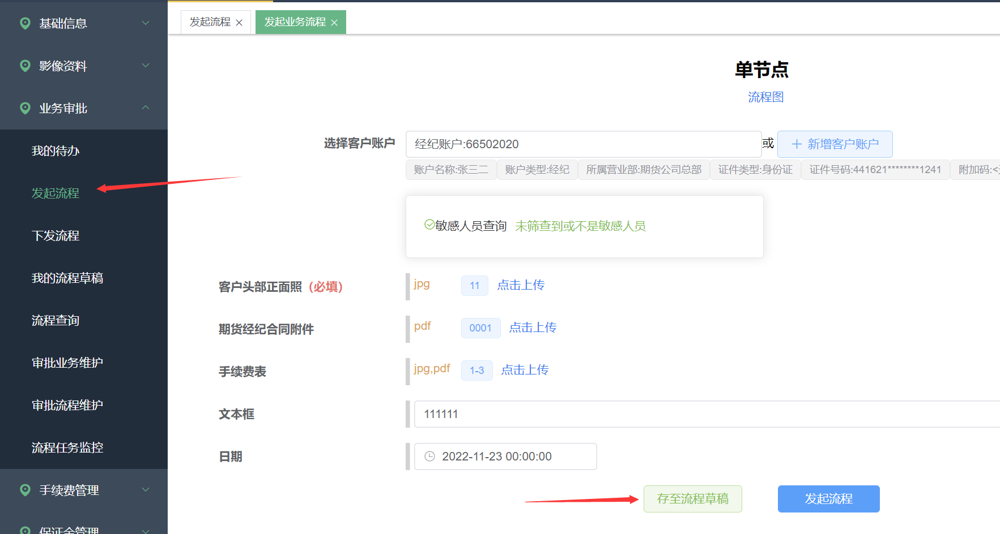

###### 7.2 批量复制【流程草稿】

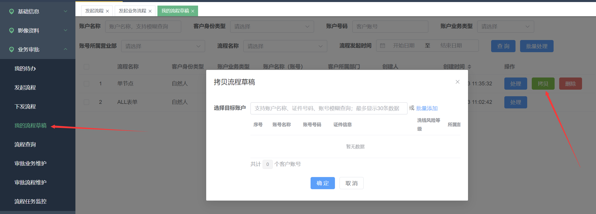

###### 7.3 批量处理草稿

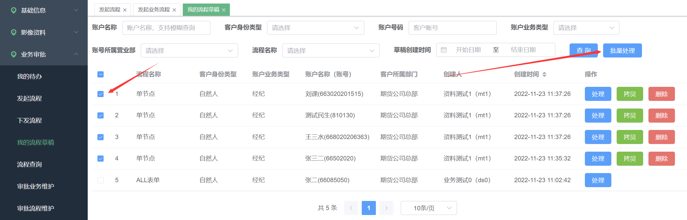

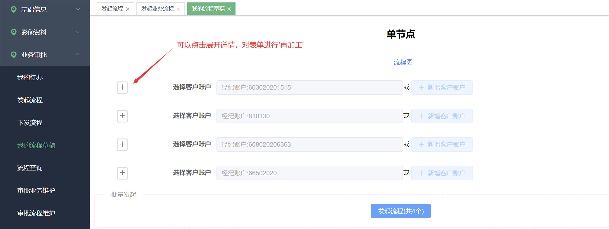

## 8、允许通过接口来作废资料归档

这个功能提供给程序用的，是API接口。

## 功能优化：

## 1、支持导出多账号的流程

## 2、【我的待办】支持多账号查询

## 3、支持云平台的居间协议

压缩包上传网卡客户影像时，增加了对压缩包中的居间协议的识别

云平台对于开户业务支持能下的相关的pdf文件有：开户协议、业务流水，22年对于带居间开户，下载的pdf文件增加了居间协议。于是我们也进行了同步支持。

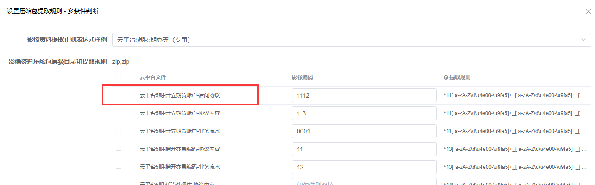

## 4、影像参数名称限制从全局唯一改为业务线唯一

## 5、浏览器Chromium内核版本兼容到72版本

## 6、显示前置流程名称

## 7、开关控制洗钱分线等级是否显示

## 8、开关控制导出的文件是否包含源文件，文件命名格式

**示例：** 账号名称_日期_影像参数名

#accountNo + \'\_\' + #format(#currentDate, \'yyyyMMdd\') + \'\_\' +
#materialName

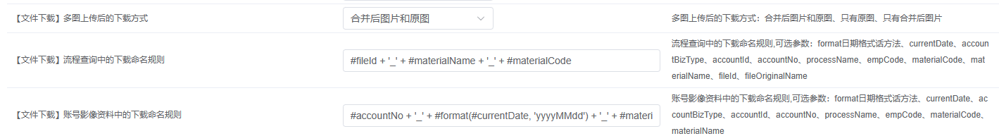

**可用字段：** 

currentDate：当前日期，可以用日期格式化函数format进行格式化。

accountBizType：业务线

accountId：客户账号id

accountNo：客户账号号码

processName：流程名称

empCode：文件上传者的名称

materialCode：影像参数编码

materialName：影像参数名称

fileId：文件id

fileOriginalName：文件上传前的名称

**可用函数：** 

format：日期格式化函数
