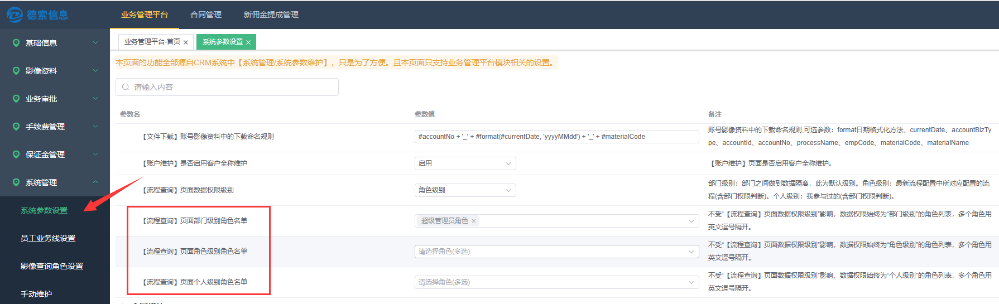
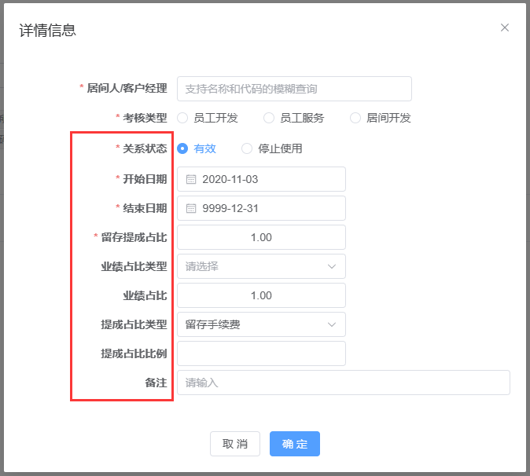

## 1、【我的待办】增加备注功能

添加属于待办的备注，能看到待办的人都可以看到备注，待办通过/驳回后备注消失。通常是用来做备忘。

## 2、【流程详情】中显示客户的统一信用代码

除了显示主证件信息外，可额外显示统一信用代码（如有）。

## 3、【我的待办】增加批量终止功能

注意，虽然会出现"批量终止按钮"，但无终止权限的待办是无法终止的，且会显示失败原因。进入待办详情页面，根据是否有终止按钮可判断是否有该待办终止权限。

## 4、【流程查询】支持固定的权限

用来固定一些角色的查询权限。

【流程查询】页面数据权限级别------指定默认的权限级别。而本功能

## 5、增加新复合控件：表格控件

**注：** 属于高阶功能，需要搭配系统的数据源使用。

支持简单的表格形式，支持合计。主要用来显示一些简单的表格。

表格控件的配置要分两步：1、配置自己表格控件；2、再将其引入到业务表单中去

**1、配置自己表格控件：**

**2、再将其引入到业务表单中去**

在流程中显示的效果：

## 6、增加新基础控件：客户多选控件

## 7、增加新基础控件：CRM账号多选控件

## 8、增加新复合控件：业绩关系控件

**注：** 搭配德索流程的数据写入节点，可以实现业绩关系写入到【新佣金提成管理】模块。

搭配数据源，可以在流程中显示客户已存在的业绩关系，并且可以在此基础上进行调整，且会高亮提示修改内容。

可限制新增关系人选择范围

新增时候支持了默认值：

修改现有关系，可显示改前改后值：

流程中加入数据写入节点，可将业绩关系写入到【新佣金提成管理】模块：

修改现有关系，可显示改前改后值：

## 9、增加新复合控件：软件费用控件

**注：** 搭配德索流程的数据写入节点，可以实现业绩关系写入到【新佣金提成管理】模块

搭配数据源，可以在流程中显示客户已存在的业绩关系，并且可以在此基础上进行调整，且会高亮提示修改内容。

流程中加入数据写入节点，可将业绩关系写入到【新佣金提成管理】模块：

修改现有收费软件条目，可显示改前改后值：

## 10、流程名称可添加说明

在流程详情页面中，流程名称后面会有个黄色感叹号，鼠标放上去显示
"流程名称说明"。该功能主要用来描述一些复杂的流程。

## 11、流程支持发送短信功能

支持指定手机号，或者读取表单中填写的手机号。

