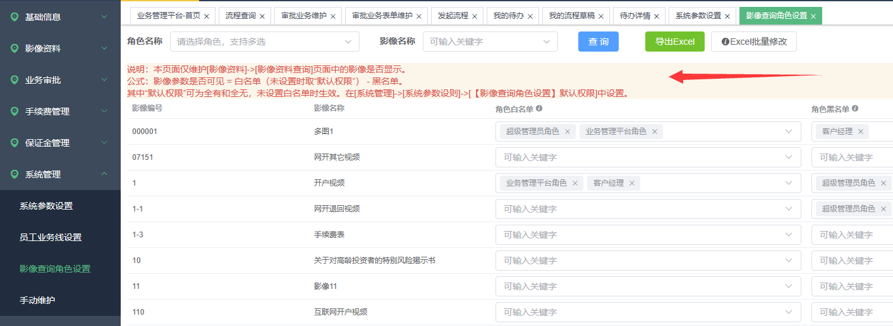

# 新功能

## 1、支持客户级的影像

在统一账户的规则下，增加客户级的影像，也就是客户也可以有影像（之前只允许客户名下的账号有影像）。客户名下任意账号查询影像资料时都会额外的显示出客户级的影像。客户级影像是通过账户影像归档时上报（拷贝）而来的。

后续将开放针对客户级影像的归档接口与查询界面。

是否将影像资料同步到客户名下：通过影像参数来设置，允许公共类型的影像参数同步至客户级别。

## 2、支持一键导出监控中心格式

## 3、流程审核时候变动内容的提醒优化

表单控件是可以指定默认值的，本次主要是将控件默认值考虑在比较逻辑中。所以，优化后的颜色提示逻辑为：

这里的比较是指**同一个流程节点**在**不同时期**进行的比较。为了说明这个，咱们假设有一个流程，如下图，然后进行一个这样的流程实例：

发起人提交（营业部）-\>审核人驳回（总部）-\>发起人修改再提交（营业部）-\>审核人审核通过（总部）-\>结束

所以从总部节点来看，该流程实例一共被它处理了两次。**第一次审核时看到的背景色是拿当前值与控件的默认值比较；第二次看到颜色是将本次内容和第一次看到的内容进行比较，得出颜色。**

**值得注意的是，** 以前版本在首次审核的时凡是有内容的控件都会被提示为绿色。而忽略了控件默认值的影响。

这套颜色表意逻辑，主要是辅助审核人员更好的进行审核，让审核者方便识别出哪些内容发生了变化。

## 4、\[影像资料查询\]页面黑白名单逻辑优化

简而言之：设置了白名单就只能被白名单的看到；黑名单的优先级高于白名单；操作员具有多角色任一角色可以看到则可以看到。

## 5、允许维护账户的标签

以前影像系统只作为标签的使用者（只能查询），现以批量开放对账号标签的维护。

