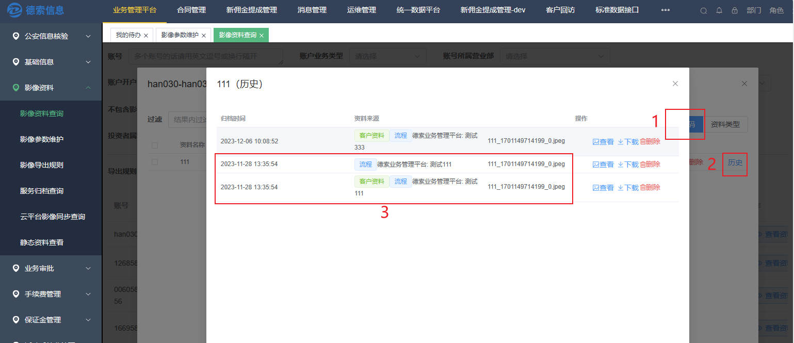

# 新功能

## 1 支持客户级的影像资料

**1.1 需求背景**

在**统一账号**的概念下，我们之前支持了账号的影像资料。现在开始支持客户的影像资料。

**统一账号**：指的是一个客户主体可以在期货公司拥有多个账号。如期货账号、基金账号、资管账号等；同为期货账户也可以有销户的账户、活跃的账号等多个。

**1.2 解决方案**

**客户级影像的产生：** 客户级的影像主要是来源账号级影像资料，一般是在对账号进行影像归档的时候，根据设置来判断是否需要将影像复制一份给到客户。

**客户级影像的查询：** 查询客户名下任意账号的影像资料时，会额外显示其客户名下的影像资料。

目前没有提供专门查询客户级影像的页面，需要依托账号级影像查询来展示。

**1.3 操作步骤**

影像资料 \--\> 影像参数维护 \--\>
选择一条影像参数数据点击修改，可以选择"是否同步到客户"选项

是否同步到客户选项由否变为是时，会出现立即同步当前所有归档影像选项。**选择是**的话，会处理存量的影像（会将系统中该影像参数的影像资料复制一份给到其客户）；**选择否**则只会对以后归档的资料进行处理。

影像资料 \--\> 影像资料查询
选择一条数据点击查看资料，按照**资料类型**查看时，可以看到资料类型一列区分为**客户资料**和**账号资料**标签。

点击**影像编码**按照影像参数查询影像，选择同步到客户选项为 **是**
的影像参数点击历史，可以看到资料来源列有**客户资料**的标签。

**1.4 待优化**

【影像资料查询】界面筛选条件仍是账号级影像

业务审批 \--\> 审批流程维护 \--\>
点击【修改】打开流程维护界面，发起时是否带出历史影像选项带出的仍是账号级影像

## 2 流程支持客户经理权限

**2.1 需求背景**

在现有的数据权限之下（如下图），细化了在同一部门下客户经理人员的权限控制。实现客户经理只允许查看和操作自己名下的客户的流程。

**2.2 解决方案**

对流程的维护关于权限的部分进行细分，增加流程关于客户经理权限的设置，客户经理权限与流程绑定。

**2.3 操作步骤**

业务审批 \--\>
审批流程维护界面更多设置列点击需要添加客户经理权限的流程对应的按钮，启用客户经理权限控制选项，默认不启用。启用后，在**流程查询、我的代办**页面，客户经理只能查询和处理自己名下客户的相关流程。

**2.4 待优化**

其他流程相关界面的查询和操作也可以添加客户经理权限的验证。

## 3 流程支持跨平级部门

**3.1 需求背景**

在现有的数据权限控制之下，审批时的部门权限在一条流程中不可变，现在对流程中的节点支持**变更部门权限**的操作。

**3.2 解决方案**

支持跨平级部门的**设置**：在流程的节点权限设置中，可以选择设置该节点是否要手动选择审批部门。

跨部门的具体**操作**：当设置为手动选择时，前一节点审批通过时弹出部门设置界面手动设置后续的审批部门。

**3.3 操作步骤**

业务审批
\--\>审批流程维护界面点击流程节点权限修改对应节点的部门权限生成策略为**手动选择部门**。

流程审批处理中的效果如下图：

在前一节点点击通过时，在弹出框选择营业部门，流程**部门主体**变更为被选项，后续流程只能由流程主体部门审批。

**3.4 演示**

## 4 流程查询权限细分

**4.1 需求背景**

流程查询的**部门权限**定义为查询出当前账号部门参与过流程审批的流程列表，现有数据权限控制下，默认创建的流程为部门权限。

**4.2 解决方案**

定义部门级别为默认级别，数据在部门之间进行隔离，无法参与流程的部门无法查询到该流程；

角色级别为数据在同一部门下不同**角色**之间进行隔离，无法参与流程的角色无法查询到该流程；

个人级别为数据在审批人员之间进行隔离，相当于只看**我参与的。**

另外允许各级别白名单的配置，配置为白名单的角色，流程查询权限始终按照白名单等级。

**4.3 操作步骤**

系统管理 \--\>
系统参数设置界面对流程查询页面的权限进行设置，可以对不同权限级别设置白名单，设置白名单的角色，在查询**全部流程**数据数据时只依赖对应级别的权限。

业务审批 \--\>
审批流程维护界面点击更多设置对**单一流程**的查询权限进行设置。

**4.4 演示**

部门级别演示

角色级别演示

**4.5 待优化**

其他相关页面数据等待优化为对应权限。

## 5 审批角色和部门调整

**5.1 需求背景**

在流程实例的后续处理中，需要将流程分配给其他角色的人员或者其他部门进行处理。

**5.2 解决方案**

在流程任务监控界面添加任务角色调整按钮，手动选择角色去处理需要特定审批人员参与审批或者重新分配工作量的场景。

在流程任务监控界面添加流程部门调整按钮，手动选择部门去处理需要特定部门参与审批或者重新分配工作量的场景。

**5.3 操作步骤**

业务审批 \--\>
流程任务监控界面点击任务角色调整对流程实例重新分配审批角色。

业务审批 \--\>
流程任务监控界面点击任务角色调整对流程实例重新分配审批角色。

**5.4 演示**

任务角色调整演示

当流程查询权限级别为角色级别并且流程配置中的角色不包含调整后的角色时，流程查询中无法查询到该流程，勾选我的代办可以查询到。

流程部门调整演示

## 优化点

## 8 支持股票期权业务线的正式账号与临时账户的自动合并

**8.1 需求背景**

当柜台注册的正式账号与业务管理平台生成的临时账号存在冲突时，将临时账号产生的数据替换为正式账号。

**8.2 解决方案**

1.定时查询出用户重复的期权账号

2.检查临时账号的流程和影像数据，更换为正式账号

## 9 改进批量审批功能

**9.1 需求背景**

批量处理弹窗中关于选中流程的操作比较模糊，不能清晰的展示流程可以进行哪些操作。

**9.2 解决方案**

结合单个流程的审批操作，具体展示批量处理时可进行操作的数量。

**9.3 操作步骤**

业务审批 \--\> 我的待办界面批量处理弹窗展示效果如图：

## 10 流程导出时支持携带表单信息

**10.1 需求背景**

导出流程excel文件时，需要同时看到流程中的某些表单信息。

**10.2 解决方案**

导出excel按钮触发携带表单信息导出弹窗。

**10.3 操作步骤**

如：业务审批 \--\>
流程查询界面点击携带表单信息导出，可以看到excel表中存在表单的键值信息。

## 11 查询条件中选流程控件改进

**11.1 需求背景**

针对流程名称进行筛选，当流程数量过多时，下拉列表的展示方式不利于审批人员的使用。

**11.2 解决方案**

参考发起流程界面，将流程筛选的下拉处理为面板展示的形式，方便审批人员查看并选择。

**11.3 操作步骤**

如：业务审批 \--\>
我的代办界面流程名称筛选项，单击进行选择，支持查询/单选/多选/分组选。

**11.4 待优化**

其他下拉列表较多的控件，也可以参考这种展示方式进行改进。

## 12 查询条件中客户身份类型控件改多选

**12.1 需求背景**

经常存在需要选择多项客户身份类型的进行查询的操作。

**12.2 解决方案**

将客户身份类型筛选项修改为支持多选。

**12.3 操作步骤**

如：业务审批 \--\>
我的代办界面客户身份类型筛选项，单击进行选择，支持查询/多选/颜色区分。

**12.4 待优化**

可参考流程名称筛选项的展示形式，对客户身份类型筛选项进行改进。

## 13 发起流程界面中支持回车精确查账号

**13.1 需求背景**

选择客户账号时，关键字匹配出来的客户列表比较多，并且由于分页形式未将需要选择的账号展示出来

**13.2 解决方案**

通过回车进行精确匹配，并且可以继续输入进行模糊匹配

**13.3 操作步骤**

如： 业务审批 \--\>
发起流程界面选择一个流程进行发起，选择客户账号输入框输入关键字可以看到模糊查询出来的列表，键盘回车可以看到精准查询出来的结果进行选择。（也可以继续输入关键字进行模糊匹配）

## 14 影像资料查询页面支持黑白角色名单

**14.1 需求背景**

影像资料查询配置黑白名单后，大部分场景为某些影像对部分审批账号不可见，现行的黑白名单权限的逻辑增加了配置的复杂性。

**14.2 解决方案**

将黑白名单的黑名单权限优先级提升，只要该审批账号的角色包含黑名单中，则该影像不可见。

**14.3 操作步骤**

系统管理 \--\>
影像查询角色设置界面，对影像编码设置白名单和黑名单，如图，对于同时拥有新业务审批和新影响模块的角色而言，不再能看到头部正面照的影像资料。

