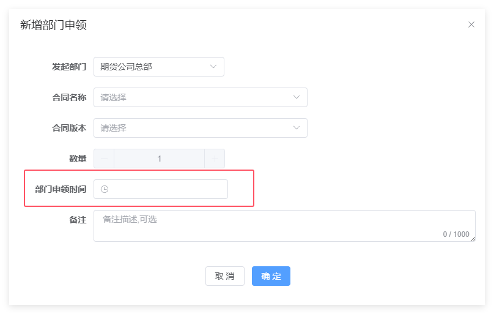

## 流程待办任务通知

**说明：** 当收到新的待办时，可以以站内信的形式进行通知。它是出现在页面的右下角。

**开关：** 流程的各个节点的通知都可单独设置。目前是默认不通知。开关分总开关和各个流程节点的开关。

## 流程节点权限支持员工

原来流程权限只允许设置到角色，现在可以具体到CRM账号了。**注意**，待办权限仍然是由【数据权限+角色权限】共同控制的，现在只是对角色权限做了扩充，指定角色
与 指定CRM账号 是"或"的关系。

**待办权限** = 数据权限 **且** **(**角色权限 **或** CRM账号权限**)**。

## 流程节点权限支持上级部门、表单中选择部门、提交时指定部门

**说明：**

-   自动使用流程主体的部门：流程默认的部门权限，即账号所属部门和上级部门有审批权限；

-   手动选择部门：待办任务提交时页面会弹出窗口，需要指定下一节点任务的审批部门；

-   流程主体上级部门：自动使用流程主体的上级部门，上级部门可在【系统管理】-\>【流程上级部门设置】页面中查看和配置；

-   通过表单内容决定：会自动在流程的业务表单内增加一个部门选择控件，用来指定下一节点任务的审批部门。

**开关：**

## 流程驳回后支持审批人不变

在审批权限设置中可以设置驳回再审批的任务只允许上一审核者处理。

## 支持客户经理权限

影像归档查询、我的待办、流程查询
等一些页面默认是部门权限（能看到本部及下级部门），现在这些页面支持客户经理权限：仅设置为
客户经理
的操作员，在部门权限的基础上会再叠加了客户关系的限制；即，客户经理只能看到自己开发的客户。

其中【流程查询】和【我的待办】页面客户经理权限是按流程来设置；影像归档查询是由总开关控制。

操作员客户经理身份设置：

**开关（影像归档查询）：**

**开关（流程查询 和 我的待办）：**

## 流程判断下一节点是否有审批人

检查到下一节点的任务无人能审批时，可选择提示警告或者报错处理。

## 云平台影像同步接口调整

云平台影像同步接口更换为新接口。云平台以前提供影像下载的接口是有可能包含未审批通过的资料的。

## 流程支持跨部门发起

开启后发起流程时，选择账号不受部门权限控制。

## 优先显示精确匹配的账号

以前可以通过输入号码后按回车进行精确查找。

现在优化为：操作员输入的号码如果能精确匹配到客户证件号码或客户账号就优先显示。

## 流程接龙功能允许指定多个流程

可以在流程的终止节点配置多个自动发起的后续流程。

## 流程支持调用掌厅的协议签署

流程到达节点后开始等待，在掌厅确认后继续下一步。

## 流程支持证通的证照核验

可以以控件的方式嵌入到流程中；也可以单独进行使用。

## 支持自然人高龄客户验证

按流程节点来配置。开启后，流程审批的时候（或者发起的时候）会进行验证。高龄的限制可以进行设置，默认是70周岁。

## 发起流程时选择客户账号的方式

可配置查找选择客户账号还是新增客户账号，或者两者都允许。

**注意：** 跨部门流程和多账户流程无效。跨部门流程只允许资金账号精确查找；多账号流程只允许查询选择。

## 流程查询权限增强

**说明：** 在原来权限控制的基础上叠加了一个黑白名单功能，可按角色也可以具体到操作员账号。

## 流程中账号信息增强

增加 年龄 字段；字段可按流程单独设置显示/隐藏。

## 流程表单拦截和验证

在流程图上使用表达式根据表单内容或者业务需求对流程进行拦截。此功能涉及一些代码（低代码）有一定使用难度。

## 表单控件优化

**文件资料控件增强。** 支持显示\'查看档案\'、发起时带出历史影像(以前是基于流程)、上传数量限制

**支持不归档文件控件。**指有些影像资料只是辅助流程审批，不需要随流程的完成而归档到客户名下。

**增强图片浏览控件**

支持图片打印、批量打印、旋转保存、支持TIF图片类型；集成图片预览、音视频播放和pdf预览，（实验性）支持word、excel、ppt的预览。

支持对"外国人永久居留证"号码的验证。在新增客户时，原来支持对身份证、组代、统一信用代码的验证，现在扩充了外国永居验证。

## 合同模块相关

**部门申领查询、员工申领查询、作废查询页面支持导出Excel。**

**支持非入库类合同不用申领就可以归档。** 设置后允许未申领的非入库合同发起归档流程。

**合同邮寄控件增强。** 支持控制可显示字段、必填字段

**部门申领、员工申领、借调、分配合同等支持指定时间。** 需要通过开关开启功能。

**员工申领、部门申领、合同遗失、合同作废几个功能支持直接生效（可以不走流程）。**

## 系统对接相关

**机构预录入对接流程**

**机构客户开户**

机构与录入审批通过后，可以携带着资料信息来启动业务管理平台中的流程。

**掌厅对接流程**

**次席切换流程**

可让客户在掌厅客户端上发起流程，然后掌厅后台将流程转到业务管理平台。

**浮动手续费流程**

场景1：可让客户在掌厅客户端上发起流程，然后掌厅后台将流程转到业务管理平台；

场景2：客户经理在业务管理管理平台中发起流程，客户在掌厅中进行签字确认。

**新佣金模块**

居间人信息的新增和修改

员工信息的新增和修改

以下为PRO版新加功能

## 可配置页面的查询条件和结果表格

根据个人偏好来设置大部分页面的查询条件和结果表格的显示字段、显示顺序。

## 根据流程表单内文件合并生成PDF

合成新的pdf，目前该功能主要用来方便给机构开户流程生成上报文件用。支持俩种模式，事先指定好要生成的源资料；或临时选择生成资料。

**控件：**

**效果：**

## 浮动手续费控件相关的多项改进

手续费控件支持一键调平。当发现由调高的品种和合约时，允许一键将调高的以单一设置的方式调平。

手续费计算开仓净留存时将软件费也考虑进来

手续费查询带有效期判断

手续费控件展示新增合约名称

支持将手续费模板推送到CTP。客户仅调整手续费模板这种情况可以直推CTP；单一设置后面也会随CTP新接口同步支持。

添加功能手续费相关黑名单设置。支持针对全部客户的和针对指定客户。

## 影像归档时也支持流程接龙

对指定系统指定业务的归档动作，配置自动发起的后续流程。

## 移动端支持

支持H5版本。在支持小程序的基础再支持了H5版本，H5版本可以满足企微应用也走VPN的场景。

  ----------------------------------------------------------------------------------- -----------------------------------------------------------------------------------
                                 
  

  ----------------------------------------------------------------------------------- -----------------------------------------------------------------------------------
