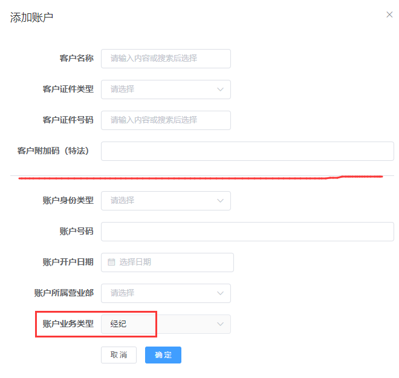
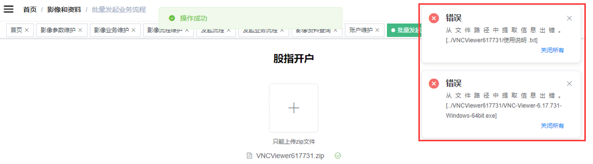
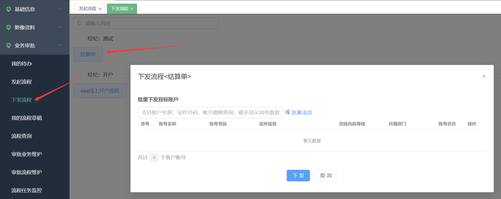
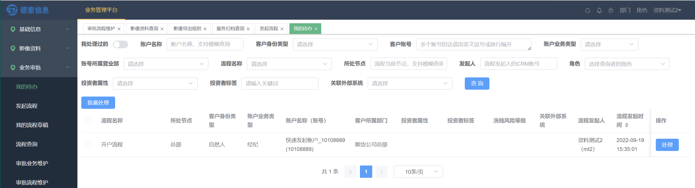
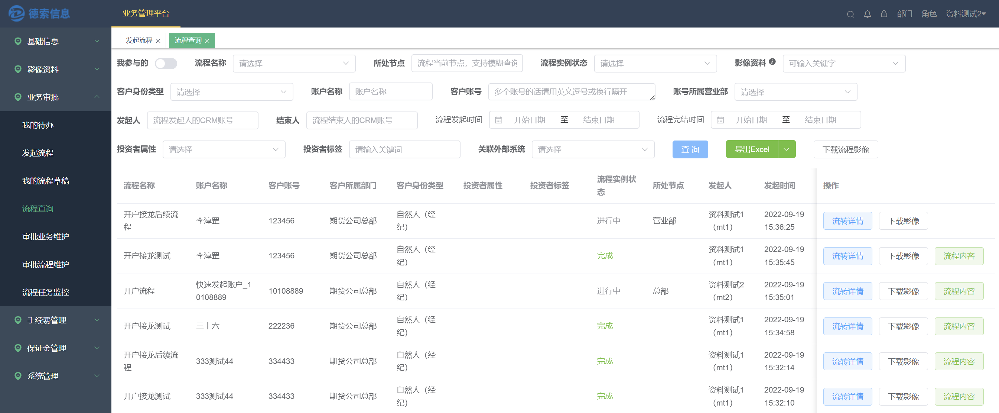

##  一，业务管理平台介绍

**系统的核心目标是：**

-   存储和管理投资者的影像资料

-   以流程引擎为依托，构建和支持更多的业务场景

德索业务管理平台系统是全新开发的一套系统。为了老用户的使用方便，系统已经最大限度的保留了德索新影像系统的操作风格和功能布局。

**与德索新影像系统关系：**

1.  延续性。德索业务管理平台兼具了德索新影像系统所有功能，保留了新影像菜单命名和操作习惯，甚至可以理解为业务管理平台是新影像系统的V2.0版本，德索新影像是可以无缝升级到业务管理平台的。

2.  增强性。业务管理平台是在新影像系统基础上进行了重构、泛化、平台化的处理。

> 新影像系统使用手册传送门：[德索新影像管理系统v1.0版本使用手册](https://docs.qq.com/aio/DSWhkbnJYUmVKYUFM?p=GSuEJHn96AYCDV1gF3BJfh)

**功能概览**：

1.  支持一个客户多种业务的影像管理；例如一个客户，可以同时维护经纪业务的影像和资管业务的影像；

2.  支持非投资者影像管理，例如居间人影像；

3.  单独的业务审批模块，将录入功能拆分出来。支持流程自定义，修改、删除等审核界面高亮提示，让影像录入审核更轻松；

4.  影像资料类型自定义，扩充了pdf、png、mav等文件类型；

5.  支持大文件上传，比如说超过300M的视频；

6.  开发归档接口，即支持外部系统来对接，将资料归档进来；

7.  批量操作流程：批量发起流程、批量审核流程；

8.  自动判断流程分支：通过设置（编写简单的判断代码）来控制分支的流转方向；

9.  流程接龙，一个流程完成后自动启动另一个流程。

**客户和账号关系：**

系统通过**证件类型**、**证件号码**、**附加码**三个要素唯一确定一个客户；

系统支持客户拥有不同业务类别的账号，且同一业务下允许多个销户账号和一个活跃账号。

**影像资料和客户账号关系：**

影像资料是挂载在账号下的，不同账号之间是互相隔离的（即使是同一个客户的不同账号之间，资料也是分开存储），目前不允许将资料直接挂到客户下。

##  二，业务管理平台与新影像系统的关系

**新影像系统：** 新影像系统主要是影像资料的存储，而流程则是作为上传影像的一种手段。除了通过发起流程录入资料外，还可以通过调用归档接口、系统中的云平台资料自动下载功能、历史资料迁入等多种方式实现影像资料的统一集中管理。

**业务管理平台：** 新影像系统已经进化为了以业务流程为主审批系统。增加了很多表单控件，有很强的业务表达能力了。其中，表单中的文件类资料，将存储至影像模块。

系统构想是之后任何涉及到影像资料的内容都将统一在影像资料管理模块中进行查询，归档。而业务流程相关内容将不再体现其中。

新影像是可以平滑升级到业务管理平台的，原先的录入功能，将统一到【业务审批】模块，而原先基于账号来查影像资料的查询功能则放在了【影像资料】模块。

业务管理平台的模块组织如下：

关系示意图：

##  三，权限控制说明

**分成三部分：菜单权限、数据权限和业务权限。**

###  1. 菜单权限控制

菜单权限控制负责分配账号可以操作的模块及其子菜单。在**德索CRM系统**中进行。

具体流程设置为
设置【角色管理】-\>设置【用户多部门维护】-\>设置【用户多角色维护】

首先在 【系统管理】-\>【角色管理】
设置角色及其可以访问的菜单权限，如下：

然后在【系统管理】-\>【用户多部门维护-新】为开通的账号添加所属部门

最后在
【系统管理】-\>【用户多角色维护-新】为开通的账户添加角色，对应其可以访问的模块，以及可以操作的权限分配

业务管理平台的登录方式：

在部署德索业务管理平台统后，德索系统上会出现一个新的模块链接，点击会自动跳转：

###  **2. 数据权限控制**

数据权限指的是登录者能看到哪些账户的权限。登录者和数据是通过下列的逻辑来建立联系的：

**登录者\<\--\>登录者的管辖部门\<\--\>管辖部门下绑定的账号\<\--\>
账号产生的数据**

在最新版本中，我的待办和流程查询页面的数据权限在**部门控制**（即上述逻辑）的前提下进行了更细节的划分.

首先是新增了流程的**客户经理权限**，设置客户经理权限后客户经理登录者只能查看和审批自己名下客户的相关流程。

并且还新增了流程查询的按**角色或个人级别**权限，在**流程查询界面**，按角色是只能查询到**允许登陆者账号所属角色参与审批**的相关流程；按个人是只能查询到**允许登陆者账号参与审批**相关流程。

最后，新增了流程实例审批中的数据权限的临时变更操作，允许登录者对流程实例的数据权限进行手动的修改。

注：

**管辖部门：** 管辖部门=主部门+扩展部门+它们所有的子部门。

(登录者都有主部门，或有扩展部门，扩展部门可以在【**德索CRM**系统 \--\>
系统管理 \--\>用户多部门维护-新】进行开通。)

###  3.**对业务线进行权限控制**

权限的控制可以精确到业务线范围。可以通过excel进行批量设置。

如，只允许某些账号有经纪业务的选项。

##  四，开始使用【业务审批】模块

前面已经提到，【影像资料】模块只做数据的查看和导出，而影像资料来源于【业务审批】模块；所以，影像录入，是在【业务审批】模块里面完成的。【业务审批】的实现思路大致如下图所示，制作好业务表单\--\>给业务单规定审核流程\--\>员工使用流程开展业务：

###  **1. 【审批业务维护】**

主要包含三部分内容：

-   创建一个业务

-   设置业务表单

-   增加表单项数据源

####  **1.1增加表单项数据源**

表单项数据源应用于表单的
单选框、复选框、下拉框等需要有候选项的控件。具体在[1.3设置业务表单](./oa#_1-3-设置业务表单)的动图里面有体现。

**功能动图演示：**

点击【业务表单数据源维护】进入表单项数据源维护界面：

**左边的边框中**，

【分类/数据源名称】：表单元素候选列表中的名称；可以多级分类。

【数据源类型】：若为**CRM码表**为系统自动初始化的码表，码表值不允许修改；
若为**自定义（=固定）**，则允许编辑，即在右边的边框中维护，新增/编辑候选项；若为**SQL**，则允许编写SQL查询语句。

【设置默认值】：可以设置数据源的默认选中项（或者文本的默认联动显示值）。

**右边的边框中：**

【数据源编码】：一个表单里面元素唯一的ID（后面会隐藏，对使用者透明）。

【候选项值】：是系统存储这个数据源的每个不同候选项的唯一ID，不允许重复。

【候选项名称】：每个不同候选项的名称。

【编码值序号】：决定显示的顺序；

【状态】：启用/停用。

####  **1.2 创建一个新业务**

在【审批业务维护】中新增日常业务，例如商品开户、股指开户、期权开户等；并且在此界面设置各个业务、不同账户类型需要上传的影像或者表单资料；

在创建业务的时候需要确定业务使用的范围。例如，经纪类的开户和资管类的开户不应混为一谈。

**业务对象：**即此业务适用对象主体的类型；区分"单客户账户"、"多客户账户"、"营业部"、"员工"。

####  **1.3 设置业务表单**

【新增业务】之后，点击右侧"操作"项【设置业务表单】：

表单的制作方式如上图，左边框里面的是\"原材料\"；将左边的\"原材料\"拖到右边框里，来组合成一个业务表单。

**对于一个只需要提交影像或者附件的业务，则不需要其他元素，只需要保留【文件资料】即可**

（注：给不同的客户类型设置业务表单，例如自然人和法人的开户通常上传的资料是不同的，可以通过【复制内容】进行快速操作。该功能只能在相同的业务线内使用。）

**功能动图演示：**

【在业务表单里新增一个需要上传的影像】

细心的你应该能发现，在设置文件资料的时候，有一个【影像参数】的列表供选择：

这些选项来自于【影像资料】-【影像参数维护】，如何维护影像参数列表，请参考下面的章节，有对应的介绍。

而其他"原材料"，包括单选、多选、下拉框，同样也有自己的候选项数据源：

###  **2. 【审批流程维护】**

制作好业务单\--\>**给业务单制作审核流程**\--\>大家使用流程开展业务

业务表单制作好了，那么下一步就是**给业务单制作审核流程**了，主要包含三部分内容：

•新增流程•设置流程节点的权限•设置节点字段权限

####  **2.1 新增流程**

**流程名称：** 在【发起流程】界面看到的流程入口显示的名称；

**流程标签和顺序：标签**
确定了该流程在【发起流程】界面显示的顺序，根据标签名称进行排序，每个标签是一个分组，后面的顺序号码是在同一个组内部的先后顺序。

**业务类型：** 下拉框来自上一节介绍的【审批业务维护】；

**业务流程：** 手动拖拽配置业务审批流转过程的流程图。

如上图表示：流程发起点是营业部，营业部提交时系统自动判断，

（1）如果该客户没有居间关系，那么该流程会流转到总部；

（2）如果该客户有居间关系，则流程会挂起休眠，24小时后再触发"营业部回访"任务，回访结果提交后，系统会自动将该流程流转到总部；

总部做一次审批，【通过】则流程结束，【驳回】则再回到营业部节点。

**允许多个活跃实例：** 决定该流程是否允许同一客户账号下，存在多个"进行中"的流程实例。

**允许发起人参与审核：** 流程的发起者是否可以参与后面的审核。比如，当营业部发起流程后，后续流程需要流转回营业部补足材料，则需要勾选该选项。

####  **2.2 设置流程节点的权限**

**状态：** 控制流程的启用中/停用。停用的流程无法新发起，已发起的流程不受影响。

**流程节点权限：** 流程中的各个节点允许哪些角色可以处理。在这个地方设置，一个节点可以对应多个角色。该权限的变更只对之后发起的流程起作用。

上面这段演示了，如何在设置一个流程在分组里头的顺序，以及为超级管理员角色授权流程发起节点的过程。只有给对应的角色授权了，对应的操作员才能在【发起流程】或【我的待办】界面看到相应的处理入口；

::: tip
**注意：流程的第一个节点的权限，就是【发起流程】页面中的权限。** 
:::

或者说
拥有流程第一个节点的权限就拥有了该流程的发起权限。

####  **2.3 设置节点字段权限**

对于一个业务表单里面包含的多个元素，系统支持在不同的流程节点有不同的表现形式，如下面这个业务流程：

上面的设置表示：

表单的4个元素，在第一个节点【营业部】**可见** 且
**可编辑**；而在第二个节点【总部】**可见** 但
**不可编辑。**（即【总部】的操作员只能审核，不能直接在界面上修改营业部提交的内容。）

::: tip
**注：** 本功能的主要应用场景：当流程节点的数量较多，第一个节点无法提交全部的表单资料，需要由后续的节点补充。

**注：** 当流程需要后续节点进行资料的补充或者修改时，需要把节点的可编辑点亮。

**注：** 节点字段权限调整，仅针对该业务后续新发起的流程生效，已经处理于流程中的不生效。

**另外，** 在此基础上还可以进一步限制表单的编辑权限，流程在驳回后，只允许处理者修改审核者指定为有问题的项（即：审核人指定有问题的地方才可以修改）。

:::

审核者的界面：

####  **2.4 设置节点的\"驳回\"计入考核**

该功能是可选功能，且是需要结合德索CRM【特定流程考核统计】功能（*个性化、非标准版功能*）来使用的。

业务管理平台可以将流程的审核信息报送给【特定流程考核统计】模块。**典型的场景：** 统计分析各操作员发起的业务流程被驳回的次数。

大致的工作原理是：流程在审核的时候，如果进行"驳回"类处理，则系统会询问审核员，是否要将本次"驳回"计入考核。

而由于业务的复杂性，并不是说所有流程节点的"驳回"都需要统计，所以系统设计成：

a、**管理员**设置流程的哪些节点在"驳回"的时候需要考虑统计

b、**审核员**在选择"驳回"时会弹出是否要将本次"驳回"计入考核的弹窗

####  2.5 启用

####  **2.6 压缩包提取规则**

本功能可以解决：

a、多账号影像资料的批量上传

b、云平台业务办理的pdf批量导入

批量发起流程，要求将多个客户的影像资料按照一定规则整理后进行ZIP压缩上传，系统自动按照匹配的规则进行各客户的影像资料解析。

"影像资料的提取正则表达式"，是用来设置压缩包及客户影像资料命名规则，也是批量发起流程时系统提取各客户影像资料的解析依据。

特别的，**云平台**批量导出的pdf压缩包的表达式已经内置好了。

系统默认提供了几种通用的提取规则：

选择某个规则后，系统会自动显示对应的正则表达式内容。

如果选择"自定义"规则，那么需要操作人员自己设置正则表达式：

"自定义"规则，是提供给有额外个性化要求、且精通正则表达式的用户使用；如果规则设置错误，那么发起批量流程时，系统将会因无法正确解析而报错。

设置好了后，你的流程发起页面就会**出现【我想批量发起】** 功能了。

####  2.7 客户经理权限

对同一部门下客户经理人员的权限细分，实现客户经理只允许查看和操作自己名下的客户的流程，在【流程查询】、【我的待办】页面生效。

####  2.8 流程查询权限

针对**单个流程**：

部门级别为默认级别，数据在部门之间进行隔离，无法参与流程的部门无法查询到该流程；

角色级别为数据在同一部门下不同角色之间进行隔离，无法参与流程的角色无法查询到该流程；

个人级别为数据在审批人员之间进行隔离，相当于只看我参与的。

针对**全部流程**：

另外允许各级别白名单的配置，配置为白名单的角色，流程查询权限始终按照白名单等级。

部门级别详细演示：

角色级别详细演示：

####  2.9 设置节点的部门权限来源

审批时的部门权限在流程发起时便确定不变，现在支持在配置的节点审批**通过时变更**部门权限。

设置为手动选择部门的流程，当审批到前一节点时，点击通过会弹出部门设置界面，选择合适的部门，将后续审批节点的部门权限置为选择的部门，流程的部门主体发生改变。

详细演示如图：

**至此，** 业务管理平台初始化工作完成，可以开始发起业务流程，或者上传影像资料了。

###  **3. 普通业务员是怎么来使用的**

##  **五，【业务管理平台**】的日常使用指南

<video width="100%" controls>
  <source src="/videos/德索业务管理平台.mp4" type="video/mp4">
  您的浏览器不支持 video 标签。
</video>

###  **1.【发起流程】**

此功能，是上传影像的功能入口。页面分"标签"显示我可以发起的流程选项：

选项按钮上展示的文字，对应【审批流程维护】的"流程名称"；

在【审批流程维护】的"流程节点权限"中的第一个流程节点中授予对应角色权限，才能在这个界面上看到相应的流程；

点击流程选项按钮，进入"发起业务流程"页面：

鼠标移动到"流程图"链接上，会悬浮显示当前业务流程的流程图。

####  **1.1 存量客户发起流程**

如果是存量客户，在"选择客户账户"输入框可以录入**客户名称**或**资金账号**或者**证件号码**，来查询系统当前的存量客户；

选定客户账户后，上传界面如下，系统会自动根据"客户类型"+当前流程的业务"账户类型"，将对应的业务表单展示出来：

对应之前维护好的业务表单：

资料添加、确认完毕，点击【发起流程】按钮，提交客户的影像流程申请。

发起成功，下一个环节的审核人员，在【我的待办】里可以看到该流程申请；如果看不到，有以下可能：

-   登录人员所属角色不具备此业务流程的审批权限；

-   登录人员不具备流程中客户账户的数据权限；

-   该申请尚未流转到此角色具有审批权限的节点；

::: tip 注意
 若【我的待办】里看不到已经发起的影像流程，此时再去【审批流程维护】中给该角色增加流程的节点授权，此修改对该流程申请也是无效的；因为，在提交发起流程的那一刻，系统已经将该流程流转的下一个节点初始化完成。
:::

**即，修改流程节点授权，仅对修改后的流程申请有效！**

####  **1.2 新开客户发起流程：**

如果是**新开客户**，则先点击【新增客户账户】按钮，填写客户信息和账户信息；添加好客户账户之后的操作，就跟存量客户的录入一样了。

该页面分上下两部分：

**上半部分：客户基本信息**

由"**证件类型+证件号码+附加码**"三要素唯一确定一个客户实体（自然人、或机构户）；

如果是已经存在的客户，可以输入客户名称或证件号码，系统自动搜索并显示模糊匹配列表供选择；

**下半部分：客户的业务账户信息**

-   账户类型：默认灰化不可选择，显示内容为当前流程对应的业务在【审批业务维护】设置的"账户类型"；

一个实体客户，每个"账户类型"，仅允许存在一个**有效**账户；

【确定】提交成功的客户账户信息，可以在【影像资料查询】和【账户维护】页面查看，此时其影像资料内容为空。

####  **1.3 压缩包发起流程**

主要用来增强以影像资料上传为主的这类流程，为多个客户同时上传资料并发起业务流程。

::: tip
"上传压缩包发起流程"按钮是需要配置了流程的压缩包提取规则才会出现，见[**第四章2节2.2小节**](./oa#_2-6-压缩包提取规则)(压缩包提取规则)。
:::

点击"压缩包发起"链接，会进入【压缩包发起业务流程】页面。可以按照【审批流程维护】中设置的"**压缩包提取规则**"将多个客户的影像资料进行规范命名和目录文件整理，然后点击【+】上传ZIP文件。

如果上传的ZIP文件不符合"压缩包提取规则"，系统会弹框提示：

**如果解析成功，界面效果如下图：**

系统自动识别出此次上传影像资料的客户账户数，显示账户类型和客户账户号。

每个账户的影像资料解析结果以组的形式展示，点击【+】按钮展开，可以查看该账户的影像资料，也可以在展开页面直接进行单个影像资料的上传和替换操作。

点击【批量发起流程】按钮，提交批量发起申请；系统逐一处理每个客户账户，后续处理同单个【发起流程】。

###  **2.【批量发起流程】**

这种批量方式主要是增强以文本内容为主的流程。本功能是通过批量复制【流程草稿】来实现的。

####  2.1 制作一份【流程草稿】。草稿里面将一些共用数据填写好

####  2.2 批量复制【流程草稿】

####  2.3 批量处理草稿

###  **3.【下发流程】**

支持批量下发。

**【下发流程】** 和 **【发起流程】** 功能相近。区别在于 **【下发流程】** 只是下发流程任务，下发者并没有参与到流程里面来。而 **【发起流程】** 更像是："给自己下发一个流程任务，并处理了"的组合操作。

**配置流程的下发开关：**

**然后有权限的操作员就可以进行下发：**

###  **4.【我的待办】**

发起流程之后，下一个环节的审核人员，在【我的待办】里处理影像审核；

【我的待办】既可以是复核人员审核流程的入口，也可以是上传人员处理被驳回申请的入口，具体看操作员的权限，这里举例审核人员的操作：

单击【处理】按钮，进入审核界面：

可以清楚地看到新增，修改，删除的部分，简化审核人员的工作。

鼠标移动到【当前阶段】的链接处，会显示流程图和当前所在的节点：

鼠标移动到【查看】图标，会浮动显示上传的影像：

审批操作有4个：

通过：进入下一个流程节点；

驳回：驳回到上一个节点；

我要终止流程：流程被终结作废，但会保留记录；

关闭：相当于返回，留待下次处理；

前面两个操作按钮显示的名称对应流程图上标识的文字。

**关于名称背景色的表意，不同于新影像系统，业务管理平台
对背景色的表意进行修改。如下：**

这里的比较是指**同一个流程节点**在**不同时期**进行的比较。为了说明这个，咱们假设有一个流程，如下图，然后进行一个这样的流程实例：

发起人提交（营业部）-\>审核人驳回（总部）-\>发起人修改再提交（营业部）-\>审核人审核通过（总部）-\>结束

所以从总部节点来看，该流程实例一共被它处理了两次。第一次看到的背景色是拿的控件的当前值与控件的默认值比较（\*注释1）；第二次看到颜色是将本次内容和第一次看到的内容进行比较，得出颜色。这套颜色表意逻辑，主要是辅助审核人员更好的进行审核，让审核者方便识别出哪些内容发生了变化。

::: info 注释1
其中影像上传类控件可以在流程设置中通过\"发起时是否带出历史影像\"开关来控制默认值；其他类型的控件是通过"数据源"来控制默认值。
:::

系统还会提示**当前处理人**：

当一个操作员在处理一个流程的时候，其他操作员可以看到当前处理人，并且颜色会发生变化：

另外，目前已支持批量处理流程，批量处理时可以清晰的看到每条流程允许的操作，并且无法完成操作的流程会返回提示信息。

###  **5.【流程查询】**

此界面用于查询当前系统中所有发起过的流程，带部门数据权限控制，操作员可以看到自己部门所属的投资者的业务流程当前处于什么状态；

在最新版本中，此界面支持部门数据权限**前提**下的细分，对于**某一条流程**支持：客户经理权限(流程开启客户经理权限后针对客户经理只能看到自己客户的流程)、操作员角色（流程查询权限设置为角色时只能看到自己角色参与过的流程）、操作员个人（流程查询权限设置为个人时，只能看到自己参与过的流程）、以及白名单（设置为白名单后对应角色的操作员对于**所有流程**都按照设置白名单的级别查询）的设置。

开启"我参与的"，可以过滤自己参与过的流程，即仅查看 我发起的+我参与审批
的所有流程；

【流转详情】可以查看该流程中各个节点的完成时间；

【流程内容】查看的内容和【我的待办】的【处理】界面一样：

系统支持按业务流程导出流程中所有涉及的影像资料，用【下载流程影像】或者【下载影像】；

【下载流程影像】：下载当前页面所有流程的影像；

【下载影像】：仅下载对应流程涉及的影像资料；

【业务管理平台】的日常使用至此结束。下面补充一个后台管理员功能\--【流程任务监控】。

###  **6.【流程任务监控】**

与【流程查询】的区别是，**此界面不做数据权限控制**，可以查询整套系统所有发起过的流程以及目前所处的状态，最主要的功能就是【终止流程】和【修改】，相当于后台有一个口子，超级管理员可以将业务人员的误操作终止或者修复。

由于最新版本增加了角色控制和部门权限变更的操作，所以在此界面相应的增加了修改任务角色和修改任务部门的功能，超级管理员可以对误操作进行修复。

####  **6.1 终止流程**

填入终止原因，就可以将一个流程终止，简单直接；

####  **6.2 修改**

对于已经正常【完成】的流程，可以对里面的表单元素进行修改，这个属于"上帝功能"，修改已经结束的流程结果；**只能用于修改人为失误，不可轻易下放使用**。

后台删除或替换附件资料

####  6.3 任务角色调整

对于正在审批中的流程，可以调整任务角色。调整后的角色在我的代办可以进行审批。当流程查询权限级别为角色级别并且流程配置中的角色不包含调整后的角色时，流程查询中无法查询到该流程，勾选我的代办可以查询到。

####  6.4 流程部门调整

对于正在审批中的流程，可以调整审批部门。

###  7. "流程分支"自动判断功能

如上图，本功能主要解决
像这种带分支的流程。通过设置好分支条件，程序自行判别要流转到哪个分支。

鼠标双击分支线条，将弹出设置框

###  8. "流程接龙"功能

当前流程在完成后再启动一个流程。

##  **六，【影像和资料】的使用指南**

影像系统提供两个视角来对资料进行查看：**账号视角**和**业务视角。** 分别对应为两个菜单【影像资料查询】、【服务归档查询】。查看账号的资料时候，会额外的显示客户级资料。

**什么是客户级资料？** 在统一账户的规则下，增加客户级的影像，也就是客户可以有他的影像，客户的账号也有他的影像，客户名下任意账号查询影像资料时都会额外的显示出客户级的影像。客户级影像是通过账户影像归档时上报（拷贝）而来的。

是否将影像资料同步到客户名下：通过影像参数来设置，允许公共类型的影像参数同步至客户级别。

当是否同步到客户由否变更为是时，会出现立即同步当前所有归档影像选项。**选择是**的话，会处理存量的影像（会将系统中该影像参数的影像资料复制一份给到其客户）；**选择否**则只会对以后归档的资料进行处理。

###  **1.【影像资料查询】**

\--查询该账号下面有哪些资料，以及每个资料的变更历史。

就是**从客户的角度出发来查看影像资料**；同时它记录单个影像资料的变化历史。

::: tip 
必须是流程走完、且全部通过状态下的影像，才可以在【影像资料查询】菜单查询到；
:::

对于单个客户，点击【查看资料】，可以查看该客户账号下所有已经上传至系统中的影像资料，筛选"业务类别"，可以查看不同审批业务类型下的影像资料信息；

-   点击"查看"，浏览图片资料；也可以"下载"文件资料；

-   勾选多个影像资料，点击【下载选中材料】按钮，可以将该账户下多个影像资料批量导出；

如果一个影像存在多次重复导入的情况，系统会自动保留历史，在【查看资料】中点击【历史】就可以看到历次导入的影像。

**【查看单个影像的变更历史】**

对于多个客户账户要批量导出影像资料，可以使用批量导出功能：

在点击【导出】之前，必须选择导出规则；可选的导出规则范围如下：

-   所有的"公有"规则；

-   自己创建的"私有"规则；

确定导出规则后，提交批量导出请求，系统自动获取符合筛选条件的客户账户中、与导出规则匹配的影像资料，并打包压缩以ZIP文件的形式导出到本地指定路径下；

**如果系统没有导出规则的下拉提供选择，则需要先编辑导出规则：**

如下图所示，单击设置图标

可以查看导出规则列表：

-   "公有"规则（对所有系统使用者可见），仅允许【查看】；

-   "私有"规则（仅对当前登陆者可见），还允许【修改】、【删除】；

此处【新增导出规则】，默认为"私有"类型：

批量导出有两个不同的按钮，这两个按钮的区别是：

-   【导出】：只导出选定"导出规则"中涉及到的每个影像代码最新的那份资料；

-   【导出（包含历史）】：导出选定"导出规则"中涉及到的每个影像代码的所有历史资料；

###  **2.【服务归档查询】**

\--查询每次业务归档包含哪些影像资料。

就是**从业务办理的角度查看影像资料**，它记录每个账号办理的每一次业务提交的附件资料。

记录影像资料来源于哪个外部系统、在哪次业务流程提交，可以查看，也支持下载。

###  **3.【影像参数维护】**

\--管理影像资料的唯一编码、基本信息，以及上传时的限制规则。

在【影像参数维护】新增日常需要上传保存的影像资料参数；

此处的列表，决定了【电子化审批】-
\>【业务表单维护】中，文件上传可以上传的资料范围；

-   资料名称：自定义，后期也可修改；

-   资料代码：影像参数的唯一标识，不允许修改；

-   资料类型：一个影像参数代码，可以设置允许多种文件格式类型；比如，身份证正反面，图片格式允许或jpg、pdf；

-   允许的最大大小：不填则表示不限制，单位KB；

::: tip
如果资料类型为图片格式（jpg、png）时，系统提供选项"允许上传多图合并"；

勾选，则表示应用到该影像资料的业务流程，在发起流程时，该项影像资料允许用户选择多个图片附件，系统自动将多个图片拼成一张长图再上传。

值得注意的是，**多图合并**功能和**多文件上传**功能是不冲突的，多图合并功能重点是提供将多张图片合并成一张的能力，可以认为它是一个合并图片的小工具。无论是否开启**多图合并功能** 系统是天生就支持上传多个文件的。
:::

多图合并上传的演示：

支持多文件上传演示：

###  **4.【影像导出规则】**

\--这个菜单里面设置的功能可以在【影像资料查询】中使用。

此页面用于维护【影像资料查询】结果【导出】时可以选择的导出规则。

拥有该菜单权限的用户可以新增、修改、删除任一导出规则。

【新增导出规则】页面如下：

导出规则名称：规则命名，要求必须唯一；

"导出规则类型"区分"公有"和"私有"；

-   公有：所有用户都可以使用；

-   私有：仅创建者本人可以使用；

**注：**"公有"规则，只有此页面可以维护；而"私有"规则可以由用户在【影像资料查询】-\>【导出】设置时新增，即
私有规则有两个入口可以维护；

影像资料列表：选择该项规则导出时包含的影像资料类型。

###  5.【云平台影像同步查询】

此页面可以查询通过监控中心云平台同步下来的投资者影像资料信息。

如果发现有投资者影像资料同步失败，可以单个客户【重新同步】，也可以【批量同步】。

##  **七，基础信息管理**

###  1.**【账户维护】**

此页面可以查询CRM系统中所有"账户类型"的客户账户信息。

账户的信息来源有两部分：

1.  柜台系统每日导入进CRM系统客户（包含当日新开账户）；

2.【发起流程】-\>【新增客户账户】界面临时新增的新开户信息；

系统每天会将临时新增的账户信息与柜台系统导入进来的进行比对，若有匹配上的，则会用柜台系统的资料对手工录入的资料进行更新（即以柜台系统数据为准）。

同时，系统提供账户信息修改功能；

不过，只允许修改临时新增的新开户信息，即通过【发起流程】-\>【新增客户账户】界面临时新增的客户账户；

###  2.【账户间影像拷贝】

此页面能够查看同一客户不同业务账户之间影像资料拷贝记录。

身份证件信息不一致的账户之间，不允许相互拷贝。

##  八、其他

###  1、版本变更历史

[德索业务管理平台v1更新内容_v1.20241229](https://docs.qq.com/aio/DSU1tenJvYmNvY25i?p=b6tSaQ0qUFkzpFpMHHX3DX)

[德索业务管理平台v1更新内容_v1_20231210](https://docs.qq.com/aio/DSWhkbnJYUmVKYUFM?p=qVvM34wFReWSKD0W2AIp09)

[德索业务管理平台v1更新内容_v1_20230515](https://docs.qq.com/aio/DSWhkbnJYUmVKYUFM?p=99R8b045aVl3VUkQ2fN0kJ)

[德索业务管理平台v1更新内容_v1_20230331](https://docs.qq.com/aio/DSWhkbnJYUmVKYUFM?p=AaYFipM5Tzmgrpcm9T4xK2)

[德索业务管理平台v1更新内容_v1_20221230](https://docs.qq.com/aio/DSWhkbnJYUmVKYUFM?p=t14lbuuMsOO4s2hNCrCNDE)

[德索业务管理平台v1更新内容_v1_20221024](https://docs.qq.com/aio/DSWhkbnJYUmVKYUFM?p=A3OymEIZ4H9P8vkxj4vISU)

[德索业务管理平台v1更新内容_v1_20220617](https://docs.qq.com/aio/DSWhkbnJYUmVKYUFM?p=IM1jH3JGzm08yAMnZYUcJF)

[德索业务管理平台v1更新内容_v1_20220112](https://docs.qq.com/aio/DSWhkbnJYUmVKYUFM?p=TnmcrIcCYjQrDSd0dGXy5O)

[德索业务管理平台v1更新内容_v1_20210806](https://docs.qq.com/aio/DSWhkbnJYUmVKYUFM?p=mO6gKrsKKKMmL0E61YYnpm)
