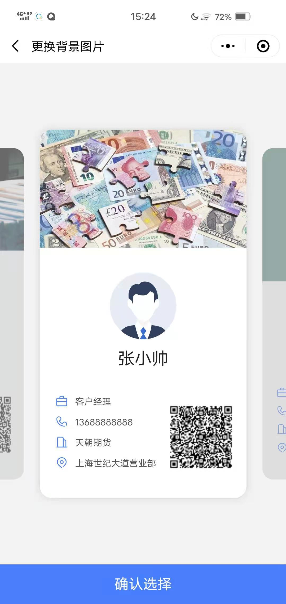
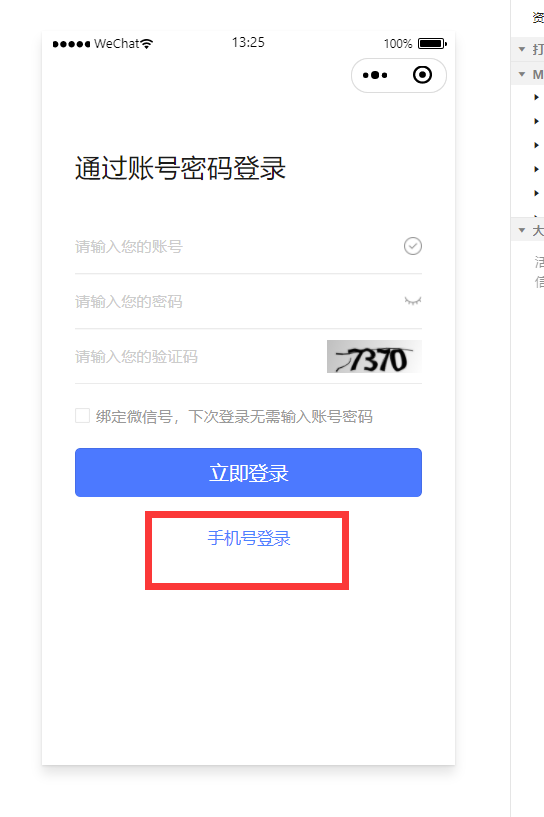

# 知客管理端使用手册

## 一、使用指南

本文档是针对知客小程序后台管理人员使用；

本文档中的配图，来源于知客模拟系统数据，仅做功能说明使用，并不包含真实生产环境的敏感客户数据。

::: info
实际交付期货公司的，数据源来自与德索CRM系统，为期货公司的每日最新的生产数据。
:::

本文档会随着知客功能的拓展而更新。

## 二、公告管理

<!-- -->

### 1.  公告概述

在知客小程序[消息]功能中，期货公司后台管理人员可以发布公告，供知客小程序使用者快速了解和自身相关的公告信息。

### 2.  发布公告

在管理后台中，点击公告管理-发布公告，即可调出发布公告界面,支持富文本编辑。

1)标题：填写公告标题；

2)分类：选择公告的类别，目前分为公司公告、内部通知、培训会议；

3)发布部门：选择发布该公告的部门，发布部门会在公告中显示出来，此处的部门数据来源于德索CRM，也就是柜台的组织架构；

4)添加附件：公告中可以添加大小不超过10M的附件，支持格式在下方列出；

5)正文：编辑公告正文内容；

6)子部门可见：该选项默认不勾选，勾选后代表发布部门及下属子部门均能看到该条公告。

<!-- -->

### 3.  公告审核

<!-- -->

1)公告编辑完成，提交后即进入待审核状态，需要审核通过后，方可在知客小程序中显示出来；

2)点击待审核菜单，即可查看到最新需要审核的公告，点击右侧蓝色的审核按钮，即可预览公告内容，并进行通过/驳回的审核操作；

3)审核通过的公告会出现在已审核和已发布中，可以点击进行查看。

<!-- -->

### 4.  公告修改及下架

<!-- -->

1)审核通过的公告，可以在公告管理-已审核中进行修改或者下架，修改：针对公告内容进行修改，下架：下架此条公告信息。

## 三、素材管理

<!-- -->

### 1.  名片素材

<!-- -->

1)当使用者点击智能名片右上角的更改背景时，即可进入名片背景更换操作。在管理后台中，可以对智能名片素材进行管理；

2)在知客管理后台，点击名片素材即可进入素材管理界面，可以对已有的素材进行下架、删除操作，也可以点击上传图片新增名片素材。

### 2.  营销海报

<!-- -->

1)在小程序端的【客户】-【营销海报】中，点击下方的更换海报，即可更换更多海报；

2)在知客管理后台，点击营销海报即可进入素材管理界面，可以对已有的素材进行下架、删除操作，也可以点击上传图片新增名片素材。

## 四、用户管理

<!-- -->

### 1.  用户查看

点击用户管理按钮，即可查看到知客小程序的用户信息，上方提供了用户检索条件，下方是客户详细信息列表；

::: important
知客的用户数据从德索CRM每日自动同步。
:::

一共由三个操作按钮：

1）修改：点击修改按钮，即可进入用户修改界面，对该用户的部分信息修改。

2）同步基础信息：点击从德索CRM重新同步基础信息，包括员工的企微号，员工微信小程序号，员工名称，部门，状态，是否为客户经理，手机号，是否自动绑定企微等信息，但不重新计算员工的业绩数据。

3）同步全部信息：除了从德索CRM重新同步基础信息之外，还额外同步员工的开发关系，提成比例等信息，并重新计算员工的业绩数据。

### 2.  用户修改

知客用户的类型，由**数据权限**和**页面权限**两部分组成。

1)**数据权限：** 决定了这个用户的数据查看范围，包括客户经理，部门经理及总部管理人员，如下表：

**客户经理：** 系统会自动判断一个用户是否为客户经理，而且仅由系统判断，暂不提供手工维护；

- 判断依据：是否在德索系统内维护了【操作员与业务人员对应关系】，只要存在操作员与业务人员的对应关系，那么就认为这个操作员**至少**是一个客户经理。

**部门经理：** 当一个用户不是客户经理时，且对应的部门不是总部，那么在初始化的时候就是一个部门经理，并且默认不允许登录，需要手工打开登录权限；

**总部管理人员：** 当一个用户不是客户经理时，且对应的部门是总部，那么在初始化的时候就是一个总部管理人员，并且默认不允许登录，需要手工打开登录权限；

::: tip
当用户是 部门经理 或 总部管理人员时，需要在管理后台手工确认并打开登录权限。
:::

2)**页面权限：** 不同的用户类型可以查看不同的知客小程序页面，如总部管理人员可以看到所有页面，而客户经理可能会被限制查看客户的实时持仓。

即使是同一种用户类型（如都是客户经理），通过配置不同的页面权限，也可实现差异化的页面展示。上线时每个用户类型会默认对应好页面模板，正常情况下无需做变动。

::: tip
如果有个性化展示要求，或者如同一种用户类型需要有不同的页面展示时，才需要在本文档[第六部分【权限管理】](./mobile-admin.md#六、权限管理)模块进行新增页面角色的维护；
:::

3)**业务角色**：决定了该用户可以查看哪些业务的数据，默认是全业务（期货经纪业务+个股期权业务）。

若知客尚未对接股票期权数据或者尚未拥有股权期权业务，则全业务等同于期货业务；

4)**登陆手机号**：默认从德索CRM同步过来。小程序支持以手机号+验证码的形式登陆。

5)**是否允许登录**：是否允许该用户登录知客小程序；

6)**其他名片展示字段**：可以修改员工证件号、办公电话、邮箱地址等信息，将在智能名片上进行展示。

::: tip

用户信息的修改功能，仅可以修改用户的部分信息，修改完用户数据如果想要实时生效，需要在用户列表最右侧点击 【同步基本信息】，否则需要等当天晚上跑批才会自动更新。

:::

## 五、消息规则管理

此模块用于配置异动消息，及提醒消息的触发规则及发送内容，由供应商进行配置，保持默认即可，若有个性化消息提醒需求，可以联系我们，由系统运维人员进行配置。

## 六、权限管理

<!-- -->

### 1.  页面资源管理

作为小程序使用的全局资源树，这里面包含了全部可供使用的功能，菜单，按钮，字段等定义。是客户经理，部门经理及总部管理人员 使用的小程序功能的全集。

::: important
因页面资源管理中的ID有特殊使用要求，不建议轻易新增、修改或删除该页面内容，如需编辑请联系德索工程师处理。
:::

### 2.  页面角色管理

系统默认的三个页面角色ID：default01，default02，default03，为系统内置的页面角色，由德索统一更新维护，不需要修改。

红框表示角色的类型，分别为客户经理、部门经理及总部管理人员。

**新增角色：** 新增的页面角色只能是三个用户类型中的一种，新增后默认对应的资源权限为该类型对应的默认页面角色，即绿框里面的页面角色

**角色授权**：页面角色遵循所见即所得的设计思路，若要修改自定义的页面角色功能，则点击授权按钮，再勾选对应权限，提交即可。

::: tip 举例

若期货公司希望 北京营业部的客户经理看到系统功能有别于系统默认的客户经理页面，则可以进行如下操作：

- 自定义新增一个叫"北京客户经理"的页面角色：

-   对"北京客户经理"授权相应的功能权限，保存；

-   最后在【用户管理】界面，将北京营业部客户经理账号的**页面权限**改成北京客户经理即可；

:::

> 权限相关概念解释
>>
>>1)  **用户**: 是指登录使用知客的操作用户。通俗来说就是期货公司员工。
>>2)  **页面角色**:
    一个权限操作的集合。一个角色包含了N多种菜单,按钮之类的功能。通俗来说：就是知客程序上每个菜单,按钮,甚至某些字段的显示与否,能否点击等功能集合。
>>3)  **资源**:知客上面的每个功能点,字段等定义为一个资源。
>>4)  **角色类型**：一共有三种角色类型，分别为：客户经理，部门经理，总部管理人员。与数据权限一一对应。
>>5)  一个角色类型可以包含多个角色。每个角色类型会对应一个默认的角色。可以在【用户管理】中修改某个角色类型对应角色。知客用户登录后，根据对应的用户类型获取对应的页面角色。若同时拥有多个用户类型，则取对应角色权限集合的并集。
>>6)  用户角色调整后，需要重新退出，然后登录知客。
>>

### 3.  消息订阅管理

知客用户在消息页面进行订阅设置，包括：异动消息、提醒消息、掌厅消息等。
其订阅设置保存在后台中，可以在此进行查看和修改。

其中，只有策略状态为启用的消息，才是后台已经正常在推送的消息，此时用户订阅了才能正常收到；

### 4.  版本信息管理

用于维护【关于】中的版本信息；

<!-- -->

## 七、配置管理

此模块用于知客小程序前端的一些展示配置，例如是否允许使用手机号进行登录等。若有个性化需求，请联系系统供应商，由德索系统运维人员进行配置。

下面是对一些配置项的解释：

| 配置项及含义 | 配置项值 | 值描述及影响范围 |
| ------------ | -------- | -------------------- |
| bind_wx 绑定微信功能 | 1(默认) | 是否启用绑定微信功能，0不启用，其他都启用 |
| channelV2_msg_wx_textcard_url 渠道V2的企微卡片消息回跳url | 由开发配置 | 渠道消息详情跳转地址 |
| channel_version 渠道版本 | 0(默认) | 投资咨询系统总开关，需要客户部署了投资咨询系统（0-关，1-开） |
| consult_enable 投资咨询功能开关 | V1(默认) | V1,V2。渠道切换版本需要和知客运维同事确认。 |
| consult_url 交易咨询系统的外跳url | 由开发配置 | 对接了交易咨询系统后才需要配置 |
| custinfo_data_desc 客户详情数据文字描述 | 仅统计期货数据，更新于 | 客户详情数据文字描述 |
| default_login_type 默认登录方式 | 0(默认) | 0：为账号密码登录，is_phone_login为1，并且default_login_type为1的时候默认手机号登录 |
| desensitize.isBrokerService 脱敏开关：居间开发客户是否脱敏 | 1(默认) | 0-不脱敏，1脱敏 |
| desensitize.isDeptService 脱敏开关：部门客户客户是否脱敏 | 1(默认) | 0-不脱敏，1脱敏 |
| desensitize.isDeptbrokerService 脱敏开关：部门居间开发客户是否脱敏 | 1(默认) | 0-不脱敏，1脱敏 |
| desensitize.isDirectService 脱敏开关：直接开发客户是否脱敏 | 1(默认) | 0-不脱敏，1脱敏 |
| desensitize.isSalesmanService 脱敏开关：部门业务经理直接开发客户是否脱敏 | 1(默认) | 0-不脱敏，1脱敏 |
| first_time_login_notice 首次登录提醒开关 | 1(默认) | 1:开启首次登录提醒 0：未开启 |
| first_time_login_notice_content 首次登录提醒内容 | 一般为保密协议 | 首次登录提醒内容 |
| idx_audit 业务审批功能是否在首页显示 | 1(默认) | 1显示，0不显示 |
| is_need_encrypt 数据传输是否需要加密 | 1(默认) | 服务端与前端通讯的数据传输是否需要加密(0：不需要，1：需要) |
| is_phone_login 是否开启手机号+验证码登录 | 1(默认) | 是否需要手机登录（0，不需要，1需要） |
| is_support_wechat 是否支持通过小程序访问 | 1(默认) | （1：支持；0：不支持） |
| login_to_page 默认登录页面 | /pages/customer/customer（客户页） | 登录跳转的目录地址(token失效情况除外，此时登录后跳转回原来的地址) |
| module_consult_enable 是否开启投资咨询系统的对接 | 0(默认) | 需要部署了投资咨询系统。1是，0否 |
| msg_dtl  | msg_dtl_cust,msg_dtl_call |  |
| msg_wx_textcard_url 发送企业微信通知url | 由开发人员配置 | 调用企微消息推送的地址 |
| my_status_valid 通讯录默认显示状态 | 1(默认) | 我的-客户，客户经理，居间人 默认显示有效状态的数据。1：默认显示有效状态 0：默认显示全量数据 |
| pk RSA公钥 | 由开发配置 | RSA公钥 |
| pwdEffectiveTime 设置免密登录的有效期 | 0.5H | 设置免密登录的有效期，当且仅当参数“pwdFreeLoginSwitch”设置为1时生效。 用户登录系统后，在此时间段内保持免密登录状态。超过此时长后，登录状态将失效，用户需要重新输入账号密码或验证码进行登录。 格式（举例）：0.5H（半小时）、12H（12小时）、7D（7天）。若设置为“0”则表示每次均需要手动登录。 |
| pwdFreeLoginSwitch 免密登录有效期开关 | 1 | 1：开（配合免密有效时间使用）0：关 |
| sync_wecom_userid_enable 同步员工信息时是否获取企微用户id. | 1 | 1：是 0：否 |
| to_page 客户经理通讯录点击效果 | 1 | 0不下转，1跳转到客户经理简报 |
| water_set 水印内容 | staffName,mobile | 需要显示设置项的id，以逗号(英文)区分，且只能填2项。staffName:员工号； mobile:手机号；deptCode:部门号；staffId:工号 |

## 八、系统指派配置

此模块用于维护消息模块的提醒是否要转换成系统指派的跟进记录，由客户经理完成跟进。若有个性化需求，请联系系统供应商，由德索系统运维人员进行配置。