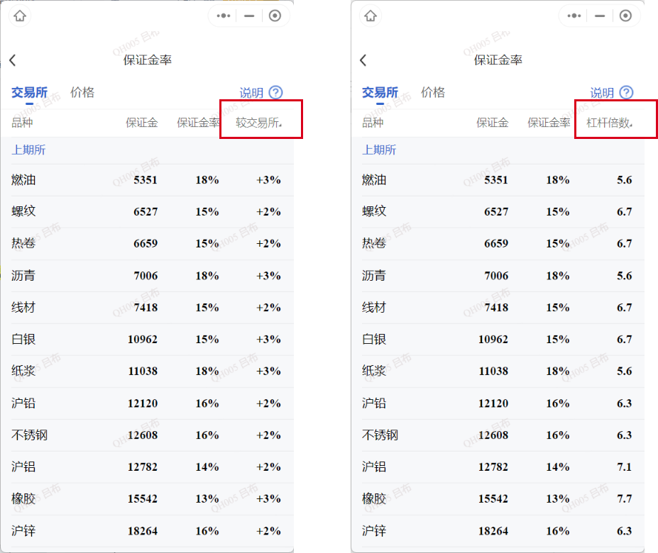
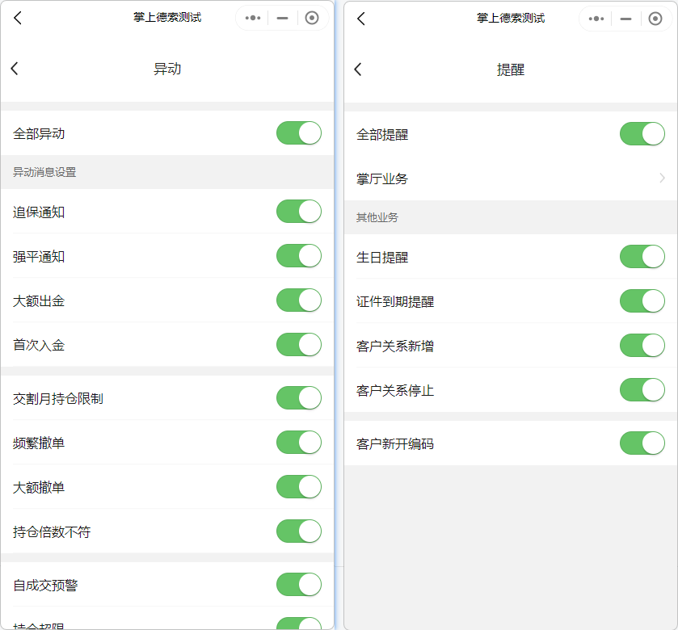
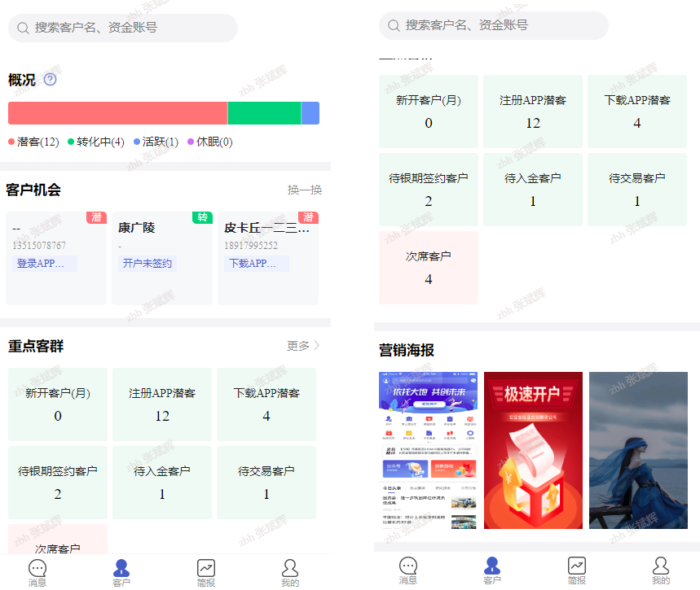
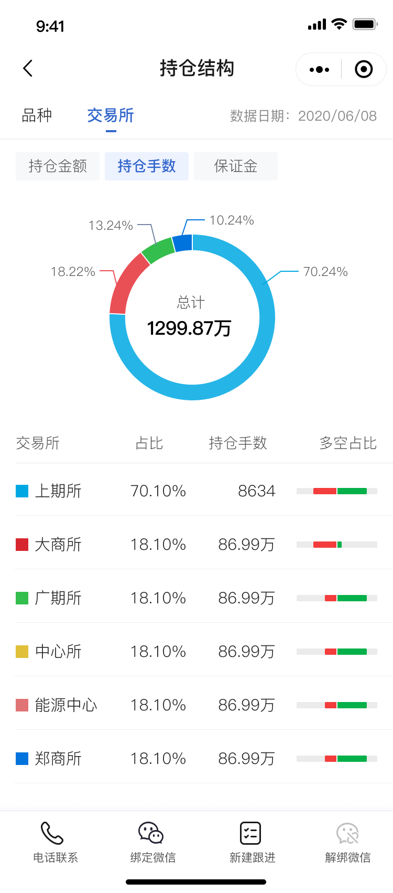
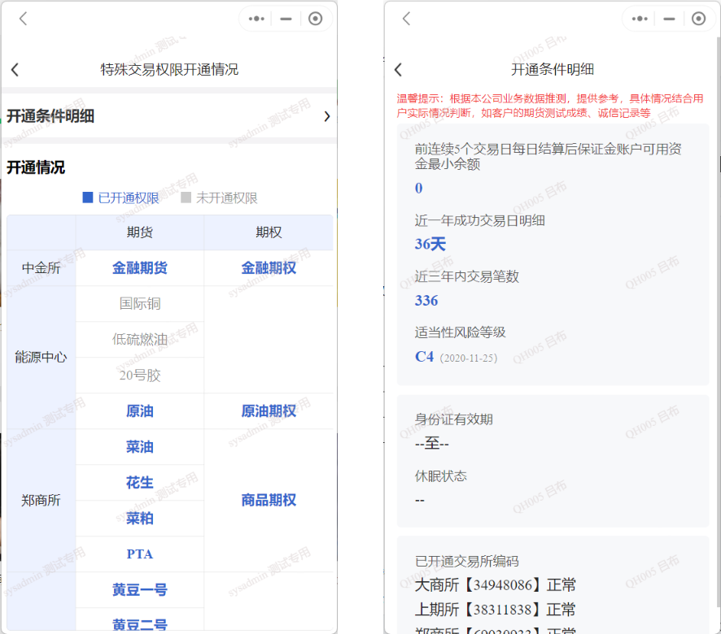
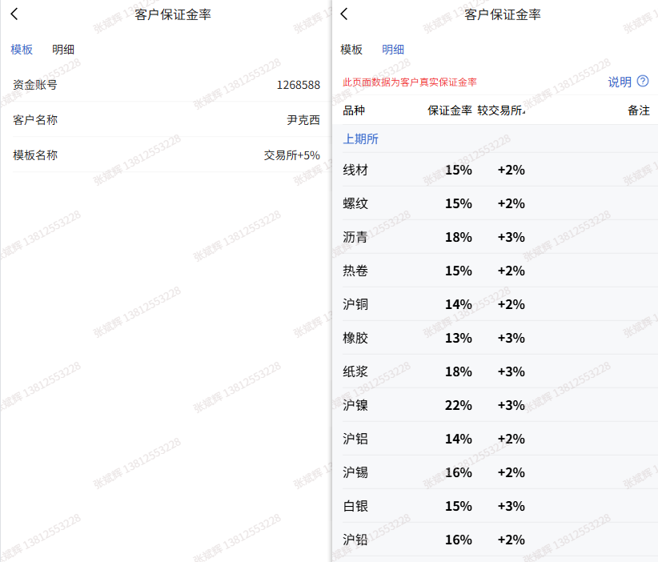
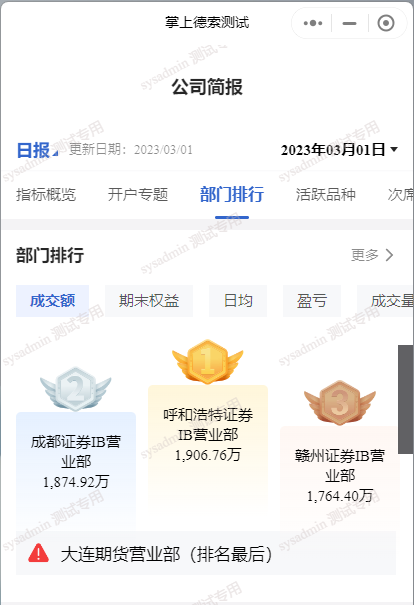
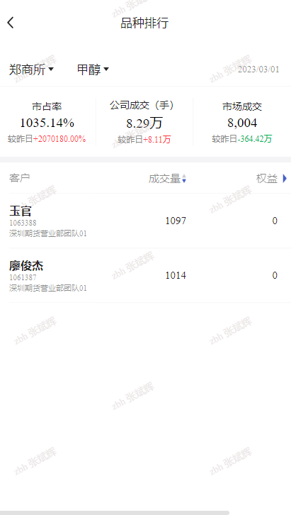
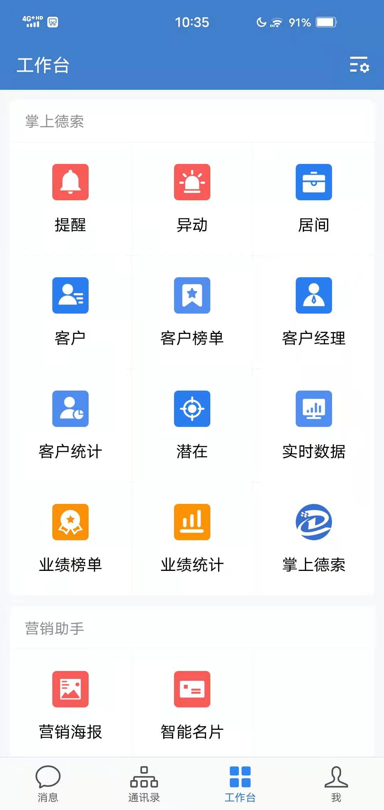
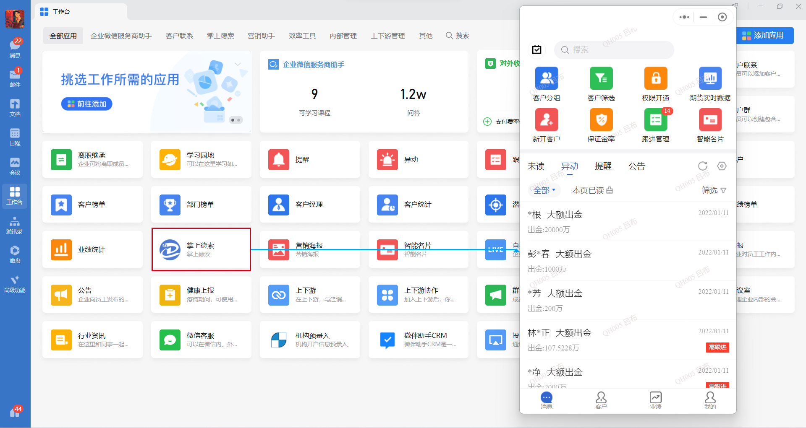

# 知客小程序使用手册

## 一、使用指南

本文档是针对知客小程序（含微信版、企业微信H5版）的使用手册。

本文档中的配图，来源于知客模拟系统数据，仅做功能说明使用，并不包含真实生产环境的敏感客户数据。

::: info
实际交付期货公司的，数据源来自与德索CRM系统，为期货公司的每日最新的生产数据。
:::

本文档会随着知客功能的拓展而更新。

## 二、关于登录

<!-- -->

### 1.在微信小程序登录

1)通过微信小程序调出知客小程序登录界面，如图；

::: tip
上线时默认设置小程序搜索屏蔽，只能通过扫描小程序二维码获得；
:::

2)登录时可以使用

- **账号 + 密码**

- **手机号 + 验证码**

账号,密码,手机号 均是从德索CRM系统的用户信息每日同步；

后台可配置使用哪种方式进行登录；

3)登录时可以选择绑定微信号：

授权操作后，下次登录无需输入账号密码：

::: important
目前一个登陆账号仅能绑定一个微信号，若进行多次微信绑定，只保留最后一次绑定关系。
:::

### 2.切换账号

<!-- -->

1)如需切换账号，点击【我的】->【设置】，在屏幕下方可看到切换账号功能；

 

2)若之前绑定了微信号，则需要先在【安全中心】中进行解绑，解绑后方可进行账号切换，如图：

## 三、【消息】模块介绍

消息页也是目前的首页，包含三个部分的功能：

上方：快捷功能金刚区入口；

中部：业务审批的快捷入口；

下方：提供及时、便捷的消息提醒服务，共包含异动、提醒和公告3种消息，涵盖客户资金监控和业务办理进度；支持提供一键拨打用户电话，或联系客户经理。把握MOT（Moment of Trust）时刻，提升服务及时性和服务满意度。

### 1.快捷功能金刚区

默认功能从左上开始依次为 客户筛选、期货实时数据、新开客户、公司保证金率、智能名片、部门榜单。

::: tip
支持根据期货公司要求调换顺序，后台配置实现。
:::

#### 1.1 客户筛选：

即智能分组功能，根据内置的条件，快速筛查出一个客群，并且这个客群每日会重新判断条件，进行更新。

#### 1.2 期货实时数据：

默认仅展示公司客户的实时资金和出入金信息；

右上方的按钮，可以对实时数据的资金、出入金的表头进行置顶和排序操作，如图：

 

#### 1.3 新开客户：

跳转到新开户客户页面，包含昨日 和 本月新开客户数据；

#### 1.4 公司保证金率：

保证金查询小工具功能，展示各品种的主力合约的公司默认保证金率和 1手的保证金占用，较交易所保证金率的浮动点数，以及杠杆倍数：

1）按交易所分类：

2) 按价格区间分类：

底部的输入框输入一个价格来筛选，会快速定位到这个价格最接近的品种。适合根据新手客户的资金量定位可交易品种；

#### 1.5 智能名片：

智能名片支持自定义头像和更换二维码操作，并提供多种背景供选择，长按图片可以进行转发或保存操作。

智能名片与渠道系统打通，此处的二维码即为客户经理在渠道系统生成的开户二维码，客户可以通过二维码直接扫码开户，并且系统会自动绑定渠道与客户的关系；

#### 1.6 部门榜单：

用于查看各个层级下部门的各项数据排行：

- 通过左上角的设置按钮，可以选择想要展示的数据内容及排列顺序：

- 左上角的统计周期切换，支持月统计 和 日统计数据：

- 通过右上角的筛选按钮，可以选择想要展示的部门层级，业务类型，针对某个部门的下级部门，以及是否统计子部门数据：

  - 业务类型： 默认为全业务合并数据，若公司只有期货经纪业务，则无需设置；若有股票期权业务，则可以分业务查看；

  - 部门层级：

    - 主管部门：当前账号所在的部门；

    - 1级部门：当前账号所在的部门的第1层子部门；

    - 2级部门：当前账号所在的部门的第2层子部门；
    
    - n级部门：以此类推；

  - 上级部门：搭配部门层级使用；例如当选择2级部门时，会有多个1级部门，这里的上级部门便是所有1级部门，可以选择某个1级部门，2级部门的数据；

  - 部门汇总/明细：默认打开，展示的部门数据为其自身以及所有子部门的汇总数据；若关闭，则只展示部门自身数据，不包含子部门数据；

### 2.业务审批

此处提供业务审批移动端功能的快捷入口，包含待办及流程查询。

点击待办，进入当前账号的待办流程页面：

点击流程查询，可进入当前账号允许查看的流程记录：

操作与PC端的业务审批系统相同，数据也是实时同步的；

### 3.未读消息

<!-- -->

1)未读消息：功能是当前所有未读消息的汇总展示，包含异动、提醒和公告，方便使用者通过该功能快速查看相关重要消息提醒；

2)查看：未读消息查看后，将从本页面中消失，也可以通过清空未读按钮进行一键清空；

3)筛选：可以点击筛选按钮，进行未读消息类型筛选，可以按照关系类型和自定义分组进行筛选。

4)客户信息卡片操作：

- 点击客户姓名：进入人员信息详情页面；

- 点击消息栏：可以进入消息详情页，并可查看客户详情、跟进、打电话。而打电话可以进一步分为**联系客户 和 联系客户对应的客户经理**；

- 长摁消息栏：可以标记已读或者新建跟进操作：

### 4.异动消息

主要和客户的**盘中交易风险**相关。

默认提供的异动消息类型包含：

- 追保通知、

- 强平通知、

- 大额出金、

- 首次入金、

- 交割月持仓限制、

- 持仓倍数不符等；

::: tip
异动类型根据客户实际需求会略有变动，此处仅列举目前已有类型。期货公司可以根据需要调整规则和话术。
:::

### 5.提醒消息

由两部分数据构成：

- 一是客户在掌厅办理业务时产生的业务进程提醒；

- 二是CRM系统定时触发的业务提醒；

::: tip
备注：提醒类型根据客户实际需求会略有变动。期货公司可以根据需要调整规则和话术。
:::

### 6.公告消息

由期货公司在知客管理后台生成发布，**支持针对不同的部门发布公告**，具体操作参考《知客小程序使用说明·后台管理版》

### 7.消息设置

点击消息页右上方的按钮，即可进行消息设置，如图：

#### 7.1 星标客户消息置顶：

是否在未读消息列表内置顶星标客户的消息；

#### 7.2 提醒消息置顶设置：

默认不打开，可以根据需要对提醒消息的类型选择置顶：

#### 7.3 订阅客户：

选择订阅哪些群组的客户消息进行展示和推送，如图：

#### 7.4 订阅消息类型：

可以设置需要查看的异动、提醒的类型，如图：

### 8.消息筛选

点击tab页右上方的按钮，即可进行消息筛选；消息筛选在未读、异动、提醒、公告四个页面中均可使用，根据不同页面内容，筛选条件也各不相同；

1)未读消息筛选：针对客户关系类型 及 客户分组；

2)异动筛选：针对异动消息的类型进行筛选；

3)提醒筛选：针对提醒消息的类型进行筛选；

## 四、【客户】功能介绍

客户功能基于客户的生命周期进行分类管理。提高客户服务满意度和单客价值，实现精细化运营。

### 1.客户功能界面

a)概况：

一图了解客户群体生命周期整体和阶段分布；

b)客户机会：

基于客户生命周期阶段、异动风险信号、业务办理进度和客户业务数据等，通过客户标签体系及对应权重分配与推荐规则，系统自动为用户提供实时需要关注的客户名单；

c)重点客群：

客群是对客户分级分类管理的方式，重点客群将重要的场景客群与公司客群呈现在客户页面，方便进行操作；

d)营销海报：

海报是素材物料的一种，方便在微信群、企微群、单人对话、朋友圈及其他多种场景下分享，实现对客户的维系与触达，知客后台支持对海报素材的扩充，也可以根据公司需要增加其他类型的素材内容；

e)客户搜索：

页面顶部的客户搜索，支持通过客户姓名、资金账号模糊匹配，实现主动查找特定客户的需求；

### 2.客户概况

<!-- -->

1)概况：展示当前权限范围内客户的生命周期阶段，目前划分了4个阶段，点击 **对应条块** 或者 **阶段名称** 跳转对应页面。

- 潜客：未开户的客户，即潜在客户。

点击跳转潜客列表（我的页面-潜客通讯录），如图；

- 转化中：已开户，但未开始交易的客户。

点击跳转客户列表（我的页面-客户通讯录），筛选条件为**客户状态-有效 + 生命周期-转化中**；

- 活跃：已开户且正常交易的客户。

点击跳转活跃客户列表（我的页面-客户通讯录），筛选条件为**客户状态-有效 + 生命周期-转化中**；

- 休眠：已开户但休眠待激活的客户。

点击跳转休眠客户列表（我的页面-客户通讯录），筛选条件为**客户状态-休眠 + 生命周期-休眠**；

2)客户类型解释说明：对客户状态和生命周期划分的口径进行说明，对这两个类型的关系和相关页面进行说明与举例；

### 3.客户机会

<!-- -->

1)换一换：页面展示至多3个客户机会卡片，包含潜在客户和开户后的客户。

- 目前推荐规则为系统默认，根据当前用户负责的客户范围中选择排序生成，一般为几十个；

- 客户关系实时更新，比如新增加了投资者关系；

- 推荐列表默认10min刷新一次的频率；

- 如果推荐内容全部都展示过后，再点击换一换将会从推荐列表中重头开始展示；

2)潜客机会卡片：

潜在客户是客户增长的重点，目前知客对接了渠道系统，将通过二维码扫码留资的客户信息同步到知客潜客列表中，后期将扩充其他渠道来源的潜客数据和潜客管理功能。

潜客目前是以客户留资的手机号作为唯一标识，潜客卡片会展示潜客姓名（如手机号为空，系统展示\--）、手机号以及潜客触发的推荐标签。

潜客详情页面介绍详见本节的 [第7点](./mobile.md#_7-潜客详情页面)。

3)客户机会卡片：
开户后客户的维护是提高客户贡献度的重要方式，尤其是近期新开户但还未形成成熟交易经验的转化阶段。

客户卡片包含客户真实姓名、投资账号以及出发的推荐标签。点击卡片会进入客户详情页面，回显客户的机会标签信息。

更多客户详情页面的介绍详见本节[第8点](./mobile.md#_8-客户详情页面)。

### 4.重点客群

<!-- -->

1)客群管理页面：

点击重点客群更多跳转客群管理页面，可以看到分组后的所有客群，并且支持对一类客群的展开和折叠；

2)场景客群：针对业内常见客户运营场景的客户分组

如图展示的是根据客户开户前后流程节点，统计的客户列表，列表表头也会根据当前分组主题进行适应调整；

3)公司客群：满足期货公司客户个性化分组要求；

如图提供次席客户明细。公司客群由期货公司定义，通过与德索工程师的对接，提交对应的分组及展示需求即可；

4)系统默认：系统根据投资者客户与用户的归属关系，分为居间开发和直接开发。

我的客户即为客户经理名下的所有客户，同时知客支持对客户添加星标，并单独设立出星标客户分组；

5)自定义分组：支持知客当前用户根据自身需要，灵活的选择客户组成分组。分组内容形式与客户通讯录一致；

- 新建自定义分组，点击自定义分组的加号图标，输入分组名称，选择客户添加到分组中；

- 编辑自定义分组，选择具体自定义分组列表右上角的更多菜单按钮，选择编辑分组可以对分组中的客户清单的具体客户进行删除，也可以选择分组底部的添加客户选择具体客户添加到分组中；

- 删除自定义分组，删除自定义分组是对整个分组进行删除，注意和编辑分组删除具体客户的区别；

- 重命名自定义分组，操作路径同上，选择重命名可以对分组名称变更；

6)智能分组：智能分组是当前用户可以根据指标条件自动生成，每天定时更新，可以看到较上一日的变化，相较于自定义分组静态的类型而言，是一种动态分组；

- 新建智能分组，点击智能分组的加号图标，输入分组名称，选择分组条件保存；

- 编辑智能分组，目前不支持对智能分组的编辑；

- 删除智能分组，删除智能分组是对整个分组进行删除；

- 重命名智能分组，操作路径同上，选择重命名可以对分组名称变更；

- 

- 查看智能分组条件，智能分组详情点击查看条件可以查看具体条件信息，智能分组列表的表头也会根据选择条件进行设置；

7)客群搜索：方便主动和指定的查找客群，支持客群名称的模糊匹配；

### 5.营销海报

营销海报支持左右滑动，点击选择想要转发的海报，通过长按图片可以保存或者转发。

营销海报会自动附上账号对应的渠道二维码，同智能名片上的二维码一样，用于让客户扫码开户，且自动绑定开发关系。

### 6.客户搜索

客户页面顶部支持通过客户姓名、资金账号的模糊匹配查找；

### 7.潜客详情页面

<!-- -->

1)潜客详情页面入口：查看某个潜客详情的入口可以通过客户机会中的潜客卡片，也可以通关过潜客列表，后续随着功能和应用的开发，支持潜客类型的客群和其他功能进入潜客详情；

2)潜客目前以客户留资的手机号作为唯一ID，由于目前仅对接了渠道二维码获取的潜客数据，所以潜客归属的客户经理、归属部门都是固定不变的，渠道来源目前只有渠道二维码一项。获取时间即为渠道系统记录潜客数据的首次时间。当前潜客详情信息相对较少，后续功能优化，开发三方对接，充实潜客信息；

3)潜客的姓名默认为空，支持变更，变更后的姓名影响潜客列表和客户机会中对应的条目；

4)潜客备注内容为空，支持变更；

### 8.客户详情页面

<!-- -->

#### 1)客户数据的查看入口：

查看单独某个客户的详细数据入口有很多，包含消息界面中未读、异动、提醒，以及客户界面中的客户机会、客户搜索、客群列表和我的页面客户通讯录等等；

#### 2)客户详情界面：包含客户资产、客户资料、客户服务和快捷查询功能。

- 客户资产：描述客户资产构成的组成明细和总额，如果对数据展示敏感，可以点击眼睛图标来控制隐藏/显示数值。

- 业务类型: 包含期货期权和个股期权。

- 客户基本信息：页面头部展示客户的基本信息，如姓名、客户ID、适当性等级、归属部门。

- 如果客户是自然人类型，头部颜色会用蓝色表示。

- 自定义标签：客户经理可以对客户添加标签，标签内容自定义，类似备注功能。

- 星标操作：点击五角星即可进行加星标/取消星标操作

- 资产详情：默认展示的是上一交易日期货业务的资产详情，如可用、盈亏、风险度,及留存、利息、交返数据等数据；如果需要查看个股期权，切换Tab之后，会列举个股期权类型下的的重要组成数据，如可用，盈亏、风险度等；

- 客户总资产分析：点击总资产旁的更多箭头，展示客户的总资产和净盈亏的时间趋势和关键数据，可用根据需要切换不同的时间周期，有本月/本季/半年/本年。

- 期货资产走势图：提供客户期货权益走势图、期货净盈亏走势图和期货收益率曲线等图形展示；

- 期货基本评估：基于期货业务交易数据提供客户基本评估信息。

- 如果客户是机构户类型，详情页面头部颜色为红色，其余功能同自然人客户。

#### 3)客户资料：点击【资料】按钮即可查看，包含客户基本资料，期货、个股期权资料等数据；

#### 4)服务记录：点击【服务】按钮即可查看，主要为该客户提供的异动、提醒等消息；

#### 5)快捷功能区：为了方便查询常用的客户信息，将常用功能显示在客户详情页

。

- 客户的实时数据:如客户的出入金和持仓方向等；

- 客户的持仓结构:按品种或按交易所统计持仓金额，手数，保证金占用等；

- 客户的交易权限开通情况：展示客户已开通和未开通的特殊权限，以及客户的开通条件明细等；

- 客户的保证金率：客户当前的真实保证金率及相对于公司标准或交易所标准的浮动情况；

- 客户的强平情况：统计出近期3个月的强平信息；

- 客户交易信息：固定周期内的关键交易信息统计；

- 客户的手续费率：包括手续费模板和明细数据；

## 五、【简报】功能介绍

围绕指标概览、开户专题、部门排行、活跃品种、次席客户和客户十大等主题，搭建起公司、部门、个人不同角色下的工作简报，支持日报和月报的切合，一手掌握工作进展，评估工作内容，及时调整业务方向。

### 1.简报功能界面

日报：

月报：

#### 1)个人、部门简报切换：

如果账号同时拥有多种身份，如客户经理+部门经理，则可同时查看个人简报及部门简报，在简报顶部可进行切换：

#### 2)日报、月报的切换：

支持日报/月报的切换，支持选择对应的具体统计周期，更加灵活方便；

### 2.指标概览

<!-- -->

1)日报，统计选定日期的常用指标，并配以对应的副指标，支持较昨日的比较，红色表示增长，绿色表示减少；

2)月报，统计选定月份的常用指标，点击某指标会还展示该月区间内的时间趋势图；

### 3.我的客户十大

<!-- -->

1)根据经营角度对客户进行多维度的排行统计，简报展示的客户十大卡片，点击更多可以查看更多指标和数量的客户排行统计；

2)客户榜单页默认同简报的统计周期一致，也支持灵活的切换和选择；

3)客户榜单支持对筛选条件的过滤；

4)为方便查看，支持对客户榜单的表头的设置，选择开关和排序，满足用户个性需求；

### 4.开户专题

<!-- -->

1)日报开户专题卡片统计了统计日期内开户的客户类型的数量占比；

2)月报开户专题卡片统计了统计月份内新开客户的收入贡献类型的金额占比，提供每个环节的转化率情况，帮助期货公司快速定位薄弱环节，以改进优化。如图6-4-2-1；

### 5.部门排行

横向比对各业务部门的经营情况，目前仅总部管理人员角色可以查看部门排行；

### 6.次席情况

客户在各次席系统的使用情况，便于管理层快速了解各次席系统的"性价比"。

### 7.活跃品种

<!-- -->

1)统计周期内公司范围下客户成交量的情况，展现形式为热力图形式；

2)热力图的色块大小根据成交量从高到低排序，取前9个，色块颜色对应统计周期内的市占率涨跌幅，详见解释说明页；

3)选择活跃品种某个色块，可以看到该品种排行详情页面，了解公司下该品种的市占率、成交量，以及使用者自己负责范围内的该品种的客户列表；

## 六、【我的】功能介绍

【我的】功能能够为使用者提供自己权限范围内的客户数据（如客户、潜在客户、居间等），并且知客提供了智能名片功能，具体功能介绍如图所示：

点击客户/潜客/居间/客户经理通讯录入口，即可查看账户权限范围内的客户列表、潜客列表、居间列表、客户经理列表；

### 1.客户

支持客户名、资金账号的模糊匹配，支持对客户状态、生命周期的条件筛选，长按某个客户条目支持对该客户的星标操作和快捷添加到自定义分组的操作；

### 2.潜客

潜客列表支持对潜客的手机号和姓名的模糊匹配搜索，与客户概览潜客阶段跳转的潜客列表页相同；

### 3.居间

根据居间类型分为我的居间和部门居间两个页签，根据用户的实际权限情况显示。客户经理角色可以查看我的居间，部门经理及总经理可以查看部门居间。居间列表支持搜索和筛选；

筛选条件包含，居间的人员类型，状态，以及合同的开始，结束日期。

### 4.客户经理

<!-- -->

1)点击头像下方的客户经理按钮，即可查看所在部门的客户经理数据；

2)在客户经理页面可以在搜索框内搜索客户经理信息，也可在右方进行客户经理筛选，点击图标，既可以进行客户经理条件筛选；

3)点击客户经理时，可以下钻查看该客户经理的数据概览和客户榜单。

### 5.跟进功能 **（不推荐使用，后续会更新）**

**跟进功能：** 指完成客户跟进的工作流程，客户经理可以使用查看跟进任务、填写跟进任务记录、跟进记录查看等功能。

- **查看跟进任务：** 查看领导指派和系统自动指派给自己的任务。

- **填写跟进记录：** 填写系统指派、领导指派及自己新建的跟进记录。

- **跟进记录查看：** 查看自己完成的所有跟进的记录。

1)跟进任务：跟进任务分为两种，一种是系统指派，一种是营业部经理人工指派，最终由客户经理实施。

- 系统指派：在后台设置哪类消息需要跟进，有对应消息之后系统自动发布给对应的客户经理的指派，可以看到客户经理系统指派的完成情况；

- 人工指派：营业部经理可以根据工作需求，手动发布跟进任务指派给某一客户经理，一条消息只可以指派一次。

2)查看跟进任务

- 消息界面查看

在消息界面如果有需跟进的任务，在消息的右后方以红色的"需跟进"字样标注提示；

- 我的界面查看

点击【我的】-【跟进】菜单，进入到跟进的功能界面，在此界面可以查看到我的全部跟进任务，分为需跟进、已跟进两个页面标签；

3)**填写跟进记录**

点击【我的】-【跟进】菜单，进入到跟进的功能界面，在此界面可以查看到跟进任务，在需跟进页面标签下，点击后方的跟进按钮，即可进入跟进任务填写界面，输入跟进文字内容，拍摄/上传跟进照片（最多支持9张）即可；

注意：跟进填写一旦提交确认后，不可修改和删除，提交前请核查无误。

4)**新建跟进记录**

除了被动完成跟进任务外，也可主动新建跟进记录，一条客户消息可以多次跟进。新建跟进记录入口较多，方便使用者在不同页面均可新建，主要包含以下四种入口。

- 消息界面新建跟进记录

在消息界面长按需要跟进的消息，在下方弹出的界面选择新建跟进，即可进行该消息的新建跟进。该途径自动引入客户姓名和消息，需要填写跟进内容（文字、图片），图片最多支持9张，允许拍摄/上传；

- 消息详情页面新建跟进记录

在消息的详情页面，点击右下角的跟进-新建跟进，即可进行新建该消息的跟进记录。该途径自动引入客户姓名和消息，需要填写跟进内容（文字、图片），图片最多支持9张，允许拍摄/上传；

- 客户详情页面新建跟进记录

在客户详情页面底部的快捷动作条选择新建跟进，即可进行新建跟进记录。通过该途径新建的跟进记录，会自动引入客户姓名，但需要手工关联跟进的消息，输入文字和图片和即可完成新建跟进记录；

- 跟进页菜单栏填写跟进任务

点击【我的】-【跟进】菜单，在跟进界面点击右上方的加号，即可进行新建跟进记录，通过该途径新建的跟进，需要手工选择客户和跟进关联消息；

5)跟进记录查看

- 点击【我的】-【跟进】菜单，选择跟进记录选项，即可查看到我全部的跟进记录；

a.在跟进记录界面查看某个记录时，可以查看客户姓名进入客户详情页，如果文字太长则会折叠显示，点击全文按钮后则会展开显示，同时全文变为收起字样，在右下方可以通过查看指派按钮来查看具体的指派情况；

- 在客户主页中选择【服务】，再选择跟进记录标签，即可看到该客户的所有跟进记录：

### 6.智能名片

智能名片支持自定义头像和更换二维码操作，并提供多种背景供选择，长按图片可以进行转发或保存操作。

智能名片与渠道系统打通，此处的二维码即为客户经理在渠道系统生成的开户二维码，客户可以通过二维码直接扫码开户，并且系统会自动绑定渠道与客户的关系；

 

## 七、企业微信版功能

企业微信版是将知客的功能嵌入企业微信的体系当中，提供了更加便捷的使用场景（如在聊天时可发送业务链接、查看客户资料、营销海报等），方便客户经理联系及服务客户。企业微信版知客支持两种嵌入方式：微信小程序 和 H5版本，期货公司可根据自己的需要选择对应版本。

### 1.企微版知客登录

<!-- -->

1)登录企业微信版知客，首先需要加入该企业微信群组（可主动扫描二维码加入，或者由企业微信管理员邀请加入）；

2)登录成功后，点击下方【工作台】，即可使用知客企业微信版的功能，如图。

3)企业微信PC端，选择工作台也可使用到知客小程序功能，如图。

### 2.功能界面介绍

在企业微信工作台中可以看到知客的部分功能模块，点击需要查看的模块，页面进入对应的数据页面。

默认部署的功能包含：

- 总的app入口
- 客户详情页
- 客户实时数据
- 交易权限
- 保证金率
- 手续费率
- 智能名片
- 营销海报
- 异动
- 提醒

例如点击客户模块，即进入右侧的客户数据页面；

在企业微信PC端的工作台，选择知客的产品和功能模块，可以在电脑终端看到同微信小程序同样的页面。如图7-1-2所示。

### 3.使用场景：消息推送

部署了企微版本的知客应用，如果需要"提醒"和"异动"内的消息推送到手机上的系统通知，

请按照如下的操作检查下配置。

#### IOS版本

1.手机系统设置中允许企业微信的通知。

2、企业微信app中，允许接受新消息通知。

3、知客小程序的消息设置中，新消息通知打开。

#### 安卓版本

1、手机系统设置中的通知管理，打开企业微信的允许通知。

2、企业微信app中，允许接受新消息通知。

3、知客小程序的消息设置中，新消息通知打开。

### 4.使用场景：聊天工具栏

<!-- -->

1)进入企业微信------通讯录------我的客户，选择需要进行沟通的客户

2)进入聊天界面后，点击右上方的调出按钮，即可在聊天内容框上方调出聊天工具栏：

3)在聊天工具栏中左右滑动，选择需要发送给客户的业务链接，例如选择智能名片，营销海报发送给客户，客户可直接通过链接打开智能名片开户或营销海报 参与活动，效果如图所示：

### 5.使用场景：查看客户详情

<!-- -->

1)在使用企业微信和客户沟通时，聊天工具栏中有客户详情，客户实时数据，交易权限，保证金率，手续费率，可以便捷查看客户的详情数据：

>

2)使用客户详情需要客户经理首先将客户和客户微信号绑定，绑定后点击客户详情即可直接调出该客户的详情资料，例如我将微信号Anthony Hao和 童*师绑定，操作如图：

先打开一个投资者的详情页 - 下方找到绑定微信按钮 - 选择要绑定的客户（后缀有@微信）- 确认。

之后便可直接在聊天工具栏直接查看童*师的客户详情，客户实时数据，交易权限，保证金率，手续费率。

3)客户微信解绑，在聊天工具栏上选择客户详情，进入客户详情页，点击右上方的微信绑定按钮，即可进行解绑；

## 八、用户角色介绍

<!-- -->

### 1.用户角色类型

- 客户经理：指期货公司的客户经理，与客户有开发关系；

- 部门经理：指期货公司部门经理，如各分支机构的部门负责人；

- 总部管理人员：指期货公司总部管理人员，如公司总经理；

::: tip
当德索CRM中开设的账号部门权限为 **全公司** 时，则知客会默认为该用户是总部管理人员角色；
:::

### 2.角色权限

不同角色数据权限分配如下表：

### 3.角色组合

- 在实际工作中存在一人多角色的情况（如部门经理本身也是客户经理），因此知客提供了角色组合，以实现同一人多角色的需求；

- 常见角色组合：客户经理+部门经理、客户经理+总部管理人员；

- 角色组合的权限为添加组合的角色权限项叠加。